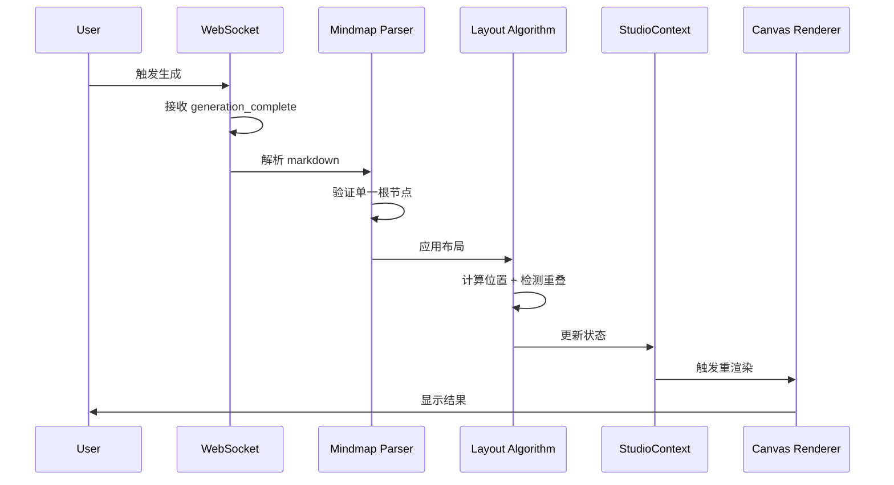

# Design Document: Fix Mindmap Generation

## Overview

本设计文档描述了修复 mindmap 生成功能中三个关键问题的技术方案：
1. 节点重叠问题 - 改进布局算法确保节点不重叠
2. 多根节点问题 - 改进解析器确保只有一个根节点
3. Loading 状态问题 - 修复状态同步确保生成完成后立即显示结果

## Architecture

### 组件交互流程



## Components and Interfaces

### 1. Layout Algorithm 改进

**文件**: `app/frontend/src/components/studio/mindmap/layoutAlgorithms.ts`

#### 新增接口

```typescript
interface NodeBounds {
  x: number;
  y: number;
  width: number;
  height: number;
}

interface OverlapCheckResult {
  hasOverlap: boolean;
  overlappingPairs: Array<[string, string]>;
}

// 检测节点重叠
function detectOverlaps(
  nodes: MindmapNode[],
  padding: number
): OverlapCheckResult;

// 解决重叠（迭代调整位置）
function resolveAllOverlaps(
  nodes: MindmapNode[],
  maxIterations: number
): MindmapNode[];

// 计算动态节点高度
function calculateDynamicNodeHeight(
  content: string,
  baseHeight: number,
  maxWidth: number
): number;
```

#### 改进 balancedLayout 函数

```typescript
export function balancedLayout(
  data: MindmapData, 
  options: LayoutOptions
): LayoutResult {
  // 1. 计算每个节点的动态高度
  const nodesWithDynamicHeight = calculateDynamicHeights(data.nodes);
  
  // 2. 执行基础布局
  const positioned = performBaseLayout(nodesWithDynamicHeight, options);
  
  // 3. 检测并解决重叠
  const finalNodes = resolveAllOverlaps(positioned, 10);
  
  // 4. 计算边界
  const bounds = calculateBounds(finalNodes);
  
  return { nodes: finalNodes, bounds };
}
```

### 2. Mindmap Parser 改进

**文件**: `app/frontend/src/lib/mindmap-parser.ts`

#### 新增验证函数

```typescript
interface ParseValidationResult {
  isValid: boolean;
  rootCount: number;
  errors: string[];
}

// 验证解析结果
function validateParseResult(result: ParseResult): ParseValidationResult;

// 修复多根节点问题
function ensureSingleRoot(result: ParseResult): ParseResult;

// 创建默认根节点
function createDefaultRoot(): MindmapNode;
```

#### 改进 parseMarkdownToMindmap 函数

```typescript
export function parseMarkdownToMindmap(
  markdown: string,
  documentId?: string
): ParseResult {
  // ... 现有解析逻辑 ...
  
  // 新增：验证并修复根节点
  const validation = validateParseResult(result);
  
  if (validation.rootCount === 0) {
    // 创建默认根节点
    result = addDefaultRoot(result);
  } else if (validation.rootCount > 1) {
    // 合并多个根节点
    result = ensureSingleRoot(result);
  }
  
  return result;
}
```

### 3. WebSocket Handler 改进

**文件**: `app/frontend/src/hooks/useCanvasActions.ts`

#### 改进 handleMindmapStreamingConcurrent 函数

```typescript
case 'generation_complete':
  console.log('[Mindmap WS Concurrent] Complete');
  
  // 1. 解析 markdown
  let finalData = parseMindmapFromMarkdown(
    data.markdownContent,
    data.documentId
  );
  
  // 2. 验证单一根节点（解析器内部已处理）
  
  // 3. 应用布局（同步操作）
  if (finalData.nodes.length > 0) {
    const layoutResult = applyLayout(finalData, 'balanced', 1200, 800);
    finalData = {
      nodes: layoutResult.nodes,
      edges: [...finalData.edges]
    };
  }
  
  // 4. 立即完成生成（同步状态更新）
  // 使用 flushSync 确保状态立即更新
  await completeGeneration(localTaskId, finalData, docTitle);
  
  // 5. 清理 WebSocket
  clearInterval(pingInterval);
  ws.close();
  resolve();
  break;
```

## Data Models

### MindmapNode 扩展

```typescript
interface MindmapNode {
  id: string;
  label: string;
  content: string;
  depth: number;
  parentId?: string;
  x: number;
  y: number;
  width: number;
  height: number;  // 现在支持动态高度
  color: string;
  status: 'pending' | 'complete';
  sourceRefs?: SourceRef[];
  
  // 新增字段
  dynamicHeight?: number;  // 基于内容计算的高度
  isRoot?: boolean;        // 标记是否为根节点
}
```

## Correctness Properties

*A property is a characteristic or behavior that should hold true across all valid executions of a system—essentially, a formal statement about what the system should do. Properties serve as the bridge between human-readable specifications and machine-verifiable correctness guarantees.*

### Property 1: No Node Overlap After Layout

*For any* valid MindmapData with N nodes (where N > 0), after applying any layout algorithm (balanced, tree, or radial), no two nodes should have overlapping bounding boxes when accounting for minimum padding (40px vertical, 80px horizontal).

**Validates: Requirements 1.1, 1.2, 1.3, 1.4**

### Property 2: Single Root Node Guarantee

*For any* markdown string input to the parser, the resulting ParseResult should contain exactly one node with depth=0 and no parentId, regardless of how many top-level headings exist in the input.

**Validates: Requirements 2.1, 2.2, 2.3, 2.4**

### Property 3: Balanced Layout Distribution

*For any* mindmap with a root node and N children, after applying balanced layout, the absolute difference between the count of left-side children and right-side children should be at most 1.

**Validates: Requirements 4.1**

### Property 4: Parent-Child Hierarchy Preservation

*For any* mindmap after layout, every child node should be positioned further from the root (in the appropriate direction based on layout type) than its parent node.

**Validates: Requirements 4.3**

### Property 5: Layout Performance

*For any* mindmap with up to 200 nodes, the layout algorithm should complete within 100ms.

**Validates: Requirements 4.4**

### Property 6: Source Marker Extraction

*For any* markdown text containing source markers ([PAGE:X] or [TIME:MM:SS]), parsing then accessing the node's sourceRefs should return the extracted markers with correct location values.

**Validates: Requirements 5.4**

### Property 7: Heading Hierarchy Correctness

*For any* markdown with nested headings (##, ###, ####), the parsed result should establish correct parent-child relationships where deeper headings are children of shallower headings.

**Validates: Requirements 5.1, 5.2**

## Error Handling

### Layout Algorithm Errors

1. **空节点列表**: 返回空结果，不抛出异常
2. **无根节点**: 使用第一个节点作为根节点
3. **循环引用**: 检测并打破循环，记录警告日志
4. **超时**: 如果迭代次数超过限制，返回当前最佳结果

### Parser Errors

1. **空 markdown**: 返回空结果
2. **无效格式**: 尽可能解析，创建默认根节点
3. **多根节点**: 自动合并为单一根节点

### WebSocket Errors

1. **连接失败**: 回退到轮询模式
2. **消息解析失败**: 记录错误，继续处理后续消息
3. **超时**: 设置最大等待时间，超时后回退到轮询

## Testing Strategy

### 单元测试

使用 Jest 进行单元测试：

1. **Layout Algorithm Tests**
   - 测试各种节点数量的布局
   - 测试重叠检测和解决
   - 测试动态高度计算

2. **Parser Tests**
   - 测试各种 markdown 格式
   - 测试多根节点处理
   - 测试 source marker 提取

### 属性测试

使用 fast-check 进行属性测试：

```typescript
import fc from 'fast-check';

// Property 1: No overlap
fc.assert(
  fc.property(
    arbitraryMindmapData(),
    (data) => {
      const result = applyLayout(data, 'balanced', 1200, 800);
      return !hasOverlaps(result.nodes);
    }
  ),
  { numRuns: 100 }
);

// Property 2: Single root
fc.assert(
  fc.property(
    arbitraryMarkdown(),
    (markdown) => {
      const result = parseMarkdownToMindmap(markdown);
      const roots = result.nodes.filter(n => n.depth === 0 && !n.parentId);
      return roots.length === 1;
    }
  ),
  { numRuns: 100 }
);
```

### 集成测试

1. **WebSocket 流程测试**: 模拟完整的生成流程
2. **状态同步测试**: 验证 React 状态更新时机
3. **端到端测试**: 使用 Playwright 测试完整用户流程
