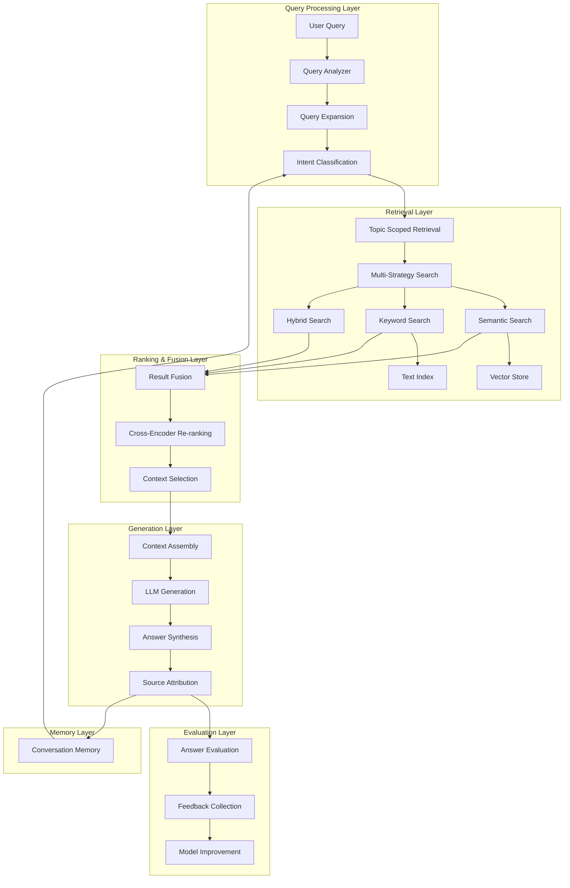

# Advanced RAG System Design for Multi-Resource Topic Chat

## 🎯 系统目标

设计一个先进的RAG系统，能够在一个topic下的多个资源间进行精准的对话问答。系统需要满足：

1. **多资源整合**: 一个主题下的多个文档能够协同提供答案
2. **精准回答**: 通过先进的检索和生成策略确保答案准确性
3. **上下文感知**: 支持多轮对话，理解上下文和引用关系
4. **可评估性**: 完整的评估框架确保系统质量

## 🏗️ 技术架构设计

### 核心架构图



### 分层架构详细设计

#### 1. 数据存储层 (Data Storage Layer)

```python
# 向量存储架构
class VectorStoreConfig:
    """向量数据库配置"""
    primary_store: str = "weaviate"  # 主向量库
    backup_store: str = "chromadb"   # 备份向量库
    embedding_model: str = "bge-large-zh-v1.5"  # 中文优化
    dimension: int = 1024
    
    # 分片策略
    sharding_strategy: str = "topic_based"
    max_docs_per_shard: int = 100000
    
    # 索引配置
    index_type: str = "HNSW"
    ef_construction: int = 200
    m: int = 16
```

**技术选型**:
- **向量数据库**: Weaviate (生产) + ChromaDB (开发)
- **图数据库**: Neo4j (知识图谱)
- **缓存层**: Redis (检索结果缓存)
- **元数据**: PostgreSQL (结构化数据)

#### 2. 嵌入与索引层 (Embedding & Indexing Layer)

```python
class AdvancedEmbeddingSystem:
    """先进的嵌入系统"""
    
    def __init__(self):
        # 多模型嵌入策略
        self.models = {
            "text_zh": "BAAI/bge-large-zh-v1.5",      # 中文文本
            "text_en": "BAAI/bge-large-en-v1.5",      # 英文文本  
            "code": "microsoft/codebert-base",         # 代码
            "math": "microsoft/math-bert-base",        # 数学公式
            "multimodal": "openai/clip-vit-base"       # 图文
        }
        
    async def embed_document(self, doc: Document) -> Dict[str, Any]:
        """文档嵌入处理"""
        # 内容类型检测
        content_type = self.detect_content_type(doc.content)
        
        # 选择合适的嵌入模型
        model = self.select_embedding_model(content_type, doc.language)
        
        # 语义分块
        chunks = await self.semantic_chunking(doc.content)
        
        # 生成嵌入向量
        embeddings = []
        for chunk in chunks:
            vector = await self.generate_embedding(chunk, model)
            embeddings.append({
                "chunk_id": chunk.id,
                "vector": vector,
                "metadata": self.extract_metadata(chunk)
            })
            
        return {
            "document_id": doc.id,
            "embeddings": embeddings,
            "model_used": model,
            "chunk_strategy": "semantic"
        }
```

**关键特性**:
- **多模型支持**: 根据内容类型选择最优嵌入模型
- **语义分块**: 基于语义边界的智能分块策略
- **多语言支持**: 中英文混合内容处理
- **增量更新**: 支持文档更新时的增量嵌入

#### 3. 检索与排序层 (Retrieval & Ranking Layer)

```python
class MultiStrategyRetriever:
    """多策略检索器"""
    
    def __init__(self):
        self.strategies = {
            "semantic": SemanticRetriever(),
            "keyword": BM25Retriever(), 
            "hybrid": HybridRetriever(),
            "graph": GraphRetriever()
        }
        self.reranker = CrossEncoderReranker()
        
    async def retrieve(self, query: str, topic_id: int, 
                      strategy: str = "hybrid") -> List[RetrievalResult]:
        """主检索接口"""
        
        # 1. 查询预处理
        processed_query = await self.preprocess_query(query)
        
        # 2. Topic范围限定
        topic_filter = await self.get_topic_filter(topic_id)
        
        # 3. 多策略检索
        if strategy == "hybrid":
            results = await self.hybrid_retrieve(
                processed_query, topic_filter
            )
        else:
            retriever = self.strategies[strategy]
            results = await retriever.retrieve(
                processed_query, topic_filter
            )
        
        # 4. 重排序
        reranked_results = await self.reranker.rerank(
            query, results
        )
        
        # 5. 多样性优化
        diverse_results = await self.diversify_results(
            reranked_results
        )
        
        return diverse_results
        
    async def hybrid_retrieve(self, query: str, 
                            topic_filter: Dict) -> List[RetrievalResult]:
        """混合检索策略"""
        
        # 并行执行多种检索策略
        semantic_task = self.strategies["semantic"].retrieve(
            query, topic_filter, top_k=20
        )
        keyword_task = self.strategies["keyword"].retrieve(
            query, topic_filter, top_k=20  
        )
        graph_task = self.strategies["graph"].retrieve(
            query, topic_filter, top_k=10
        )
        
        # 等待所有检索完成
        semantic_results, keyword_results, graph_results = await asyncio.gather(
            semantic_task, keyword_task, graph_task
        )
        
        # 结果融合 (Reciprocal Rank Fusion)
        fused_results = self.fuse_results([
            semantic_results, keyword_results, graph_results
        ], weights=[0.5, 0.3, 0.2])
        
        return fused_results
```

**检索策略**:
1. **语义检索**: 基于向量相似度的检索
2. **关键词检索**: BM25/TF-IDF传统检索
3. **混合检索**: 语义+关键词加权融合
4. **图检索**: 基于知识图谱的关系检索

#### 4. 上下文管理层 (Context Management Layer)

```python
class ContextManager:
    """上下文管理器"""
    
    def __init__(self):
        self.conversation_memory = ConversationMemory()
        self.context_window = 4096  # token限制
        
    async def build_context(self, query: str, retrieval_results: List[RetrievalResult],
                          conversation_id: str) -> ContextualPrompt:
        """构建上下文提示"""
        
        # 1. 获取对话历史
        conversation_history = await self.conversation_memory.get_history(
            conversation_id, max_turns=5
        )
        
        # 2. 检索结果过滤和排序
        relevant_chunks = await self.filter_relevant_chunks(
            retrieval_results, query, conversation_history
        )
        
        # 3. 上下文长度管理
        managed_context = await self.manage_context_length(
            relevant_chunks, self.context_window
        )
        
        # 4. 构建结构化提示
        prompt = ContextualPrompt(
            system_instruction=self.get_system_instruction(),
            conversation_history=conversation_history,
            retrieved_context=managed_context,
            current_query=query,
            metadata={
                "topic_id": retrieval_results[0].topic_id,
                "source_count": len(set(chunk.document_id for chunk in managed_context)),
                "confidence_scores": [chunk.score for chunk in managed_context]
            }
        )
        
        return prompt
        
    def get_system_instruction(self) -> str:
        """获取系统指令"""
        return """
        你是一个专业的知识助手，专门回答基于给定文档内容的问题。
        
        指导原则：
        1. 仅基于提供的上下文回答问题，不要编造信息
        2. 如果上下文中没有相关信息，明确说明
        3. 引用具体的文档来源和页码（如果可用）
        4. 对于复杂问题，整合多个文档的信息给出综合回答
        5. 保持回答的准确性和相关性
        6. 用中文回答（除非用户指定其他语言）
        
        回答格式：
        - 直接回答问题
        - 提供支持性证据和来源
        - 如有不确定性，明确标注
        """
```

#### 5. 生成与合成层 (Generation & Synthesis Layer)

```python
class AdvancedAnswerGenerator:
    """先进的答案生成器"""
    
    def __init__(self):
        self.llm_config = {
            "primary": "gpt-4-turbo",      # 主要生成模型
            "backup": "claude-3-sonnet",    # 备用模型
            "local": "qwen-14b-chat"       # 本地部署选项
        }
        self.citation_manager = CitationManager()
        
    async def generate_answer(self, context_prompt: ContextualPrompt) -> GeneratedAnswer:
        """生成答案"""
        
        try:
            # 1. 主要模型生成
            answer = await self.generate_with_model(
                context_prompt, self.llm_config["primary"]
            )
        except Exception as e:
            # 2. 备用模型
            logger.warning(f"Primary model failed: {e}")
            answer = await self.generate_with_model(
                context_prompt, self.llm_config["backup"]
            )
        
        # 3. 答案后处理
        processed_answer = await self.post_process_answer(answer, context_prompt)
        
        # 4. 引用和来源处理
        answer_with_citations = await self.citation_manager.add_citations(
            processed_answer, context_prompt.retrieved_context
        )
        
        # 5. 置信度评估
        confidence_score = await self.assess_confidence(
            answer_with_citations, context_prompt
        )
        
        return GeneratedAnswer(
            content=answer_with_citations,
            confidence=confidence_score,
            sources=self.extract_sources(context_prompt.retrieved_context),
            model_used=self.llm_config["primary"],
            generation_metadata={
                "context_length": len(context_prompt.retrieved_context),
                "source_diversity": self.calculate_source_diversity(context_prompt),
                "answer_length": len(answer_with_citations)
            }
        )
        
    async def multi_document_synthesis(self, contexts: List[DocumentContext]) -> str:
        """多文档信息合成"""
        
        synthesis_prompt = f"""
        基于以下多个文档的信息，提供一个综合性的回答：
        
        {self.format_multi_document_context(contexts)}
        
        请整合这些信息，提供一个连贯、全面的答案，并标明每个信息点的来源。
        """
        
        return await self.generate_with_model(synthesis_prompt, "gpt-4-turbo")
```

## 🔍 多资源Topic Chat实现

### Chat系统架构

```python
class TopicChatSystem:
    """基于Topic的多资源聊天系统"""
    
    def __init__(self):
        self.retriever = MultiStrategyRetriever()
        self.context_manager = ContextManager()
        self.answer_generator = AdvancedAnswerGenerator()
        self.conversation_store = ConversationStore()
        
    async def chat(self, query: str, topic_id: int, 
                  conversation_id: str) -> ChatResponse:
        """主要聊天接口"""
        
        # 1. 查询理解和预处理
        query_analysis = await self.analyze_query(query, topic_id)
        
        # 2. 检索相关内容
        retrieval_results = await self.retriever.retrieve(
            query_analysis.processed_query,
            topic_id,
            strategy=query_analysis.best_strategy
        )
        
        # 3. 构建上下文
        context_prompt = await self.context_manager.build_context(
            query, retrieval_results, conversation_id
        )
        
        # 4. 生成答案
        answer = await self.answer_generator.generate_answer(context_prompt)
        
        # 5. 保存对话
        await self.conversation_store.save_turn(
            conversation_id=conversation_id,
            query=query,
            answer=answer,
            context=context_prompt,
            metadata={
                "topic_id": topic_id,
                "retrieval_strategy": query_analysis.best_strategy,
                "sources_used": len(answer.sources)
            }
        )
        
        # 6. 构建响应
        response = ChatResponse(
            answer=answer.content,
            confidence=answer.confidence,
            sources=answer.sources,
            conversation_id=conversation_id,
            follow_up_suggestions=await self.generate_follow_ups(
                query, answer, topic_id
            )
        )
        
        return response
        
    async def analyze_query(self, query: str, topic_id: int) -> QueryAnalysis:
        """查询分析"""
        
        # 获取topic相关信息
        topic_info = await self.get_topic_info(topic_id)
        
        # 查询分类
        query_type = await self.classify_query_type(query)
        
        # 查询扩展
        expanded_query = await self.expand_query(query, topic_info)
        
        # 检索策略选择
        best_strategy = self.select_retrieval_strategy(query_type, topic_info)
        
        return QueryAnalysis(
            original_query=query,
            processed_query=expanded_query,
            query_type=query_type,
            best_strategy=best_strategy,
            topic_context=topic_info
        )
```

### 多轮对话支持

```python
class ConversationContext:
    """对话上下文管理"""
    
    def __init__(self):
        self.memory_window = 10  # 保持最近10轮对话
        self.entity_tracker = EntityTracker()  # 实体追踪
        self.topic_tracker = TopicTracker()    # 话题追踪
        
    async def maintain_context(self, conversation_id: str) -> ConversationState:
        """维护对话上下文"""
        
        # 获取历史对话
        history = await self.get_conversation_history(
            conversation_id, self.memory_window
        )
        
        # 实体追踪和共指消解
        entities = await self.entity_tracker.track_entities(history)
        
        # 话题演化追踪
        topic_flow = await self.topic_tracker.track_topics(history)
        
        # 上下文状态
        return ConversationState(
            current_entities=entities,
            topic_progression=topic_flow,
            unresolved_references=await self.find_unresolved_references(history),
            context_summary=await self.summarize_context(history)
        )
```

## 📊 评估框架设计

### 评估体系架构

```python
class RAGEvaluationFramework:
    """RAG评估框架"""
    
    def __init__(self):
        self.metrics = {
            # 检索评估
            "retrieval": RetrievalMetrics(),
            # 生成评估  
            "generation": GenerationMetrics(),
            # 端到端评估
            "end_to_end": EndToEndMetrics(),
            # 用户体验评估
            "user_experience": UXMetrics()
        }
        
    async def comprehensive_evaluation(self, 
                                     test_dataset: List[TestCase]) -> EvaluationReport:
        """综合评估"""
        
        results = {}
        
        # 1. 检索质量评估
        retrieval_results = await self.evaluate_retrieval(test_dataset)
        results["retrieval"] = retrieval_results
        
        # 2. 生成质量评估
        generation_results = await self.evaluate_generation(test_dataset)
        results["generation"] = generation_results
        
        # 3. 端到端评估
        e2e_results = await self.evaluate_end_to_end(test_dataset)
        results["end_to_end"] = e2e_results
        
        # 4. 用户体验评估
        ux_results = await self.evaluate_user_experience(test_dataset)
        results["user_experience"] = ux_results
        
        # 5. 生成报告
        report = EvaluationReport(
            overall_score=self.calculate_overall_score(results),
            detailed_metrics=results,
            recommendations=await self.generate_recommendations(results),
            timestamp=datetime.now()
        )
        
        return report
        
class RetrievalMetrics:
    """检索评估指标"""
    
    async def evaluate(self, queries: List[str], 
                      ground_truth: List[List[str]],
                      retrieved_results: List[List[str]]) -> Dict[str, float]:
        """检索评估"""
        
        metrics = {}
        
        # Precision@K
        for k in [1, 3, 5, 10]:
            precision_k = self.calculate_precision_at_k(
                retrieved_results, ground_truth, k
            )
            metrics[f"precision@{k}"] = precision_k
            
        # Recall@K  
        for k in [1, 3, 5, 10]:
            recall_k = self.calculate_recall_at_k(
                retrieved_results, ground_truth, k
            )
            metrics[f"recall@{k}"] = recall_k
            
        # MRR (Mean Reciprocal Rank)
        metrics["mrr"] = self.calculate_mrr(retrieved_results, ground_truth)
        
        # NDCG (Normalized Discounted Cumulative Gain)
        metrics["ndcg@10"] = self.calculate_ndcg(
            retrieved_results, ground_truth, k=10
        )
        
        # Hit Rate
        metrics["hit_rate"] = self.calculate_hit_rate(
            retrieved_results, ground_truth
        )
        
        return metrics

class GenerationMetrics:
    """生成评估指标"""
    
    async def evaluate(self, questions: List[str],
                      generated_answers: List[str],
                      reference_answers: List[str],
                      contexts: List[List[str]]) -> Dict[str, float]:
        """生成质量评估"""
        
        metrics = {}
        
        # BLEU Score
        metrics["bleu"] = await self.calculate_bleu(
            generated_answers, reference_answers
        )
        
        # ROUGE Scores
        rouge_scores = await self.calculate_rouge(
            generated_answers, reference_answers
        )
        metrics.update(rouge_scores)
        
        # BERTScore
        metrics["bert_score"] = await self.calculate_bert_score(
            generated_answers, reference_answers
        )
        
        # Faithfulness (基于LLM的评估)
        metrics["faithfulness"] = await self.calculate_faithfulness(
            generated_answers, contexts
        )
        
        # Answer Relevance
        metrics["answer_relevance"] = await self.calculate_answer_relevance(
            questions, generated_answers
        )
        
        # Context Precision
        metrics["context_precision"] = await self.calculate_context_precision(
            questions, contexts, reference_answers
        )
        
        return metrics
```

## 🚀 实施方案

### Phase 1: 核心RAG Pipeline (4-6周)

1. **向量存储集成**
   ```python
   # 集成Weaviate向量数据库
   class WeaviateVectorStore:
       async def setup_schema(self, topic_id: int):
           # 创建topic-specific schema
           pass
           
       async def index_documents(self, documents: List[Document]):
           # 批量索引文档
           pass
   ```

2. **嵌入系统**
   ```python
   # 多模型嵌入管理
   class EmbeddingManager:
       async def embed_text(self, text: str, model: str):
           # 生成文本嵌入
           pass
   ```

3. **基础检索**
   ```python
   # 实现语义检索
   class SemanticRetriever:
       async def search(self, query: str, topic_id: int):
           # 语义搜索实现
           pass
   ```

### Phase 2: 高级检索策略 (4-6周)

1. **混合检索**
2. **重排序机制**
3. **查询优化**
4. **上下文管理**

### Phase 3: 对话系统 (3-4周)

1. **多轮对话支持**
2. **上下文维护**
3. **Follow-up生成**

### Phase 4: 评估与优化 (2-3周)

1. **评估框架实现**
2. **A/B测试系统**
3. **持续优化机制**

## 📈 性能优化策略

### 1. 缓存策略
```python
class RAGCacheManager:
    """RAG缓存管理"""
    
    def __init__(self):
        self.embedding_cache = RedisCache("embeddings", ttl=86400)
        self.retrieval_cache = RedisCache("retrieval", ttl=3600)
        self.generation_cache = RedisCache("generation", ttl=1800)
        
    async def cache_embedding(self, text_hash: str, embedding: List[float]):
        await self.embedding_cache.set(text_hash, embedding)
        
    async def cache_retrieval_result(self, query_hash: str, results: List[Dict]):
        await self.retrieval_cache.set(query_hash, results)
```

### 2. 异步处理
```python
class AsyncRAGPipeline:
    """异步RAG处理管道"""
    
    async def process_batch(self, queries: List[str]) -> List[ChatResponse]:
        # 批量异步处理
        tasks = [self.process_single_query(query) for query in queries]
        return await asyncio.gather(*tasks)
```

### 3. 资源管理
```python
class ResourceManager:
    """资源管理器"""
    
    def __init__(self):
        self.model_pool = ModelPool(max_models=3)
        self.connection_pool = ConnectionPool(max_connections=20)
        
    async def allocate_resources(self, workload_type: str):
        # 根据工作负载分配资源
        pass
```

## 🛡️ 质量保证

### 1. 数据质量
- 文档预处理和清洗
- 分块质量验证
- 嵌入质量检查

### 2. 检索质量  
- 检索结果相关性验证
- 覆盖率检查
- 多样性保证

### 3. 生成质量
- 事实性检查
- 一致性验证
- 引用准确性

### 4. 用户体验
- 响应时间优化
- 答案可读性
- 交互自然性

这个设计提供了一个完整的、可扩展的、高性能的多资源Topic Chat RAG系统，涵盖了从技术选型到实施方案的各个方面。