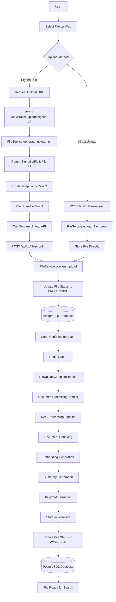
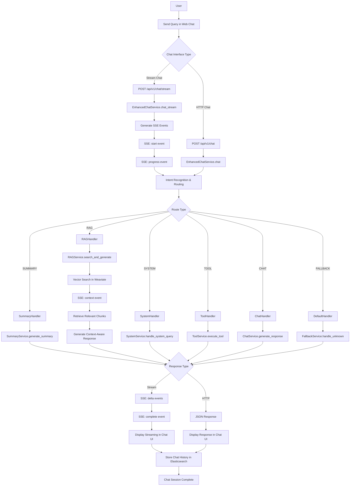
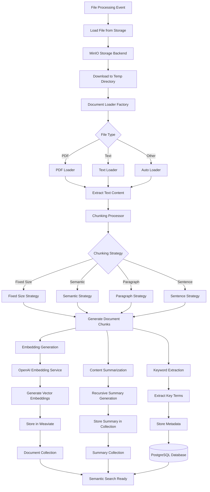
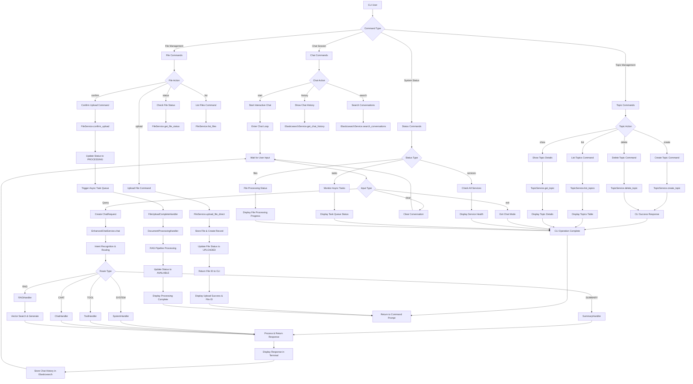
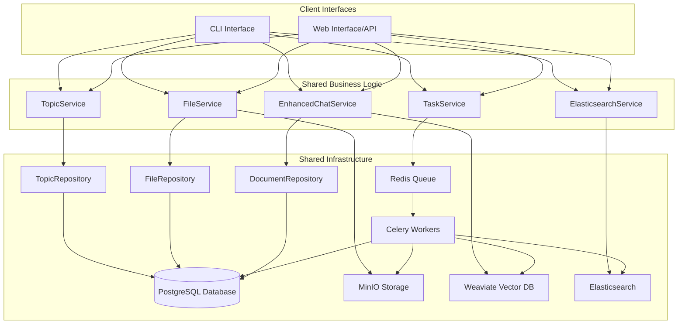
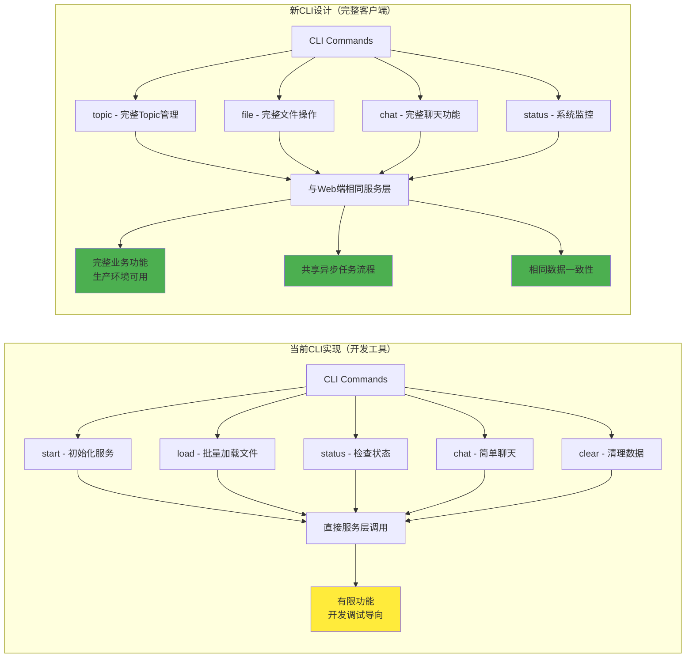

# CLAUDE.md

This file provides guidance to Claude Code (claude.ai/code) when working with code in this repository.

## Project Overview

This is a RAG (Retrieval-Augmented Generation) knowledge management system based on the NotebookLM concept, implementing an intelligent agent for solving the "island problem" between PDF documents. The project follows modular architecture with clean separation of concerns and SOLID principles.

**Key Architecture:** FastAPI + SQLAlchemy + PostgreSQL + Redis + MinIO + Weaviate + Celery with clean layered architecture (Schema → Repository → Service → API).

**Technology Stack:**
- **Backend:** FastAPI with async/await patterns
- **Database:** PostgreSQL with SQLAlchemy ORM + Alembic migrations
- **Vector Store:** Weaviate for semantic search capabilities  
- **Cache/Queue:** Redis for caching + Celery for background tasks
- **Storage:** MinIO for object storage (S3-compatible)
- **Package Management:** UV for fast Python dependency management
- **Monitoring:** Structured logging + health checks + metrics collection

## Development Commands

### Package Management (UV)
The project uses UV for fast Python package management:
- `make install` - Install production dependencies
- `make install-dev` - Install development dependencies  
- `make install-all` - Install all dependencies
- `make setup-dev` - Complete development environment setup
- `uv add package-name` - Add new dependency
- `uv sync` - Sync dependencies from lock file

### Middleware Services
Docker-based middleware stack with PostgreSQL, Weaviate, Redis, MinIO, Elasticsearch:
- `make start` - Start all middleware services
- `make stop` - Stop all middleware services
- `make status` - Check service status
- `make logs` - View all service logs
- `make health-check` - Check service health

### Development Server
FastAPI application with multiple server modes:
- `make server` or `make server-quick` - Start development server with hot reload
- `make server-prod` - Start production server
- `make server-debug` - Start with debug logging
- `make server-status` - Check server status
- `make server-stop` - Stop running server

### Database Management
Alembic-based database migrations:
- `make db-init` - Initialize database and run migrations
- `make db-migrate` - Create new migration
- `make db-upgrade` - Apply pending migrations
- `make db-status` - Check migration status
- `make db-backup` - Create database backup

### Code Quality
- `make format` - Format code with Black and isort
- `make lint` - Run flake8 and mypy linting  
- `make check` - Format and lint code
- `make test` - Run pytest tests
- `make test-cov` - Run tests with coverage
- `make pre-commit` - Run pre-commit hooks

### Testing Individual Components
- `python -m pytest tests/unit/file_loader/` - Run file loader tests
- `python -m pytest tests/integration/ -v` - Run integration tests with verbose output
- `python -m pytest tests/unit/file_loader/test_pdf_loader.py::TestPDFLoader::test_specific_method` - Run specific test
- `python -m pytest -m "not slow"` - Run tests excluding slow ones
- `python -m pytest -m "database"` - Run only database integration tests
- `python -m pytest --cov=modules --cov-report=html` - Generate HTML coverage report

## Architecture Overview

### Core Architecture Layers (Bottom-Up)

**1. Schemas Layer (`modules/schemas/`)**
- Pydantic models for data validation and serialization
- Enums for system-wide constants (FileStatus, ContentType, ProcessingStatus)
- Converter functions between database models and API schemas
- Import pattern: `from modules.schemas import FileSchema, ContentType`

**2. Database Layer (`modules/database/`)**
- SQLAlchemy models and database connection management
- Database service for health checks and basic operations
- Alembic migrations in `alembic/versions/`
- Import pattern: `from modules.database import get_db_session, File, Topic`

**3. Repository Layer (`modules/repository/`)**
- Data access abstraction following Repository pattern
- Interfaces in `interfaces.py`, implementations per entity
- Base repository with common CRUD operations
- Import pattern: `from modules.repository import FileRepository, TopicRepository`

**4. Service Layer (`modules/services/`)**
- Business logic orchestration and domain operations
- Cross-cutting concerns (caching, validation, workflows)
- Task service for async background processing with Celery
- Import pattern: `from modules.services import FileService, TopicService`

**5. API Layer (`modules/api/`)**
- FastAPI routers and HTTP request handling
- Error handlers and response formatting
- Route organization by domain (topics, files, documents)
- Import pattern: `from modules.api import api_router`

### Supporting Modules

**RAG System (`modules/rag/`)**
- Document processing pipeline with orchestrator pattern
- Embedding providers, vector stores, and search capabilities
- Processors for chunking, text processing, and content extraction
- Pipeline management for end-to-end document workflows

**File Processing (`modules/file_loader/`, `modules/file_upload/`)**
- Multi-format file loading (PDF, text, etc.) with factory pattern
- File upload service with signed URLs and storage backends
- Content type detection and metadata extraction
- Support for local, MinIO, and cloud storage

**Storage Backends (`modules/storage/`)**
- Abstracted storage interface with multiple implementations
- MinIO, local filesystem, and mock storage for testing
- Signed URL generation and file management operations

**Task System (`modules/tasks/`)**
- Celery-based async task processing with Redis broker
- Task handlers for file processing, document operations, and RAG workflows
- Priority queues, retry logic, and monitoring
- Decorators for task registration and configuration
- TaskRegistry for managing task handlers and configurations

### Configuration System

**Centralized Config (`config/`)**
- Pydantic Settings with environment variable support and .env file loading
- Nested configuration with delimiter support (e.g., `DATABASE__HOST`)
- Database, storage, Redis, Celery, and AI service configurations
- Environment-specific settings (development, testing, production)
- Comprehensive validation and security checks for production environments
- API documentation settings (Swagger/OpenAPI)

**Import Patterns (All Absolute)**
The codebase uses absolute imports exclusively:
- `from modules.schemas.enums import FileStatus`
- `from modules.services.file_service import FileService`
- `from modules.database.models import Topic, File`

## Core Business Flows

### 1. Topic Management
- Users create, edit, and delete topics through `TopicService`
- Topics can be associated with multiple files and documents
- Status management (active, archived, draft, completed)

### 2. RAG Processing Pipeline
- File upload through signed URLs (`FileService`)
- Document processing via `DocumentOrchestrator`
- Content chunking with multiple strategies (fixed, semantic, paragraph)
- Embedding generation and vector storage
- Semantic search and retrieval capabilities

### 3. Document Lifecycle
- File upload → Processing → Chunking → Embedding → Search Ready
- Background task processing for scalability
- Error handling and retry mechanisms
- Progress tracking and status updates

## System Flow Diagrams

### 1. Topic Management Flow

```mermaid
graph TD
    A[User] --> B{Action Type}
    B -->|Create Topic| C[Web Frontend]
    B -->|Delete Topic| D[Web Frontend]
    B -->|View Topic| E[Web Frontend]
    
    C --> F[POST /api/v1/topics]
    D --> G[DELETE /api/v1/topics/{id}]
    E --> H[GET /api/v1/topics/{id}]
    
    F --> I[TopicService.create_topic]
    G --> J[TopicService.delete_topic]
    H --> K[TopicService.get_topic]
    
    I --> L[TopicRepository.create]
    J --> M[TopicRepository.delete]
    K --> N[TopicRepository.get_by_id]
    
    L --> O[(PostgreSQL Database)]
    M --> O
    N --> O
    
    O --> P[Success Response]
    P --> Q[Update Frontend UI]
    Q --> R[Display Result to User]
```

### 2. File Upload Flow



### 3. User Chat Flow



### 4. RAG Processing Pipeline



### 5. CLI Client Interface Flow



## CLI Client Interface Design

### CLI与Web端业务流程一致性设计

CLI客户端与Web端共享相同的业务逻辑和服务层，确保功能完全对等：

#### **1. 共享服务层架构**



#### **2. CLI命令设计与Web功能对应**

| Web功能 | CLI命令 | 共享服务 | 异步任务复用 |
|---------|---------|----------|-------------|
| 创建Topic | `rag topic create <name>` | TopicService.create_topic | ❌ |
| 删除Topic | `rag topic delete <id>` | TopicService.delete_topic | ❌ |
| 查看Topic | `rag topic show <id>` | TopicService.get_topic | ❌ |
| 文件上传 | `rag file upload <path>` | FileService.upload_file_direct | ✅ |
| 确认上传 | `rag file confirm <file_id>` | FileService.confirm_upload | ✅ |
| 文件状态 | `rag file status <file_id>` | FileService.get_file_status | ❌ |
| 开始聊天 | `rag chat start` | EnhancedChatService.chat | ❌ |
| 聊天历史 | `rag chat history` | ElasticsearchService | ❌ |
| 系统状态 | `rag status services` | Multiple Health Checks | ❌ |

#### **3. 完整异步任务流程复用**

**文件处理流程（CLI与Web完全一致）：**
```
CLI: rag file upload doc.pdf
├── FileService.upload_file_direct()
├── 创建文件记录（status: UPLOADED）
├── 返回 file_id 给CLI用户
└── 等待用户确认...

CLI: rag file confirm <file_id>
├── FileService.confirm_upload()
├── 更新状态为 PROCESSING
├── 触发Redis异步任务队列
├── FileUploadCompleteHandler 执行
├── DocumentProcessingHandler 执行
├── RAG Pipeline 完整处理
│   ├── 文档分块
│   ├── Embedding生成
│   ├── 向量存储
│   └── 摘要生成
└── 更新状态为 AVAILABLE
```

#### **4. CLI命令示例**

**Topic管理：**
```bash
# 创建新topic
rag topic create "机器学习研究" --description "深度学习相关文献"

# 列出所有topics
rag topic list --page 1 --size 10

# 查看topic详情
rag topic show 123

# 删除topic
rag topic delete 123
```

**文件管理：**
```bash
# 上传文件到指定topic
rag file upload ./research.pdf --topic-id 123 --title "深度学习论文"

# 确认文件上传，触发RAG处理
rag file confirm abc-123-def

# 查看文件处理状态
rag file status abc-123-def

# 监控文件处理进度
rag file status abc-123-def --watch

# 列出topic下的所有文件
rag file list --topic-id 123
```

**聊天交互：**
```bash
# 在指定topic下开始聊天
rag chat start --topic-id 123

# 单次问答
rag chat ask "什么是Transformer?" --topic-id 123

# 查看聊天历史
rag chat history --topic-id 123 --limit 20

# 搜索聊天记录
rag chat search "深度学习" --topic-id 123
```

**系统监控：**
```bash
# 检查服务状态
rag status services

# 监控异步任务队列
rag status tasks

# 查看文件处理进度
rag status files --processing

# 实时监控系统状态
rag status watch
```

#### **5. CLI实现架构**

**核心组件：**
```python
class CLIApplication:
    def __init__(self):
        self.session_manager = DatabaseSessionManager()
        self.topic_service = TopicService()
        self.file_service = FileService()
        self.chat_service = EnhancedChatService()
        self.task_monitor = CeleryTaskMonitor()
    
    async def handle_command(self, command: CLICommand):
        # 复用Web端相同的服务层调用
        pass

class CLITopicManager:
    def __init__(self, topic_service: TopicService):
        self.topic_service = topic_service
    
    async def create_topic(self, args: CreateTopicArgs):
        # 直接调用与Web端相同的服务方法
        result = await self.topic_service.create_topic(args.to_schema())
        return self.format_cli_response(result)

class CLIFileManager:
    def __init__(self, file_service: FileService):
        self.file_service = file_service
    
    async def upload_file(self, args: UploadFileArgs):
        # 与Web端完全相同的上传流程
        result = await self.file_service.upload_file_direct(args.to_schema())
        return result
    
    async def confirm_upload(self, file_id: str):
        # 触发与Web端相同的异步处理链
        result = await self.file_service.confirm_upload(
            ConfirmUploadRequest(file_id=file_id)
        )
        # 可选：实时显示处理进度
        await self.monitor_processing_progress(file_id)
        return result

class CLIChatManager:
    def __init__(self, chat_service: EnhancedChatService):
        self.chat_service = chat_service
    
    async def interactive_chat(self, topic_id: int):
        while True:
            user_input = await self.get_user_input()
            request = ChatRequest(
                message=user_input,
                topic_id=topic_id,
                include_context=True
            )
            # 使用与Web端相同的聊天服务
            response = await self.chat_service.chat(request)
            self.display_response(response)
```

#### **6. 配置复用**

CLI完全复用现有配置系统：
```python
# 使用相同的配置文件
from config.settings import get_config

config = get_config()
# 数据库、Redis、MinIO、Weaviate等配置完全一致
```

#### **7. 错误处理与日志**

CLI复用现有的错误处理和日志系统：
```python
from logging_system import get_logger, log_execution_time

logger = get_logger(__name__)

@log_execution_time()
async def cli_upload_file(file_path: str, topic_id: int):
    # 与Web端相同的日志记录和错误处理
    pass
```

这样设计确保了CLI与Web端的业务逻辑完全一致，只是交互方式不同。用户无论使用哪个接口，都能获得相同的功能体验和数据一致性。

#### **8. 当前实现 vs 新设计对比**



**关键改进点：**

| 功能领域 | 当前实现 | 新设计 | 改进说明 |
|----------|----------|--------|----------|
| **Topic管理** | ❌ 不支持 | ✅ 完整CRUD | 与Web端功能对等 |
| **文件上传** | 🟡 批量加载，无确认机制 | ✅ 上传+确认分离 | 支持异步处理监控 |
| **文件状态** | ❌ 无状态查询 | ✅ 实时状态监控 | 可跟踪处理进度 |
| **聊天功能** | 🟡 基础聊天 | ✅ 完整聊天体验 | 历史、搜索、多topic |
| **异步任务** | ❌ 不复用 | ✅ 完全复用 | 与Web端一致的处理流程 |
| **配置系统** | ✅ 已复用 | ✅ 继续复用 | 无变化 |
| **错误处理** | ✅ 已复用 | ✅ 继续复用 | 无变化 |
| **用户定位** | 🛠️ 开发者工具 | 👥 生产用户界面 | 从调试工具升级为客户端 |

**实现优先级建议：**
1. 🔥 **高优先级**：Topic管理命令（create, list, show, delete）
2. 🔥 **高优先级**：文件确认机制（confirm命令）和状态监控
3. 🟡 **中优先级**：完整聊天功能（history, search命令）
4. 🟢 **低优先级**：高级监控功能（watch模式，实时进度）

## Key Development Patterns

### Database Operations
```python
async with get_db_session() as session:
    repository = FileRepository(session)
    file = await repository.create_file(file_data)
```

### Service Layer Usage
```python
file_service = FileService(session, storage_backend)
result = await file_service.confirm_upload(request)
```

### Task Processing
```python
@task_handler("document.process", priority=TaskPriority.HIGH)
class DocumentProcessingHandler(ITaskHandler):
    async def handle(self, document_id: str) -> Dict[str, Any]:
        # Implementation
```

### Error Handling
- Domain-specific exceptions with error codes
- Structured error responses through API layer
- Centralized error handlers in `modules/api/error_handlers.py`

## Database Schema

**Core Tables:**
- `topics` - Topic management with metadata and status
- `files` - File storage with upload status and metadata
- `documents` - Processed document content and chunks
- `topic_files` - Many-to-many relationship between topics and files

**Key Relationships:**
- Topics have many Files (M:N through topic_files)
- Files have many Documents (1:N)
- Documents have many DocumentChunks (1:N)

## Docker Middleware Services

The development environment uses Docker Compose with these services:

- **PostgreSQL** (port 5432): Main database with health checks
- **Weaviate** (port 8080): Vector database for semantic search
- **Redis** (port 6379): Cache and Celery task broker
- **MinIO** (port 9000): S3-compatible object storage
- **Elasticsearch** (port 9200): Full-text search capabilities
- **Grafana** (port 3000): Monitoring dashboards
- **Prometheus** (port 9090): Metrics collection

**Service Management:**
- All services include health checks and automatic restart policies
- Data persistence through named Docker volumes
- Network isolation through `rag-network`
- Service discovery through container names

## Development Guidelines

- All modules follow SOLID principles with clear separation of concerns
- Use absolute imports exclusively (already implemented): `from modules.service import FileService`
- Repository pattern for data access with interface abstractions
- Service layer for business logic orchestration
- Async/await throughout for scalable I/O operations
- Pydantic for data validation and serialization
- Use TDD approach with pytest for all new features
- All comments and documentation in English

## Testing Structure

- `tests/unit/` - Unit tests for individual components
- `tests/integration/` - Integration tests for component interactions  
- `tests/conftest.py` - Shared test fixtures and configuration
- Mock external dependencies (storage, databases) in unit tests
- Use real services for integration tests with Docker middleware

**Testing Patterns:**
- Automatic test marking based on file location and naming
- Database fixtures with automatic setup/teardown per test
- Async test client with dependency overrides for API testing
- Test database isolation using NullPool and separate test DB
- Comprehensive pytest markers: `integration`, `slow`, `database`, `api`, `fullstack`

## Monitoring and Observability

- Structured logging through `logging_system/` module
- Task monitoring service for Celery queue management
- Health check endpoints for system components
- Prometheus/Grafana integration for metrics collection

## Known Architectural Issues

⚠️ **IMPORTANT: Model/Schema Overlap Issues** - There are currently significant overlaps and unclear responsibilities between models and schemas:

- **Duplicate Enums**: Same enums defined in `modules/models.py` AND `modules/schemas/enums.py`
- **Conflicting DocumentChunk Models**: Three different DocumentChunk definitions with different field names
- **Mixed Responsibilities**: `modules/models.py` contains domain models, API models, enums, and exceptions
- **Inconsistent Field Naming**: Same concepts use different field names across layers

**When Working With Models/Schemas:**
- Be aware of these overlaps when making changes
- Check both `modules/models.py` and `modules/schemas/` for existing definitions
- Consider consolidating duplicate enums and standardizing field names
- Prefer using schemas from `modules/schemas/` for API-related work

## Common Troubleshooting

**Import Issues**: All imports are absolute - use `from modules.package import ClassName`
**Database Issues**: Check middleware services with `make status`, run `make db-upgrade`
**Task Processing**: Monitor Celery workers and check task queues in Redis
**File Processing**: Verify storage backend configuration and file permissions
**Model Conflicts**: Check both `modules/models.py` and `modules/schemas/` for duplicate definitions