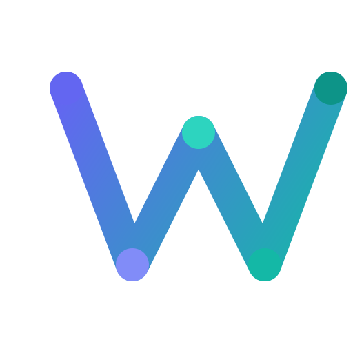

<p align="center">
  
</p>

<h1 align="center">🕸️ Weaver</h1>

<p align="center">
  <strong>The Open-Source NotebookLM Alternative with Infinite Canvas</strong><br>
  A self-hosted Google NotebookLM replacement that gives you complete control.<br>
  Chat with documents, generate mindmaps, and organize research visually.
</p>

<p align="center">
  <a href="https://github.com/guangtouwangba/weaver/stargazers"></a>
  <a href="https://github.com/guangtouwangba/weaver/network/members"></a>
  <a href="https://github.com/guangtouwangba/weaver/issues"></a>
</p>

<p align="center">
  <a href="LICENSE-AGPL"></a>
  <a href="https://www.python.org/"></a>
  <a href="https://nextjs.org/"></a>
  <a href="https://fastapi.tiangolo.com/"></a>
</p>

<p align="center">
  <a href="https://weaver.zeabur.app"><strong>🌐 Try Live Demo</strong></a> · 
  <a href="#-quick-start"><strong>🚀 Quick Start</strong></a> · 
  <a href="#-features"><strong>✨ Features</strong></a> · 
  <a href="./README.zh-CN.md"><strong>🇨🇳 中文文档</strong></a>
</p>

---

## 🤔 Why Weaver? (NotebookLM vs Weaver)

**Tired of Google NotebookLM's limitations?** Weaver is a **free, open-source NotebookLM alternative** that you can self-host and customize.

| Feature | Google NotebookLM | **Weaver** |
|---------|-------------------|------------|
| **Open Source** | ❌ Proprietary | ✅ **AGPL-3.0** |
| **Self-Hosted** | ❌ Google Cloud only | ✅ **Deploy anywhere** |
| **Visual Canvas** | ❌ List-based UI | ✅ **Infinite canvas workspace** |
| **LLM Choice** | ❌ Gemini only | ✅ **Any LLM** (Claude, GPT-4, Gemini, Ollama) |
| **Video Sources** | YouTube only | ✅ **YouTube + Bilibili + Douyin** |
| **Data Privacy** | ⚠️ Google servers | ✅ **Your data, your servers** |
| **API Access** | ❌ None | ✅ **Full REST API** |
| **Cost** | 💰 Usage limits | ✅ **Pay only for LLM API** |

> **Weaver = NotebookLM + Miro + Obsidian** — All in one open-source package.

---

## ✨ Features

### 📚 Multi-Source Import (Like NotebookLM, But Better)
Import from multiple sources and let AI help you understand:
- **📄 PDF Documents** — OCR support for scanned documents
- **🌐 Web Pages** — Extract content from any URL
- **🎬 YouTube Videos** — Auto-transcribe with timestamps
- **📺 Bilibili & Douyin** — Chinese video platform support (NotebookLM can't do this!)

### 🎨 Infinite Canvas Workspace (Unique to Weaver)
Unlike NotebookLM's rigid list view, Weaver gives you a **visual thinking space**:
- **Drag-and-drop** nodes on an infinite canvas
- **Connect ideas** with relationship lines
- **Rich node types** — Notes, sources, AI-generated content
- **Real-time collaboration** via WebSocket

### 🤖 AI-Powered Research Tools
- **💬 RAG Chat** — Ask questions about your documents with citations
- **🧠 Mindmaps** — Auto-generate structured mindmaps
- **📝 Summaries** — AI summaries with source references
- **📇 Flashcards** — Generate study cards automatically
- **📰 Articles** — Synthesize long-form content

### 🔌 Built for Developers
- **Full API access** — Integrate with your workflow
- **Bring your own LLM** — OpenRouter, OpenAI, Anthropic, or local Ollama
- **Extensible** — Add custom sources and generators

---

## 🚀 Quick Start

Get Weaver running in 30 seconds:

```bash
# Clone the repository
git clone https://github.com/guangtouwangba/weaver.git
cd weaver

# Setup (creates venv, installs deps)
make setup

# Configure your API keys
cp env.example .env
# Edit .env and add OPENROUTER_API_KEY

# Run
make run-backend   # Terminal 1: API on :8000
make run-frontend  # Terminal 2: UI on :3000
```

> 💡 **Tip**: For quick local testing, set `AUTH_BYPASS_ENABLED=true` in `.env`

**Open http://localhost:3000 and start researching!** 🎉

---

## 🖼️ Screenshots

<!-- TODO: Add actual screenshots -->
<p align="center">
  <i>Screenshots coming soon! Star the repo to stay updated.</i>
</p>

---

## 📖 Use Cases

### 🎓 Students & Researchers
- Upload lecture PDFs and papers
- Ask questions across all your sources
- Generate study flashcards automatically
- Create visual mindmaps for exam prep

### ✍️ Content Creators
- Research topics from multiple sources
- Generate article outlines
- Organize ideas on the canvas
- Export structured content

### 💼 Professionals
- Analyze reports and documents
- Build a personal knowledge base
- Self-host for data privacy
- Integrate with existing workflows

---

## 🛠️ Tech Stack

| Layer | Technologies |
|-------|-------------|
| **Frontend** | Next.js 15, React 19, TypeScript, Konva.js (Canvas) |
| **Backend** | Python 3.11+, FastAPI, SQLAlchemy, LangGraph |
| **Database** | PostgreSQL, pgvector (Vector Search) |
| **AI/LLM** | OpenRouter, OpenAI, Anthropic, Ollama |

---

## 📋 Prerequisites

- Python 3.11+ / Node.js 18+
- PostgreSQL with pgvector extension
- macOS: `brew install poppler ffmpeg`
- Linux: `apt install poppler-utils ffmpeg`

---

## 🗺️ Roadmap

- [x] PDF/Web/YouTube import
- [x] Infinite canvas workspace
- [x] RAG chat with citations
- [x] Mindmap generation
- [ ] 🎙️ Podcast generation (like NotebookLM Audio Overviews)
- [ ] 📱 Mobile app
- [ ] 🔗 Obsidian plugin
- [ ] 🌍 Multi-language UI

---

## 📈 Star History

<a href="https://star-history.com/#guangtouwangba/weaver&Date">
  <picture>
    <source media="(prefers-color-scheme: dark)" srcset="https://api.star-history.com/svg?repos=guangtouwangba/weaver&type=Date&theme=dark" />
    <source media="(prefers-color-scheme: light)" srcset="https://api.star-history.com/svg?repos=guangtouwangba/weaver&type=Date" />
    
  </picture>
</a>

---

## 🤝 Contributing

We welcome contributions! Whether it's:
- 🐛 Bug reports
- 💡 Feature requests
- 📖 Documentation
- 🔧 Pull requests

See [CONTRIBUTING.md](CONTRIBUTING.md) to get started.

---

## 💬 Community

- ⭐ **Star this repo** if you find it useful!
- 🐛 [Report bugs](https://github.com/guangtouwangba/weaver/issues)
- 💡 [Request features](https://github.com/guangtouwangba/weaver/issues)
- 🐦 Follow updates on Twitter (coming soon)

---

## 📄 License

**Dual Licensed:**
- **Open Source**: [AGPL-3.0](LICENSE-AGPL) — Free to use, modifications must be open-sourced
- **Commercial**: Contact 819110812@qq.com for closed-source licensing

---

<p align="center">
  <strong>🕸️ Weaver — The open-source NotebookLM alternative</strong><br>
  <sub>Built with ❤️ by the Weaver community</sub><br>
  <sub>Inspired by <a href="https://notebooklm.google.com/">Google NotebookLM</a></sub>
</p>

<p align="center">
  <strong>If you're looking for an open-source NotebookLM replacement, give Weaver a ⭐!</strong>
</p>
