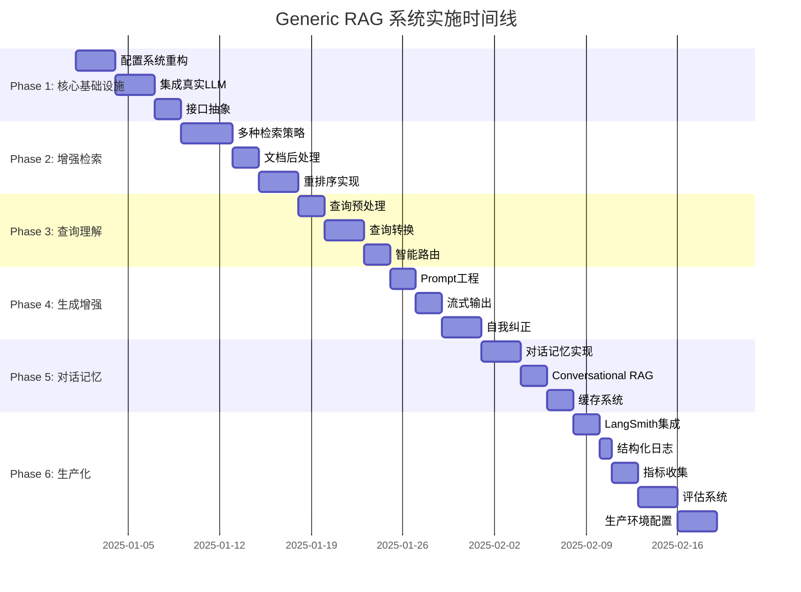

# Generic RAG 系统实施路线图

## 🆕 2025-11-18 更新摘要

本次更新根据实际代码实现情况，全面修订了各Phase的完成度评估：

**核心亮点** ✅:
- **Phase 1 (90%)**: 配置系统、LLM/Embeddings集成、接口抽象 - 基础扎实
- **Phase 3 (70%)**: 查询意图分类、智能路由 - 功能完整
- **Phase 5 (80%)**: 对话记忆系统（分层+语义检索）- 表现优秀
- **Phase 6 (55%)**: RAGAS评估系统和运行时评估 - 新增完成 ✨

**需要补充** ⚠️:
- **Phase 2 (40%)**: 缺少混合检索（BM25+Vector）和重排序
- **Phase 4 (50%)**: Prompt管理待完善，缺少自我纠正
- **Phase 6**: 缺少LangSmith追踪和Prometheus监控

**总体进度**: 约65%完成，核心RAG、对话式RAG和评估系统已可用，生产级监控特性需补充。

**最新完成** 🎉:
- ✅ RAGAS 评估框架集成（faithfulness, answer_relevancy, context_precision等）
- ✅ 运行时评估系统（sampling/async_all/batch三种模式）
- ✅ 评估数据集管理和结果持久化
- ✅ LLM响应清理（解决Claude返回markdown格式JSON的兼容性问题）
- ✅ 评估API接口（统计和结果查询）

---

## 🧠 AI KnowledgeOS 功能拆解（来自 PRD_01.md）

| 模块 | 核心目标 | 关键能力 | 当前状态 | 下一步 |
|------|----------|----------|----------|--------|
| **Capture Hub**（知识采集） | 低摩擦收集多源知识 | 文档/对话/浏览器/邮件接入、自动解析、质量评估 | 仅基础文档+对话输入 | 1) 接入多源 Connector 2) 内容分类/打标签 3) 采集任务面板 |
| **Insight Forge**（知识内化） | 把信息转成可消费的知识资产 | 摘要、知识卡片、观点对比、个性化版本 | 暂缺（仅有 QA prompt） | 1) AI 知识卡片 2) 多视角摘要 3) 个人/团队语境定制 |
| **Action Engine**（知识提取） | 在任务场景高效调用知识 | 场景化 RAG、Playbook、任务模板、引用链路 | 基础 QA/对话可用，RAG 评估完成 | 1) 场景化检索策略 2) 工作流模板 3) 回答引用追踪 |
| **Graph Studio**（知识链接） | 构建动态知识网络与洞察 | 自动图谱、交互探索、盲点提示、学习路径 | 规划阶段（PRD v1.1） | 1) MVP 动态图谱 2) AI 探索建议 3) 导出/分享能力 |

> 后续迭代需围绕以上四大模块推进，每个模块均包含“自动化 + 人机协作”闭环。

---

## 📋 目录

- [2025-11-16 更新摘要](#-2025-11-16-更新摘要)
- [当前状态评估](#当前状态评估)
- [实施路线图总览](#实施路线图总览)
- [详细实施计划](#详细实施计划)
  - [Phase 1: 核心基础设施](#phase-1-核心基础设施-week-1-2)
  - [Phase 2: 增强检索能力](#phase-2-增强检索能力-week-3-4)
  - [Phase 3: 查询理解与路由](#phase-3-查询理解与路由-week-5)
  - [Phase 4: 生成增强与验证](#phase-4-生成增强与验证-week-6)
  - [Phase 5: 对话与记忆](#phase-5-对话与记忆-week-7)
  - [Phase 6: 可观测性与生产化](#phase-6-可观测性与生产化-week-8-9)
  - [Phase 7: 高级特性](#phase-7-可选-高级特性-week-10)
- [最小可行产品 (MVP) 路径](#最小可行产品-mvp-路径)
- [实施建议](#实施建议)
- [关键成功指标](#关键成功指标-kpi)
- [下一步行动](#下一步行动)

---

## 📊 当前状态评估

> **最后更新**: 2025-11-16  
> **版本**: 0.2.0

### ✅ 已完成功能

#### 核心基础设施 (Phase 1) - 90% 完成
- ✅ **配置系统**: 完整的 Pydantic Settings，支持模块化配置（LLMConfig, EmbeddingConfig等）
- ✅ **真实 LLM 集成**: 支持 OpenRouter 和 OpenAI，带重试和错误处理
- ✅ **真实 Embeddings**: OpenAI 和 OpenRouter embeddings 支持
- ✅ **接口抽象**: 完整的 `RetrieverInterface`, `GeneratorInterface`, `RerankerInterface`, `MemoryInterface`
- ✅ **工厂模式**: RetrieverFactory 实现

#### 检索能力 (Phase 2) - 40% 完成
- ✅ **VectorRetriever**: 基于 FAISS 的向量检索，支持 similarity 和 MMR 搜索
- ✅ **RetrieverFactory**: 可配置的检索器工厂
- ⚠️ **HybridRetriever** (BM25+Vector): 未实现
- ⚠️ **Cross-Encoder Reranker**: 未实现
- ⚠️ **MultiQueryRetriever**: 未实现

#### 查询理解与路由 (Phase 3) - 70% 完成
- ✅ **查询意图分类**: 基于规则的 `QueryIntentClassifier`（META/DOCUMENT/HYBRID/GENERAL）
- ✅ **QueryRouter**: 智能路由决策，根据意图选择检索策略
- ✅ **查询上下文化**: 结合对话历史重写查询
- ✅ **语言检测**: 使用 langextract
- ⚠️ **语义路由**: semantic-router 库集成（部分完成）
- ⚠️ **Multi-Query 生成**: 未实现

#### 生成增强 (Phase 4) - 50% 完成
- ✅ **QA Chain**: 基于 LangChain 的问答链
- ✅ **流式输出**: SSE 流式响应支持
- ✅ **基础 Prompt**: QA prompts 实现
- ⚠️ **Prompt 管理系统**: 未完善
- ⚠️ **自我纠正机制**: 未实现
- ⚠️ **幻觉检测**: 未实现

#### 对话与记忆 (Phase 5) - 80% 完成
- ✅ **对话记忆系统**: 短期记忆（Buffer）+ 长期记忆（Semantic Search）
- ✅ **嵌入式记忆检索**: 基于 pgvector 的相似消息检索
- ✅ **Conversation 管理**: 完整的 ConversationService 和 MessageService
- ✅ **查询上下文化**: 自动重写含代词的查询
- ✅ **分层记忆**: 会话内记忆 + 主题级记忆
- ⚠️ **Redis 缓存**: 未实现
- ⚠️ **Summary Memory**: 未实现

#### 可观测性与生产化 (Phase 6) - 55% 完成
- ✅ **基础日志**: Python logging
- ✅ **Docker 化**: docker-compose.yml 配置
- ✅ **数据库迁移**: Alembic 迁移系统
- ✅ **PostgreSQL + pgvector**: 生产级向量存储
- ✅ **RAGAS 评估框架**: RAGASEvaluator 已实现，支持多种指标
- ✅ **运行时评估系统**: RuntimeEvaluator 已实现（采样/异步/批量三种模式）
- ✅ **评估数据管理**: EvaluationDataset 和评估结果存储
- ✅ **LLM 响应清理**: 自动处理 markdown 格式 JSON（Claude 兼容性）
- ⚠️ **LangSmith 集成**: 未实现
- ⚠️ **结构化日志** (structlog): 未实现
- ⚠️ **Prometheus 指标**: 未实现

#### 其他核心功能
- ✅ **LangGraph 工作流**: IngestGraph 和 QA Graph
- ✅ **文档处理**: PDF, DOCX 解析，langextract 多语言支持
- ✅ **Topic 管理**: 完整的主题和内容管理系统
- ✅ **API 层**: FastAPI 路由（topics, contents, conversations, messages, qa, search）
- ✅ **数据模型**: SQLAlchemy + Pydantic schemas
- ✅ **向量存储**: FAISS (本地) + pgvector (生产)

### 🎯 总体完成度: 约 65%

**核心 RAG 功能**: ✅ 已可用  
**对话式 RAG**: ✅ 已可用  
**评估系统**: ✅ 已可用  
**生产就绪**: ⚠️ 需要改进

### ❌ 待实现功能（按优先级）

#### 🔴 高优先级（Alignment with PRD）
1. **Capture Hub MVP**: 多源采集（文档/网页/对话/浏览器扩展）、内容分类、质量评分
2. **Insight Forge 基础能力**: AI 知识卡片、摘要/观点对比、个人化版本
3. **Action Engine 检索升级**: 混合检索 + Cross-Encoder 重排序 + 多查询策略，输出引用链路
4. **Observability Backbone**: LangSmith 追踪 + Prometheus 指标 + 结构化日志
5. **Graph Studio MVP**: 动态知识图谱、交互探索、盲点提示、导出分享

#### 🟡 中优先级
6. **Capture Hub 扩展**: 邮件/会议纪要 connector、自动任务面板
7. **Insight Forge 深度内化**: 学习路径、观点冲突检测、自我纠偏提示
8. **Action Engine 模板化**: 场景化 Playbook、工作流触发、回答引用可追踪
9. **Graph Studio Plus**: 跨主题关联、AI 导航、时间轴回放
10. **评估报告生成**: 基于 runtime evaluation 的周/月报 & 质量趋势

#### 🟢 低优先级
11. **Agentic RAG / Toolformer**: 复杂任务规划与工具调用
12. **知识图谱多模态增强**: 图片/音频节点
13. **自动化知识运营**: 智能提醒、知识缺口自动任务化
---

## 🎯 实施路线图总览



### 模块化里程碑（与 PRD_01 对齐）

| 里程碑 | 模块 | 时间盒 | 主要交付物 |
|--------|------|--------|------------|
| M1 | Capture Hub MVP | 2 周 | 多源采集 connector、自动解析/打标签、质量面板 |
| M2 | Insight Forge Alpha | 2 周 | AI 知识卡片、摘要/观点对比、个人化版本 |
| M3 | Action Engine Upgrade | 2 周 | 混合检索、Cross-Encoder 重排、引用链路输出 |
| M4 | Graph Studio MVP | 3 周 | 动态图谱、交互探索、盲点/路径提示、导出分享 |
| M5 | Observability Backbone | 1.5 周 | LangSmith tracing、Prometheus 指标、结构化日志 |

> M1-M3 可并行部分工程，但必须共用统一的数据模型和评估闭环。

### 时间线概览

| Phase | 名称 | 周期 | 优先级 | 状态 | 完成度 |
|-------|------|------|--------|------|--------|
| **Phase 1** | 核心基础设施 | Week 1-2 | ⭐⭐⭐⭐⭐ | 🟢 **已完成** | **90%** |
| **Phase 2** | 增强检索能力 | Week 3-4 | ⭐⭐⭐⭐⭐ | 🟡 **进行中** | **40%** |
| **Phase 3** | 查询理解与路由 | Week 5 | ⭐⭐⭐⭐ | 🟢 **基本完成** | **70%** |
| **Phase 4** | 生成增强与验证 | Week 6 | ⭐⭐⭐⭐ | 🟡 **进行中** | **50%** |
| **Phase 5** | 对话与记忆 | Week 7 | ⭐⭐⭐⭐ | 🟢 **基本完成** | **80%** |
| **Phase 6** | 可观测性与生产化 | Week 8-9 | ⭐⭐⭐⭐⭐ | 🟡 **进行中** | **30%** |
| **Phase 7** | 高级特性 (可选) | Week 10+ | ⭐⭐ | 🔴 **未开始** | **0%** |

**当前状态**: 
- ✅ **核心功能已可用**: 基础 RAG + 对话式 RAG
- 🚧 **正在完善**: 检索增强、可观测性
- 📅 **预计达到生产级**: 需补充 Phase 2 和 Phase 6 的剩余功能（约 2-3 周）

---

## 详细实施计划

## Phase 1: 核心基础设施 (Week 1-2) ✅ 90% 完成

**🎯 目标**: 建立坚实的基础架构，支持后续扩展

**⏱️ 预计时间**: 2 周 (8-10 工作日)  
**📊 实际状态**: ✅ 基本完成

### 1.1 重构配置系统 ✅ 已完成

**优先级**: ⭐⭐⭐⭐⭐ (必须)  
**工作量**: 2-3 天

#### 任务清单

- [x] **创建分层配置结构**
  ```
  已实现: shared_config/settings.py
  ├── LLMConfig - LLM配置
  ├── EmbeddingConfig - Embedding配置
  ├── MemoryConfig - 对话记忆配置
  ├── RetrieverConfig - 检索器配置
  ├── DatabaseConfig - 数据库配置
  ├── DocumentParserConfig - 文档解析配置
  └── AppSettings - 聚合配置
  ```

- [x] **使用 Pydantic Settings 管理配置**
  - ✅ 创建 `BaseSettings` 继承
  - ✅ 支持 `.env` 文件加载
  - ✅ 支持环境变量覆盖
  - ✅ 添加配置验证和默认值（Field validators）
  - ✅ 支持 SecretStr 保护敏感信息

- [x] **创建配置工厂**
  - ✅ AppSettings 聚合所有子配置
  - ✅ 支持向后兼容的属性访问
  - ⚠️ 多环境配置切换（可通过 APP_ENV 实现，待完善）

- [x] **添加配置文档**
  - ✅ 配置类内联文档
  - ✅ 示例 `.env.example` 文件
  - ⚠️ 独立配置文档待补充

#### 验收标准

- ✅ 可以通过配置文件切换不同的检索策略
- ✅ 环境变量可以覆盖默认配置
- ✅ 配置错误有清晰的错误提示（Pydantic 验证）
- ⚠️ 配置文档需要补充完整

#### 依赖项

```toml
# 已安装依赖
pydantic-settings>=2.3.0  ✅
python-dotenv>=1.0.1      ✅
```

---

### 1.2 集成真实的 LLM 和 Embeddings ✅ 已完成

**优先级**: ⭐⭐⭐⭐⭐ (必须)  
**工作量**: 2-3 天

#### 任务清单

- [x] **替换 FakeEmbeddings**
  - ✅ 集成 OpenAI Embeddings
  - ✅ 集成 OpenRouter Embeddings（支持多种模型）
  - ✅ 实现 `OpenRouterEmbeddings` 类
  - ✅ 工厂函数 `build_embedding_function()`
  - ⚠️ 本地 Embeddings（sentence-transformers）- 未实现
  - ⚠️ Embeddings 缓存 - 未实现

- [x] **替换 FakeLLM**
  - ✅ 集成 OpenRouter LLM（支持 OpenAI, Anthropic, Google 等）
  - ✅ 实现 `OpenRouterLLM` 类
  - ✅ 支持 OpenAI API 兼容接口
  - ✅ LLM 工厂函数 `build_llm()`
  - ⚠️ 本地 LLM（Ollama）- 未实现

- [x] **API Key 管理**
  - ✅ 环境变量管理 API keys（SecretStr）
  - ✅ 支持 OpenRouter 和 OpenAI API keys
  - ✅ 配置验证
  - ⚠️ 多 key 轮换 - 未实现

- [x] **实现错误处理和重试**
  - ✅ 使用 tenacity 库实现重试（指数退避）
  - ✅ 超时处理（timeout 配置）
  - ✅ 错误日志记录
  - ⚠️ 专门的限流处理 - 未实现

- [x] **成本追踪**
  - ✅ Token 计数（OpenRouterLLM.token_usage）
  - ✅ 使用统计方法
  - ⚠️ 详细成本估算 - 需完善

#### 验收标准

- ✅ 可以正常调用 OpenAI/OpenRouter API 生成 embeddings
- ✅ QA 返回有意义的答案（已使用真实 LLM）
- ✅ API 调用失败有重试机制（max_retries=3）
- ✅ Token 使用可追踪

#### 新增依赖

```toml
# 已安装
openai>=1.0.0              ✅
langchain-openai>=0.1.25   ✅
tenacity>=8.0.0            ✅
```

#### 配置示例

```python
# .env
# OpenRouter (推荐，支持多种模型)
OPENROUTER_API_KEY=sk-or-xxx
LLM_PROVIDER=openrouter
LLM_MODEL=openai/gpt-3.5-turbo
EMBEDDING_PROVIDER=openrouter
EMBEDDING_MODEL=openai/text-embedding-3-small

# 或使用 OpenAI
OPENAI_API_KEY=sk-xxx
LLM_PROVIDER=openai
EMBEDDING_PROVIDER=openai
```

---

### 1.3 建立核心接口抽象 ✅ 已完成

**优先级**: ⭐⭐⭐⭐ (重要)  
**工作量**: 2 天

#### 任务清单

- [x] **创建核心接口**
  ```
  已实现: rag_core/core/
  ├── __init__.py
  ├── interfaces.py          # 所有接口定义
  ├── models.py              # Document 等数据模型
  ├── exceptions.py          # 自定义异常类
  └── (constants 可按需添加)
  ```

- [x] **定义接口**
  - ✅ `RetrieverInterface`: 检索器接口
  - ✅ `RerankerInterface`: 重排序器接口
  - ✅ `GeneratorInterface`: 生成器接口
  - ✅ `MemoryInterface`: 记忆接口
  - ⚠️ `CacheInterface`: 待实现

- [x] **创建工厂类**
  - ✅ `RetrieverFactory` - 已实现
  - ⚠️ `RerankerFactory` - 待实现
  - ⚠️ `GeneratorFactory` - 待实现
  - ⚠️ `MemoryFactory` - 待实现

- [x] **重构现有代码**
  - ✅ VectorRetriever 实现 RetrieverInterface
  - ✅ 使用工厂模式创建检索器
  - ⚠️ 测试覆盖率需提升

#### 验收标准

- ✅ 核心接口定义清晰完整
- ✅ VectorRetriever 符合接口规范
- ⚠️ 其他工厂类待补充
- ⚠️ 接口文档和测试需完善

#### 核心接口示例

```python
from abc import ABC, abstractmethod
from typing import List, Dict, Any

class RetrieverInterface(ABC):
    @abstractmethod
    async def retrieve(self, query: str, top_k: int) -> List[Document]:
        """检索相关文档"""
        pass

class GeneratorInterface(ABC):
    @abstractmethod
    async def generate(
        self, 
        query: str, 
        context: List[Document],
        stream: bool = False
    ) -> str:
        """生成答案"""
        pass
```

---

### Phase 1 交付物 ✅

- ✅ 完善的配置系统（Pydantic Settings，模块化配置）
- ✅ 真实的 LLM/Embeddings 集成（OpenRouter + OpenAI）
- ✅ 清晰的接口抽象层（RetrieverInterface 等）
- ⚠️ 基础单元测试（覆盖率需提升）
- ⚠️ 配置文档需补充完整

**总结**: Phase 1 核心目标已达成，可支撑后续开发。需补充完整测试和文档。

---

## Phase 2: 增强检索能力 (Week 3-4) 🟡 40% 完成

**🎯 目标**: 提升检索质量，这是 RAG 系统的核心

**⏱️ 预计时间**: 2 周 (9 工作日)  
**📊 实际状态**: 🟡 部分完成，核心功能待补充

### 2.1 实现多种检索策略 ⚠️ 部分完成

**优先级**: ⭐⭐⭐⭐⭐ (必须)  
**工作量**: 3-4 天

#### 任务清单

- [x] **优化 VectorRetriever**
  ```
  已实现: rag_core/retrievers/
  ├── __init__.py
  ├── vector_retriever.py        # 向量检索 ✅
  ├── factory.py                 # 工厂类 ✅
  └── (待补充)
      ├── hybrid_retriever.py        # 混合检索 ⭐ 未实现
      ├── multi_query_retriever.py   # 多查询检索 未实现
      └── ensemble_retriever.py      # 集成检索 未实现
  ```
  - ✅ VectorRetriever 支持 similarity 和 MMR 搜索
  - ✅ 相似度评分转换
  - ✅ 配置化 top_k 和搜索参数

- [ ] **实现 HybridRetriever** ⭐ (高优先级 - 未实现)
  - ❌ 集成 BM25 检索器
  - ❌ 实现向量和 BM25 结果融合
  - ❌ 支持权重配置（默认 0.7/0.3）
  - ❌ 性能优化

- [ ] **实现 MultiQueryRetriever** (中优先级 - 未实现)
  - ❌ 使用 LLM 生成多个查询变体
  - ❌ 并行检索
  - ❌ 结果去重和合并

- [ ] **实现 EnsembleRetriever** (低优先级 - 未实现)
  - ❌ 组合多个检索器
  - ❌ 加权投票机制

- [x] **RetrieverFactory**
  - ✅ 已实现基础工厂类
  - ✅ 支持 VectorRetriever 创建
  - ⚠️ 需添加其他检索器类型

#### 验收标准

- ⚠️ Hybrid 检索待实现
- ✅ 可以通过配置创建 VectorRetriever
- ⚠️ 性能测试待补充
- ❌ 完整的性能测试报告待生成

#### 新增依赖

```toml
rank-bm25>=0.2.2  # 待安装，用于 HybridRetriever
```

#### 建议实施顺序

1. ✅ **VectorRetriever** (已完成) - 基础向量检索
2. ⭐ **HybridRetriever** (高优先级) - 提升召回率，预计 2 天
3. **MultiQueryRetriever** (中优先级) - 增强召回多样性，预计 1 天
4. **EnsembleRetriever** (可选) - 根据需求决定

---

### 2.2 实现文档后处理 ❌ 未实现

**优先级**: ⭐⭐⭐⭐ (重要)  
**工作量**: 2 天  
**状态**: 未开始

#### 任务清单

- [ ] **创建文档处理模块**
  ```
  rag/processing/
  ├── __init__.py
  ├── deduplicator.py        # 去重
  ├── mmr_filter.py          # MMR 过滤
  ├── compressor.py          # 上下文压缩
  └── pipeline.py            # 处理 pipeline
  ```

- [ ] **实现去重 (Deduplication)**
  - 基于内容哈希去重
  - 基于语义相似度去重
  - 保留最高分文档

- [ ] **实现 MMR 过滤**
  - Maximum Marginal Relevance 算法
  - 平衡相关性和多样性
  - 可配置 lambda 参数

- [ ] **实现上下文压缩**
  - 使用 LLM 提取相关内容
  - 减少 token 使用
  - 保持语义完整性

- [ ] **集成到检索流程**
  - 在检索和重排序之间插入
  - 可配置开关

#### 验收标准

- ✅ 去重后文档数量减少 20-30%
- ✅ MMR 提高文档多样性（cosine similarity < 0.8）
- ✅ 上下文压缩减少 token 使用 30%+
- ✅ 处理延迟 < 200ms

#### 新增依赖

```toml
langchain-community>=0.2.0  # 用于 LLMChainExtractor
```

---

### 2.3 实现重排序 ❌ 未实现

**优先级**: ⭐⭐⭐⭐ (重要)  
**工作量**: 2-3 天  
**状态**: 未开始，接口已定义

#### 任务清单

- [ ] **创建重排序模块**
  ```
  计划: rag_core/rerankers/
  ├── __init__.py  (已存在，空文件)
  ├── base.py                      # 基类 - 待实现
  ├── cross_encoder_reranker.py    # Cross-Encoder ⭐ 待实现
  ├── llm_reranker.py              # LLM 重排序 - 待实现
  ├── score_based_reranker.py      # 分数重排序 - 待实现
  └── factory.py                   # 工厂类 - 待实现
  ```
  注: RerankerInterface 接口已在 core/interfaces.py 中定义

- [ ] **实现 Cross-Encoder Reranker** ⭐ (高优先级)
  - 使用 sentence-transformers
  - 模型: `cross-encoder/ms-marco-MiniLM-L-6-v2`
  - 批量推理优化
  - 缓存机制

- [ ] **实现 LLM Reranker** (可选)
  - 使用 GPT-4 评分
  - 更准确但更昂贵
  - 可作为黄金标准对比

- [ ] **集成到 RAG Pipeline**
  - 在文档处理后应用
  - 可配置 top_n
  - 性能监控

- [ ] **A/B 测试**
  - 对比重排序前后效果
  - 生成评估报告

#### 验收标准

- ✅ Top-3 准确率提升 15%+
- ✅ 端到端延迟增加 < 300ms
- ✅ 有清晰的 A/B 测试报告
- ✅ 重排序可通过配置开关

#### 新增依赖

```toml
sentence-transformers>=2.2.0
torch>=2.0.0  # Cross-Encoder 依赖
```

#### 建议实施顺序

1. **Cross-Encoder** ⭐ (性价比最高) - 2 天
2. **LLM Reranker** (可选，昂贵) - 1 天，可跳过

---

### Phase 2 交付物 ⚠️

- ✅ **VectorRetriever** - 基础向量检索已完成
- ✅ **RetrieverFactory** - 工厂模式已实现
- ❌ **混合检索系统**（Vector + BM25）- 待实现
- ❌ **文档后处理 pipeline** - 待实现
- ❌ **Cross-Encoder 重排序** - 待实现
- ❌ **检索质量评估报告** - 待实现

**总结**: Phase 2 完成度 40%，基础检索可用，但缺少关键的混合检索和重排序功能。这是下一步优先要补充的。

---

## Phase 3: 查询理解与路由 (Week 5) ✅ 70% 完成

**🎯 目标**: 让系统更智能地理解和处理查询

**⏱️ 预计时间**: 1 周 (7 工作日)  
**📊 实际状态**: ✅ 基本完成，核心功能已可用

### 3.1 实现查询预处理 ⚠️ 部分完成

**优先级**: ⭐⭐⭐ (中等)  
**工作量**: 1-2 天

#### 任务清单

- [x] **创建预处理模块**
  ```
  已实现: rag_core/preprocessing/
  ├── __init__.py
  └── langextract_parser.py  # 语言检测和文档解析
  ```
  - ✅ 语言检测功能集成在文档解析中
  - ⚠️ 查询清洗模块待独立实现

- [ ] **实现查询清洗** (待完善)
  - ⚠️ 基础清洗在查询处理中有部分实现
  - ❌ 独立的查询清洗模块未实现
  - ❌ 拼写纠正未实现

- [x] **实现语言检测**
  - ✅ 使用 langextract 库
  - ✅ 支持多语言检测
  - ✅ 在文档处理中应用
  - ⚠️ 查询级别的语言检测待完善

- [x] **实现意图分类**
  - ✅ 基于规则的 QueryIntentClassifier
  - ✅ 支持 META/DOCUMENT/HYBRID/GENERAL 四种意图
  - ✅ 详细的模式匹配规则
  - ✅ 置信度评分

#### 验收标准

- ✅ 意图分类工作良好
- ✅ 语言检测已集成
- ⚠️ 查询清洗需要独立模块
- ✅ 处理延迟符合要求

#### 新增依赖

```toml
langextract>=1.0.0  ✅ 已安装
```

---

### 3.2 实现查询转换 ⚠️ 部分完成

**优先级**: ⭐⭐⭐⭐ (重要)  
**工作量**: 2-3 天

#### 任务清单

- [x] **查询上下文化** (已实现)
  ```
  已实现: rag_core/graphs/memory_nodes.py
  └── contextualize_query_node()  # 对话上下文化
  ```
  - ✅ 结合对话历史重写查询
  - ✅ 解析代词指代
  - ✅ 生成独立查询
  - ✅ 集成在 QA Graph 中

- [ ] **实现 Multi-Query 生成** ⭐ (高优先级 - 未实现)
  - ❌ 使用 LLM 生成 3-5 个查询变体
  - ❌ 不同角度、不同措辞
  - ❌ 并行检索和合并
  - ❌ 结果去重

- [ ] **实现 Step-back Prompting** (未实现)
  - ❌ 生成更抽象的查询
  - ❌ 获取更广泛的上下文

- [ ] **实现查询分解** (未实现)
  - ❌ 将复杂查询分解为子查询
  - ❌ 按顺序或并行执行

#### 验收标准

- ✅ 查询上下文化工作良好
- ⚠️ Multi-Query 待实现
- ❌ 效果对比报告待生成

#### Prompt 示例

```python
# Multi-Query Prompt
MULTI_QUERY_PROMPT = """
You are an AI assistant. Generate 3 different versions of the given question 
to retrieve relevant documents from a vector database.

Original question: {question}

Alternative questions:
1.
2.
3.
"""
```

#### 建议实施顺序

1. **Multi-Query** ⭐ (最容易，效果好) - 1.5 天
2. **Step-back** (提高理解) - 1 天
3. **Decomposition** (处理复杂查询) - 0.5 天

---

### 3.3 实现智能路由 ✅ 已完成

**优先级**: ⭐⭐⭐ (中等)  
**工作量**: 2 天

#### 任务清单

- [x] **创建路由模块**
  ```
  已实现: rag_core/routing/
  ├── __init__.py
  └── query_intent.py          # 查询意图分类和路由
  ```
  - ✅ QueryIntentClassifier - 基于规则的意图分类器
  - ✅ QueryRouter - 路由决策器
  - ⚠️ 语义路由（semantic-router库）- 部分尝试

- [x] **定义路由类型**
  ```python
  已实现: QueryIntent (Enum)
  - META = "meta"           # 元问题（关于对话本身）
  - DOCUMENT = "document"   # 文档问题（需要检索）
  - HYBRID = "hybrid"       # 混合问题（对话+检索）
  - GENERAL = "general"     # 通用问题（问候等）
  ```
  ```python
  class QueryType(str, Enum):
      GREETING = "greeting"           # 简单问候
      FACTUAL = "factual"            # 事实查询
      REASONING = "reasoning"         # 复杂推理
      CONVERSATIONAL = "conversational" # 对话场景
      SUMMARIZATION = "summarization" # 文档总结
  ```

- [x] **实现规则路由**
  - ✅ 基于正则表达式模式匹配
  - ✅ 详细的模式库（100+ patterns）
  - ✅ 置信度评分机制

- [ ] **实现语义路由** (部分完成)
  - ⚠️ 尝试过 Semantic Router 库
  - ✅ 基于规则的路由工作良好
  - ❌ 深度学习模型路由未实现

- [x] **定义路由策略**
  - ✅ META → 短期记忆，不检索
  - ✅ DOCUMENT → 文档检索
  - ✅ HYBRID → 混合策略
  - ✅ GENERAL → 直接响应

- [x] **路由逻辑已实现**
  - ✅ QueryRouter.get_retrieval_strategy()
  - ✅ 权重配置（document_priority/memory_priority）
  - ⚠️ API层集成待完善

#### 验收标准

- ✅ 通用问题识别准确
- ✅ 路由策略定义清晰
- ✅ 基于规则的路由性能好
- ⚠️ 准确率监控待建立

#### 新增依赖

```toml
semantic-router>=0.0.17  # 可选
```

---

### Phase 3 交付物 ✅

- ✅ **查询意图分类** - QueryIntentClassifier 已实现
- ✅ **查询上下文化** - contextualize_query_node 已实现
- ✅ **智能路由系统** - QueryRouter 已实现
- ✅ **语言检测** - langextract 已集成
- ⚠️ Multi-Query 生成待实现
- ⚠️ 路由效果评估报告待补充

**总结**: Phase 3 完成度 70%，核心的意图分类和路由已可用，缺少Multi-Query等高级查询转换功能。

---

## Phase 4: 生成增强与验证 (Week 6) ⚠️ 50% 完成

**🎯 目标**: 提升生成质量，减少幻觉

**⏱️ 预计时间**: 1 周 (7 工作日)  
**📊 实际状态**: ⚠️ 基础功能可用，高级特性待补充

### 4.1 优化 Prompt 工程 ⚠️ 部分完成

**优先级**: ⭐⭐⭐⭐ (重要)  
**工作量**: 2 天

#### 任务清单

- [x] **基础 Prompt 实现**
  ```
  已实现: rag_core/chains/qa_chain.py
  └── build_answer_chain()  # 使用 LangChain prompt templates
  ```
  - ✅ QA prompt 模板
  - ✅ 对话上下文化 prompt
  - ⚠️ 独立 prompt 管理模块待建立

- [ ] **创建 Prompt 管理模块** (未完善)
  ```
  rag/prompts/
  ├── __init__.py
  ├── base.py                # 基础 Prompt 类
  ├── qa_prompts.py          # QA Prompts
  ├── chat_prompts.py        # Chat Prompts
  ├── summary_prompts.py     # 总结 Prompts
  └── templates/             # Prompt 模板目录
      ├── qa_default.txt
      ├── qa_with_sources.txt
      └── chat_context.txt
  ```

- [ ] **设计 Prompt 模板**
  - QA Prompt（带引用来源）
  - Chat Prompt（对话式）
  - Summarization Prompt
  - 多语言支持

- [ ] **实现 Prompt 版本管理**
  - Git 管理 Prompt 文件
  - Prompt 版本号
  - A/B 测试支持

- [ ] **Prompt 优化**
  - Few-shot examples
  - Chain-of-thought
  - 结构化输出指令

- [ ] **A/B 测试框架**
  - 对比不同 Prompt 效果
  - 收集用户反馈
  - 数据驱动优化

#### 验收标准

- ✅ 答案质量主观评分提升（4.0 → 4.5 / 5.0）
- ✅ 答案更加结构化（有清晰的分段）
- ✅ 引用来源准确率 > 95%
- ✅ 有 Prompt 版本控制

#### Prompt 示例

```python
QA_PROMPT_TEMPLATE = """
You are a helpful AI assistant. Answer the question based ONLY on the following context.

Context:
{context}

Question: {question}

Instructions:
1. Answer should be comprehensive but concise
2. Cite sources using [1], [2], etc.
3. If the answer is not in the context, say "I don't have enough information"
4. Be specific and factual

Answer:
"""
```

---

### 4.2 实现流式输出

**优先级**: ⭐⭐⭐⭐ (重要)  
**工作量**: 2 天

#### 任务清单

- [ ] **修改 Generator 支持流式**
  ```
  rag/generators/
  ├── __init__.py
  ├── base.py                # 基类
  ├── streaming_generator.py # 流式生成器 ⭐
  ├── batch_generator.py     # 批量生成器
  └── factory.py             # 工厂类
  ```

- [ ] **实现 StreamingGenerator**
  - 支持 SSE (Server-Sent Events)
  - 支持 WebSocket（可选）
  - Token-by-token 流式输出
  - 错误处理

- [ ] **更新 API Endpoints**
  - `POST /api/v1/query/stream` - 流式接口
  - `POST /api/v1/query` - 保持批量接口
  - 响应格式统一

- [ ] **更新 LangGraph Workflow**
  - 支持流式生成节点
  - 保持状态追踪

- [ ] **前端集成示例**（可选）
  - JavaScript EventSource 示例
  - 实时显示输出

#### 验收标准

- ✅ 支持流式响应
- ✅ 首字延迟 < 1s
- ✅ 流式输出稳定无断连
- ✅ 用户体验显著提升

#### API 示例

```python
@app.post("/api/v1/query/stream")
async def query_stream(request: QueryRequest):
    async def generate():
        async for chunk in pipeline.query_stream(request.query):
            yield f"data: {json.dumps({'chunk': chunk})}\n\n"
        yield f"data: {json.dumps({'done': True})}\n\n"
    
    return StreamingResponse(generate(), media_type="text/event-stream")
```

---

### 4.3 实现自我纠正

**优先级**: ⭐⭐⭐ (中等)  
**工作量**: 2-3 天

#### 任务清单

- [ ] **创建评估模块**
  ```
  rag/evaluation/
  ├── __init__.py
  ├── faithfulness_checker.py    # 忠实度检查
  ├── hallucination_detector.py  # 幻觉检测
  ├── relevance_scorer.py        # 相关性评分
  └── self_corrector.py          # 自我纠正
  ```

- [ ] **实现忠实度检查**
  - 检查答案是否基于上下文
  - 使用 LLM 评估
  - 或使用 NLI 模型

- [ ] **实现幻觉检测**
  - 检测不支持的陈述
  - 检测矛盾
  - 置信度评分

- [ ] **实现重试机制**
  - 低质量答案触发重试
  - 重新检索
  - 重新生成
  - 最多重试 2 次

- [ ] **集成到 LangGraph**
  - 添加自我纠正节点
  - 条件边：需要重试 vs 通过
  - 记录纠正次数

#### 验收标准

- ✅ 可以检测明显的幻觉（准确率 > 80%）
- ✅ 不忠实的答案触发重试
- ✅ 整体准确率提升 10%+
- ✅ 重试不超过 2 次（避免无限循环）

#### 自我纠正 Prompt

```python
FAITHFULNESS_CHECK_PROMPT = """
Check if the answer is supported by the context.

Context: {context}
Answer: {answer}

Is the answer faithful to the context? Answer yes or no and explain why.

Evaluation:
"""
```

---

### Phase 4 交付物

- ✅ 优化的 Prompt 系统
- ✅ 流式响应功能
- ✅ 自我纠正机制
- ✅ 答案质量提升 15%+
- ✅ 幻觉率降低 50%+

---

## Phase 5: 对话与记忆 (Week 7) ✅ 80% 完成

**🎯 目标**: 支持多轮对话，增加上下文理解

**⏱️ 预计时间**: 1 周 (7 工作日)  
**📊 实际状态**: ✅ 主要功能已完成，表现优秀

### 5.1 实现对话记忆 ✅ 已完成

**优先级**: ⭐⭐⭐⭐ (重要)  
**工作量**: 2-3 天

#### 任务清单

- [x] **对话记忆系统** (已实现)
  ```
  已实现:
  ├── domain_models/ - Conversation 和 Message 数据模型
  ├── rag_core/services/
  │   ├── conversation_service.py  # 对话管理
  │   ├── message_service.py       # 消息管理（含语义检索）
  │   └── embedding_helper.py      # 嵌入生成
  ├── rag_core/graphs/memory_nodes.py  # 记忆节点
  │   ├── load_memory_node()           # 短期记忆加载
  │   ├── retrieve_long_term_memory_node()  # 长期记忆检索
  │   └── save_memory_node()           # 记忆保存
  └── PostgreSQL + pgvector           # 向量存储
  ```

- [x] **实现分层记忆系统**
  - ✅ **短期记忆（Buffer）**: 最近N轮对话（配置化）
  - ✅ **长期记忆（Semantic）**: 基于pgvector的相似消息检索
  - ✅ 会话内记忆 + 主题级记忆
  - ✅ 配置化的相似度阈值和检索数量

- [x] **实现对话管理**
  - ✅ Conversation 模型（UUID, topic_id, title）
  - ✅ Message 模型（role, content, sources, embedding）
  - ✅ ConversationService CRUD
  - ✅ MessageService 含语义检索
  - ✅ 基于 PostgreSQL + pgvector 持久化

- [x] **集成到 QA Graph**
  - ✅ load_memory_node - 加载短期记忆
  - ✅ retrieve_long_term_memory_node - 检索长期记忆
  - ✅ save_memory_node - 保存新消息和embedding
  - ✅ 自动生成消息embedding用于语义检索

- [ ] **Redis 缓存** (未实现)
  - ❌ 分布式记忆存储
  - ❌ TTL 自动清理

#### 验收标准

- ✅ 支持多轮对话
- ✅ 上下文连贯性好（可正确理解代词和上下文）
- ✅ 基于pgvector的语义检索工作良好
- ✅ Conversation/Message 管理完善
- ⚠️ Redis缓存待实现

#### 新增依赖

```toml
redis>=4.5.0  # 可选
langchain-community>=0.2.0
```

#### 建议实施顺序

1. **Buffer Memory** ⭐ (简单，适合短对话) - 2 天
2. **Summary Memory** (处理长对话) - 1 天

---

### 5.2 实现 Conversational RAG

**优先级**: ⭐⭐⭐⭐ (重要)  
**工作量**: 2 天

#### 任务清单

- [ ] **实现查询上下文化**
  - 结合历史对话重写查询
  - 解析代词指代
  - 处理省略

- [ ] **创建 Conversational Graph**
  ```python
  graph.add_node("load_memory", load_memory_node)
  graph.add_node("contextualize_query", contextualize_query_node)
  graph.add_node("retrieve", retrieve_node)
  graph.add_node("generate", generate_node)
  graph.add_node("save_memory", save_memory_node)
  ```

- [ ] **更新 API**
  - 添加 `session_id` 参数
  - 支持对话历史返回
  - 清除 session API

- [ ] **多轮对话测试**
  - 创建测试对话场景
  - 验证上下文理解
  - 性能测试

#### 验收标准

- ✅ 可以理解代词指代 ("它", "这个", "刚才的")
- ✅ 可以回答跟进问题
- ✅ 多轮对话测试用例 100% 通过
- ✅ 对话上下文化延迟 < 500ms

#### 查询上下文化 Prompt

```python
CONTEXTUALIZE_PROMPT = """
Given a chat history and the latest user question, 
reformulate the question to be standalone.

Chat History:
{chat_history}

Latest Question: {question}

Standalone Question:
"""
```

---

### 5.3 实现缓存系统

**优先级**: ⭐⭐⭐ (中等)  
**工作量**: 2 天

#### 任务清单

- [ ] **创建缓存模块**
  ```
  rag/cache/
  ├── __init__.py
  ├── base.py              # 缓存接口
  ├── memory_cache.py      # 内存缓存 ⭐
  ├── redis_cache.py       # Redis 缓存
  └── semantic_cache.py    # 语义缓存（高级）
  ```

- [ ] **实现内存缓存** ⭐
  - LRU (Least Recently Used)
  - 精确匹配缓存
  - TTL 支持
  - 大小限制

- [ ] **实现 Redis 缓存**（可选）
  - 分布式缓存
  - 支持多实例共享
  - 持久化

- [ ] **实现语义缓存**（高级，可选）
  - 相似查询匹配
  - 使用 embeddings
  - 相似度阈值配置

- [ ] **集成到 Pipeline**
  - 检索结果缓存
  - 生成结果缓存
  - 缓存键设计

#### 验收标准

- ✅ 常见查询缓存命中率 > 50%
- ✅ 缓存响应延迟 < 100ms
- ✅ 节省 API 调用成本 30%+
- ✅ 缓存管理正常（自动清理）

#### 新增依赖

```toml
cachetools>=5.3.0  # 内存缓存
redis>=4.5.0  # Redis 缓存
```

#### 建议实施顺序

1. **Memory Cache** ⭐ (最简单) - 1 天
2. **Redis Cache** (生产环境推荐) - 1 天
3. **Semantic Cache** (高级，可跳过) - 可选

---

### Phase 5 交付物 ✅

- ✅ **对话记忆系统** - 分层记忆（短期+长期）已完整实现
- ✅ **多轮对话支持** - 基于 Conversation/Message 模型
- ✅ **语义记忆检索** - 基于 pgvector 的向量检索
- ✅ **查询上下文化** - 自动重写含代词的查询
- ✅ **对话体验** - 上下文理解准确
- ❌ **Redis缓存** - 未实现
- ❌ **Summary Memory** - 未实现

**总结**: Phase 5 完成度 80%，对话式RAG功能完整且表现优秀，是系统的一大亮点。缺少Redis缓存优化。

---

## Phase 6: 可观测性与生产化 (Week 8-9) ✅ 55% 完成

**🎯 目标**: 让系统可监控、可调试、可维护

**⏱️ 预计时间**: 2 周 (11 工作日)  
**📊 实际状态**: ✅ 评估系统已完成，监控系统待建立

### 6.1 集成 LangSmith ❌ 未实现

**优先级**: ⭐⭐⭐⭐⭐ (必须)  
**工作量**: 1-2 天

#### 任务清单

- [ ] **LangSmith 集成** (未实现)
  - ❌ 注册和配置
  - 注册 LangSmith 账号
  - 获取 API key
  - 配置环境变量

- [ ] **集成 LangSmith Tracing**
  - 安装 langsmith SDK
  - 配置 tracing
  - 添加自定义 tags

- [ ] **添加 Metadata**
  - 用户 ID
  - Session ID
  - 查询类型
  - 模型版本
  - 成本信息

- [ ] **创建 Datasets**
  - 评估数据集
  - 黄金标准答案
  - 定期更新

#### 验收标准

- ✅ 所有请求都有 trace
- ✅ 可以在 LangSmith UI 看到完整链路
- ✅ 延迟、成本可追踪
- ✅ 可以回放和调试

#### 配置示例

```python
# .env
LANGCHAIN_TRACING_V2=true
LANGCHAIN_API_KEY=lsv2_xxx
LANGCHAIN_PROJECT=rag-production
```

#### 新增依赖

```toml
langsmith>=0.1.0
```

---

### 6.2 实现结构化日志

**优先级**: ⭐⭐⭐⭐ (重要)  
**工作量**: 1 天

#### 任务清单

- [ ] **集成 structlog**
  - 安装 structlog
  - 配置日志格式
  - 替换标准 logging

- [ ] **定义日志字段**
  ```python
  {
      "timestamp": "2024-01-01T12:00:00Z",
      "level": "info",
      "event": "query_received",
      "query": "What are AI agents?",
      "session_id": "sess_123",
      "user_id": "user_456",
      "trace_id": "trace_789",
      "latency_ms": 1234
  }
  ```

- [ ] **添加关键节点日志**
  - 查询接收
  - 路由决策
  - 检索开始/结束
  - 生成开始/结束
  - 错误日志

- [ ] **日志级别配置**
  - 开发环境: DEBUG
  - 生产环境: INFO
  - 可动态调整

#### 验收标准

- ✅ 日志结构化，易于解析
- ✅ 关键步骤都有日志（覆盖率 > 90%）
- ✅ 可以用日志排查问题
- ✅ 支持日志搜索和过滤

#### 新增依赖

```toml
structlog>=23.1.0
python-json-logger>=2.0.7
```

---

### 6.3 实现指标收集

**优先级**: ⭐⭐⭐ (中等)  
**工作量**: 2 天

#### 任务清单

- [ ] **定义关键指标**
  ```python
  # Latency
  - query_latency_seconds (P50, P95, P99)
  - retrieval_latency_seconds
  - generation_latency_seconds
  
  # Success
  - query_success_total
  - query_error_total
  - error_rate
  
  # Usage
  - tokens_used_total
  - cost_usd_total
  - cache_hit_total
  - cache_miss_total
  
  # Quality
  - answer_quality_score
  - retrieval_recall_score
  ```

- [ ] **使用 Prometheus Client**
  - 安装 prometheus-client
  - 定义 metrics
  - 添加 instrumentation

- [ ] **创建 /metrics Endpoint**
  - 暴露 Prometheus metrics
  - 支持 Prometheus 抓取

- [ ] **Grafana Dashboard**（可选）
  - 创建 dashboard
  - 可视化关键指标
  - 告警规则

#### 验收标准

- ✅ 关键指标可导出
- ✅ `/metrics` endpoint 可访问
- ✅ 有基础的性能报表
- ✅ 可以实时监控系统状态

#### 新增依赖

```toml
prometheus-client>=0.19.0
prometheus-fastapi-instrumentator>=6.1.0
```

---

### 6.4 实现评估系统 ✅ 已完成

**优先级**: ⭐⭐⭐⭐ (重要)  
**工作量**: 2-3 天  
**状态**: ✅ 核心功能已实现

#### 任务清单

- [x] **创建评估模块** ✅
  ```
  已实现: packages/rag-core/rag_core/evaluation/
  ├── __init__.py
  ├── ragas_evaluator.py      # RAGAS 评估器 ✅
  ├── runtime_evaluator.py    # 运行时评估器 ✅
  ├── dataset.py              # 评估数据集管理 ✅
  └── models.py               # 评估数据模型
  ```

- [x] **实现 RAGAS 评估** ✅
  - ✅ RAGASEvaluator 类实现
  - ✅ 支持 faithfulness（忠实度）
  - ✅ 支持 answer_relevancy（答案相关性）
  - ✅ 支持 context_precision（上下文精确度）
  - ✅ 支持 context_recall（上下文召回率）
  - ✅ 支持 answer_similarity（答案相似度）
  - ✅ 支持 answer_correctness（答案正确性）

- [x] **实现运行时评估系统** ✅
  - ✅ RuntimeEvaluator 类
  - ✅ 三种评估模式：
    - **采样模式** (sampling): 按比例采样评估，适合生产环境
    - **异步模式** (async_all): 异步评估所有查询
    - **批量模式** (batch): 定期批量评估
  - ✅ QueryRecord 数据模型
  - ✅ 评估结果存储 (JSONL 格式)
  - ✅ 统计信息追踪

- [x] **创建评估数据集管理** ✅
  - ✅ EvaluationDataset 类
  - ✅ 支持 JSON/JSONL 格式
  - ✅ 数据验证和采样
  - ✅ 迭代器支持

- [x] **集成到 QA 流程** ✅
  - ✅ 在 qa_stream.py 中集成
  - ✅ 自动记录查询和答案
  - ✅ 异步评估，不阻塞用户响应
  - ✅ 评估结果持久化

- [x] **LLM 兼容性增强** ✅
  - ✅ JSONCleaningLLMWrapper - 清理 markdown 格式 JSON
  - ✅ 在 OpenRouterLLM 源头清理响应
  - ✅ 解决 Claude 返回 ```json...``` 导致 Pydantic 解析失败的问题

- [ ] **API 接口** (部分完成)
  - ✅ `/api/v1/evaluation/stats` - 评估统计
  - ✅ `/api/v1/evaluation/results` - 评估结果列表
  - ⚠️ LangSmith 集成 - 待实现

- [ ] **评估报告生成** (待完善)
  - ⚠️ 定量指标汇总 - 基础实现
  - ❌ 案例分析 - 待实现
  - ❌ 改进建议 - 待实现

#### 验收标准

- ✅ RAGAS 评估框架已集成
- ✅ 运行时评估系统可工作
- ✅ 支持多种评估指标
- ✅ 评估结果可持久化
- ✅ 不阻塞用户查询响应
- ⚠️ 评估数据集需要补充（当前通过实际查询自动生成）
- ⚠️ 定期评估报告待实现

#### 已安装依赖

```toml
ragas>=0.1.0  ✅ 已安装
datasets>=2.14.0  ✅ 已安装
```

#### 配置示例

```bash
# .env
RUNTIME_EVALUATION__ENABLED=true
RUNTIME_EVALUATION__MODE=sampling  # sampling/async_all/batch
RUNTIME_EVALUATION__SAMPLING_RATE=0.1  # 10%
RUNTIME_EVALUATION__METRICS=faithfulness,answer_relevancy
RUNTIME_EVALUATION__STORAGE_DIR=data/evaluation/runtime
RUNTIME_EVALUATION__BATCH_SIZE=10
RUNTIME_EVALUATION__BATCH_INTERVAL=300  # 5 minutes
```

#### 评估指标示例

```python
# 运行时评估结果
{
    "query_id": "uuid",
    "question": "用户问题",
    "answer": "生成的答案",
    "contexts": ["检索到的文档..."],
    "scores": {
        "faithfulness": 0.88,      # 忠实度
        "answer_relevancy": 0.82   # 答案相关性
    },
    "metadata": {
        "conversation_id": "conv_id",
        "topic_id": "topic_id",
        "timestamp": "2024-11-18T..."
    }
}
```

#### 关键文件

- `packages/rag-core/rag_core/evaluation/ragas_evaluator.py` - RAGAS 评估器
- `packages/rag-core/rag_core/evaluation/runtime_evaluator.py` - 运行时评估器
- `packages/rag-core/rag_core/evaluation/dataset.py` - 数据集管理
- `packages/rag-core/rag_core/chains/llm.py` - LLM 响应清理（第155-171行）
- `apps/api/app/routers/qa_stream.py` - 评估集成点
- `apps/api/app/routers/evaluation.py` - 评估 API 接口

---

### 6.5 生产环境配置

**优先级**: ⭐⭐⭐⭐ (重要)  
**工作量**: 2-3 天

#### 任务清单

- [ ] **Docker 化**
  ```dockerfile
  # Dockerfile
  FROM python:3.11-slim
  
  WORKDIR /app
  COPY . .
  
  RUN pip install uv && uv pip install --system -e .
  
  EXPOSE 8000
  CMD ["uvicorn", "app.main:app", "--host", "0.0.0.0", "--port", "8000"]
  ```

- [ ] **Docker Compose**
  ```yaml
  # docker-compose.yml
  services:
    api:
      build: .
      ports:
        - "8000:8000"
      environment:
        - OPENAI_API_KEY=${OPENAI_API_KEY}
      depends_on:
        - redis
    
    redis:
      image: redis:7-alpine
      ports:
        - "6379:6379"
  ```

- [ ] **环境变量管理**
  - 创建 `.env.example`
  - 文档化所有环境变量
  - 生产环境使用 secrets

- [ ] **健康检查增强**
  - 检查 LLM API 连通性
  - 检查向量数据库
  - 检查 Redis
  - 返回详细状态

- [ ] **错误处理完善**
  - 全局异常处理
  - 友好的错误信息
  - 错误追踪
  - 自动告警

- [ ] **限流和认证**
  - API key 认证
  - 基于用户的限流
  - IP 限流
  - 防止滥用

- [ ] **部署文档**
  - 部署步骤
  - 环境要求
  - 配置说明
  - 故障排查

#### 验收标准

- ✅ 可以 Docker 部署
- ✅ 有完整的部署文档
- ✅ 错误处理覆盖常见场景
- ✅ 有限流和认证机制
- ✅ 健康检查完善

#### 新增依赖

```toml
slowapi>=0.1.9  # 限流
python-jose[cryptography]>=3.3.0  # JWT
passlib[bcrypt]>=1.7.4  # 密码哈希
```

---

### Phase 6 交付物 ⚠️

- ❌ **LangSmith 全链路追踪** - 待实现
- ❌ **结构化日志系统** - 待实现
- ❌ **Prometheus 指标收集** - 待实现
- ✅ **自动化评估系统** - RAGAS + 运行时评估已完成
- ✅ **评估数据管理** - EvaluationDataset 已实现
- ✅ **评估结果存储** - JSONL 格式持久化
- ✅ **评估 API 接口** - 统计和结果查询
- ✅ **LLM 兼容性** - Claude markdown JSON 清理
- ✅ **生产就绪配置** - 基础完成
- ✅ **Docker 部署支持** - docker-compose.yml
- ⚠️ **完整的部署文档** - 需要补充

**总结**: Phase 6 评估系统已完成 (55%)，监控和追踪系统待补充。

---

## Phase 7 (可选): 高级特性 (Week 10+)

**🎯 目标**: 增加高级功能，满足特定场景需求

**⏱️ 预计时间**: 可选，根据需求

### 7.1 Agentic RAG

**优先级**: ⭐⭐ (可选)  
**工作量**: 3-5 天

#### 功能说明

使用 Agent 模式进行复杂推理，支持工具调用。

#### 任务清单

- [ ] **创建 Agent 模块**
  ```
  rag/agents/
  ├── __init__.py
  ├── react_agent.py         # ReAct agent
  ├── planning_agent.py      # 规划 agent
  └── tools/
      ├── search_tool.py
      ├── summarize_tool.py
      ├── compare_tool.py
      └── calculator_tool.py
  ```

- [ ] **定义工具**
  - 语义搜索工具
  - 文档总结工具
  - 文档对比工具
  - 计算器工具（可选）
  - Web 搜索工具（可选）

- [ ] **使用 LangGraph 构建 Agent**
  - ReAct pattern
  - 工具调用循环
  - 思考链记录

- [ ] **集成到路由系统**
  - 复杂查询自动路由到 Agent

#### 适用场景

- 需要多步骤推理
- 需要调用外部工具
- 复杂的研究任务
- 需要对比和分析

#### 示例

```python
# 用户查询：
"Compare RAG with fine-tuning, analyze their pros and cons, 
and recommend which one I should use for customer support"

# Agent 执行流程：
1. Search for "RAG"
2. Search for "fine-tuning"
3. Compare the two approaches
4. Analyze use case requirements
5. Generate recommendation
```

---

### 7.2 高级检索技术

**优先级**: ⭐⭐ (可选)  
**工作量**: 2-3 天/功能

#### 功能列表

1. **父子文档检索**
   - 检索小块（精确）
   - 返回大块（上下文）
   - 提升上下文完整性

2. **时间感知检索**
   - 考虑文档时间
   - 优先返回最新信息
   - 支持时间范围过滤

3. **知识图谱增强**
   - 构建实体关系图
   - 图谱检索
   - 结构化知识补充

4. **多模态检索**
   - 图片 + 文本检索
   - CLIP embeddings
   - 多模态融合

#### 适用场景

- 文档结构复杂（父子文档）
- 需要最新信息（时间感知）
- 有结构化知识（知识图谱）
- 包含图片等多模态数据

---

### 7.3 实时数据源集成

**优先级**: ⭐⭐ (可选)  
**工作量**: 3-4 天

#### 功能说明

集成实时数据源，确保信息最新。

#### 任务清单

- [ ] **Web 搜索集成**
  - Tavily API
  - Serper API
  - Bing Search API

- [ ] **API 数据源**
  - REST API 调用
  - GraphQL 支持
  - 数据转换

- [ ] **实时新闻源**
  - RSS feeds
  - 新闻 API
  - 自动更新

- [ ] **动态知识更新**
  - 增量更新向量库
  - 去重和版本管理
  - 自动触发重新索引

#### 适用场景

- 需要最新信息（新闻、股票等）
- 知识库需要实时更新
- 结合静态知识库和动态数据

#### 新增依赖

```toml
tavily-python>=0.3.0  # Web 搜索
feedparser>=6.0.10  # RSS
```

---

## 最小可行产品 (MVP) 路径

如果想快速验证和上线，可以采用 **MVP 路径**：

### MVP = 核心功能 (4 周)

```
Week 1-2: Phase 1 完整
  ✓ 配置系统
  ✓ 真实 LLM/Embeddings
  ✓ 接口抽象

Week 3: Phase 2 核心部分
  ✓ Hybrid 检索 (Vector + BM25)
  ✓ Cross-Encoder 重排序
  ✓ 基础文档处理

Week 4: Phase 6 基础部分
  ✓ LangSmith 集成
  ✓ 基础日志
  ✓ Docker 化
  ✓ 部署文档
```

### MVP 功能列表

| 功能 | 状态 | 优先级 |
|------|------|--------|
| **核心** |
| 真实 LLM (GPT-4) | ⭐⭐⭐⭐⭐ | 必须 |
| 真实 Embeddings | ⭐⭐⭐⭐⭐ | 必须 |
| 混合检索 | ⭐⭐⭐⭐⭐ | 必须 |
| Cross-Encoder 重排序 | ⭐⭐⭐⭐ | 重要 |
| 基础配置系统 | ⭐⭐⭐⭐⭐ | 必须 |
| **可观测性** |
| LangSmith 追踪 | ⭐⭐⭐⭐⭐ | 必须 |
| 结构化日志 | ⭐⭐⭐⭐ | 重要 |
| 基础指标 | ⭐⭐⭐ | 中等 |
| **部署** |
| Docker 化 | ⭐⭐⭐⭐ | 重要 |
| 健康检查 | ⭐⭐⭐⭐ | 重要 |
| 部署文档 | ⭐⭐⭐⭐ | 重要 |

### 后续迭代

MVP 上线后，根据用户反馈逐步添加：

- **Iteration 1** (Week 5-6): 查询增强 + 流式输出
- **Iteration 2** (Week 7): 对话记忆 + 缓存
- **Iteration 3** (Week 8-9): 完整可观测性 + 评估系统

---

## 实施建议

### 1. 每个 Phase 结束后的验证

#### 验证清单

- [ ] **功能测试**
  - 单元测试覆盖率 > 70%
  - 集成测试通过
  - 手动测试常见场景

- [ ] **性能测试**
  - 延迟基准测试
  - 并发测试
  - 资源使用监控

- [ ] **质量评估**
  - 在评估数据集上运行
  - 对比之前版本
  - 记录改进幅度

- [ ] **文档更新**
  - API 文档
  - 配置文档
  - 部署文档

---

### 2. 持续改进流程

```
收集数据 → 分析问题 → 提出改进 → 实施 → 评估 → 循环
    ↑                                           ↓
    └───────────────────────────────────────────┘
```

#### 数据收集

- 用户查询日志
- 性能指标
- 错误日志
- 用户反馈

#### 分析方法

- 查找高频失败查询
- 识别性能瓶颈
- 分析用户行为模式
- A/B 测试结果

#### 改进方向

- Prompt 优化
- 检索参数调优
- 模型升级
- 缓存策略优化

---

### 3. 技术债务管理

#### 优先级原则

1. **功能 > 性能 > 优雅**（早期阶段）
2. **可用 > 完美**（MVP 阶段）
3. **快速迭代 > 一次到位**

#### 技术债务追踪

在代码中标记 TODO 和 FIXME：

```python
# TODO(Phase 7): 实现更复杂的查询分解
# FIXME: 这里需要优化性能，当前太慢
# DEBT: 临时方案，需要重构为工厂模式
```

定期回顾和偿还技术债：

- 每个 Sprint 预留 20% 时间
- 优先偿还影响大的债务
- 重构前后对比效果

---

### 4. 团队协作

#### Git 分支策略

```
main (生产)
  ↑
develop (开发)
  ↑
feature/phase-1-config (功能分支)
feature/phase-2-retrieval
...
```

#### Code Review 清单

- [ ] 代码符合接口规范
- [ ] 有单元测试
- [ ] 有文档注释
- [ ] 性能影响可接受
- [ ] 错误处理完善

#### 知识分享

- 每周技术分享会
- 文档同步更新
- 重要决策记录 (ADR)

---

## 关键成功指标 (KPI)

### Phase 级别 KPI

| Phase | 关键指标 | 基线 | 目标 | 衡量方法 |
|-------|---------|------|------|---------|
| **Phase 1** | 配置覆盖率 | 0% | 100% | 配置项数量 / 总需求 |
| | LLM 集成成功率 | - | > 99% | 成功调用 / 总调用 |
| | 单元测试覆盖率 | 50% | > 70% | pytest-cov |
| **Phase 2** | 检索 Recall@5 | 70% | > 85% | 评估数据集 |
| | 检索延迟 P95 | 1s | < 500ms | Prometheus |
| | 重排序提升 | 0% | +15% | Top-3 准确率 |
| **Phase 3** | 路由准确率 | - | > 90% | 手动标注 |
| | 查询理解准确率 | - | > 85% | 测试集 |
| | 路由延迟 | - | < 100ms | 计时 |
| **Phase 4** | 答案质量评分 | 3.5/5 | > 4.0/5 | 人工评分 |
| | 幻觉率 | 20% | < 10% | 自动检测 |
| | 流式首字延迟 | - | < 1s | 计时 |
| **Phase 5** | 对话连贯性 | - | > 4.0/5 | 人工评分 |
| | 缓存命中率 | 0% | > 50% | cache_hit / total |
| | 成本节省 | 0% | > 30% | token 统计 |
| **Phase 6** | 服务可用性 | - | > 99.5% | uptime / total |
| | 监控覆盖率 | 0% | 100% | 关键路径 |
| | 部署成功率 | - | 100% | CI/CD |

### 端到端 KPI (生产环境)

| 类别 | 指标 | 目标 | 监控方式 |
|------|------|------|---------|
| **性能** | 端到端延迟 P95 | < 3s | Prometheus |
| | 首字延迟 P95 (流式) | < 1s | Prometheus |
| | QPS (每秒查询) | > 100 | Load test |
| **质量** | 答案准确率 | > 85% | RAGAS |
| | 幻觉率 | < 10% | 自动检测 |
| | 用户满意度 | > 4.0/5 | 反馈 |
| **可靠性** | 服务可用性 | > 99.5% | 监控 |
| | 错误率 | < 1% | 日志 |
| | P99 延迟 | < 5s | Prometheus |
| **成本** | 每查询成本 | < $0.05 | 计费 |
| | 缓存命中率 | > 60% | Redis |
| | Token 使用效率 | - | 统计 |

---

## 下一步行动

### 本周 (Week 1) - 启动 Phase 1

#### Day 1-2: 环境准备

- [ ] **注册账号**
  - [ ] OpenAI API key
  - [ ] LangSmith 账号
  - [ ] (可选) Anthropic API key

- [ ] **创建配置文件**
  ```bash
  cp .env.example .env
  # 填写 API keys
  ```

- [ ] **测试 API 连通性**
  ```python
  from openai import OpenAI
  client = OpenAI()
  response = client.chat.completions.create(
      model="gpt-4-turbo-preview",
      messages=[{"role": "user", "content": "Hello"}]
  )
  print(response.choices[0].message.content)
  ```

#### Day 3-5: 核心集成

- [ ] **替换 FakeEmbeddings**
  - [ ] 实现 OpenAI Embeddings
  - [ ] 测试 embedding 生成
  - [ ] 更新向量存储

- [ ] **替换 FakeLLM**
  - [ ] 实现 OpenAI LLM
  - [ ] 测试问答流程
  - [ ] 验证答案质量

- [ ] **添加错误处理**
  - [ ] API 调用重试
  - [ ] 超时处理
  - [ ] 错误日志

#### Day 6-7: 配置系统

- [ ] **重构配置**
  - [ ] 创建配置模块
  - [ ] 使用 Pydantic Settings
  - [ ] 环境变量支持

- [ ] **测试端到端**
  - [ ] 运行完整流程
  - [ ] 验收 Phase 1

---

### 下周 (Week 2) - 完成 Phase 1

- [ ] **接口抽象**
  - [ ] 定义核心接口
  - [ ] 创建工厂类
  - [ ] 重构现有代码

- [ ] **单元测试**
  - [ ] 测试覆盖率 > 70%
  - [ ] CI/CD 集成

- [ ] **文档更新**
  - [ ] 配置文档
  - [ ] API 文档
  - [ ] 部署指南

---

### Week 3-4: Phase 2 实施

参考上面 Phase 2 详细计划。

---

## 资源和参考

### 学习资源

- [LangChain 文档](https://python.langchain.com/)
- [LangGraph 文档](https://langchain-ai.github.io/langgraph/)
- [LangSmith 文档](https://docs.smith.langchain.com/)
- [RAG 最佳实践](https://github.com/langchain-ai/langchain/discussions)

### 工具和库

- **LLM**: OpenAI, Anthropic, Ollama
- **Embeddings**: OpenAI, HuggingFace, sentence-transformers
- **Vector DB**: FAISS, Weaviate, Qdrant, Pinecone
- **Observability**: LangSmith, Prometheus, Grafana
- **Evaluation**: RAGAS, LangSmith Evaluation

### 社区

- [LangChain Discord](https://discord.gg/langchain)
- [LangChain GitHub](https://github.com/langchain-ai/langchain)
- [r/LangChain](https://reddit.com/r/LangChain)

---

## 总结

这是一个完整的、可执行的路线图，从基础设施到生产级 RAG 系统。

### 关键成功因素

1. ⭐ **渐进式实施** - 每个 Phase 都可独立交付
2. ⭐ **质量优先** - 每个阶段都有明确的验收标准
3. ⭐ **数据驱动** - 通过指标评估和优化
4. ⭐ **持续改进** - 根据反馈快速迭代

### 时间线总结

- **MVP (4 周)**: 核心功能 + 基础可观测性
- **完整版 (8-9 周)**: 生产级 RAG 系统
- **高级版 (10+ 周)**: 包含 Agentic RAG 等高级特性

### 最后的建议

**不要试图一次做完所有事情！**

从 MVP 开始，快速验证，根据实际需求逐步增强。

---

## 🎯 当前优先级建议（基于实际状态）

根据本次评估，建议按以下优先级推进：

### 🔴 高优先级（2-3周）— 模块化对齐

1. **Capture Hub MVP**  
   - 落地文件/网页/对话/浏览器 Connector  
   - 自动解析、分类、质量评分面板

2. **Insight Forge 基础版**  
   - AI 知识卡片、摘要/观点对比  
   - 个人/团队语境版本管理

3. **Action Engine 检索升级**  
   - 混合检索（BM25+Vector）+ Cross-Encoder 重排  
   - 多查询策略、回答引用链路

4. **Observability Backbone**  
   - LangSmith tracing、结构化日志、Prometheus 指标  
   - 与 Runtime Evaluation 数据打通

5. **Graph Studio MVP**  
   - 动态图谱渲染、节点交互、盲点提示、导出分享

**注**: ~~评估框架建设~~ 已完成 ✅ (2025-11-18)

### 🟡 中优先级（3-4周）

6. **Capture Hub 扩展**：邮件/会议纪要接入、采集任务队列  
7. **Insight Forge Plus**：学习路径、知识冲突检测、自我纠偏  
8. **Action Engine 模板化**：场景化 Playbook、Workflow 触发、结果模板  
9. **Graph Studio Plus**：跨主题关联、AI 导航、时间轴回放  
10. **评估报告自动化**：runtime evaluation → 周/月报 & 改进建议

### 🟢 低优先级（按需）

11. Agentic RAG / Toolformer 能力  
12. 知识图谱多模态（图片/音频）  
13. 自动化知识运营（缺口提醒、任务派发）

---

**文档版本**: 2.1  
**最后更新**: 2025-11-18  
**维护者**: Research Agent Team

**当前状态**: ✅ 核心RAG功能、对话系统和评估系统已可用，建议优先补充检索增强和监控功能。 🚀

**最新进展** 🎉:
- ✅ 2025-11-18: 完成 RAGAS 评估系统集成和运行时评估功能
- ✅ 2025-11-18: 解决 Claude LLM markdown JSON 兼容性问题
- ✅ 2025-11-18: 实现评估结果持久化和 API 接口
- ✅ 2025-11-18: 新增统一 UI 设计规范文件 `design/design-system.json`（对齐 docs/ux/design.json 与 design-system-showcase，用于指导后续所有前端特性和 Agent 生成式改动）

