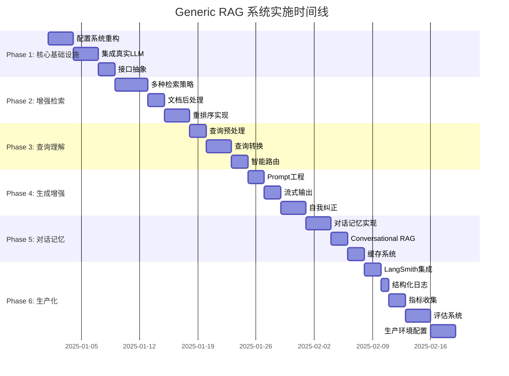

# Generic RAG 系统实施路线图

## 📋 目录

- [当前状态评估](#当前状态评估)
- [实施路线图总览](#实施路线图总览)
- [详细实施计划](#详细实施计划)
  - [Phase 1: 核心基础设施](#phase-1-核心基础设施-week-1-2)
  - [Phase 2: 增强检索能力](#phase-2-增强检索能力-week-3-4)
  - [Phase 3: 查询理解与路由](#phase-3-查询理解与路由-week-5)
  - [Phase 4: 生成增强与验证](#phase-4-生成增强与验证-week-6)
  - [Phase 5: 对话与记忆](#phase-5-对话与记忆-week-7)
  - [Phase 6: 可观测性与生产化](#phase-6-可观测性与生产化-week-8-9)
  - [Phase 7: 高级特性](#phase-7-可选-高级特性-week-10)
- [最小可行产品 (MVP) 路径](#最小可行产品-mvp-路径)
- [实施建议](#实施建议)
- [关键成功指标](#关键成功指标-kpi)
- [下一步行动](#下一步行动)

---

## 📊 当前状态评估

### ✅ 已完成

- ✓ FastAPI 基础架构
- ✓ LangChain + LangGraph 基本集成
- ✓ 简单的文档入库流程
- ✓ 基础的 QA 功能（FAISS + FakeEmbeddings）
- ✓ 项目结构和测试框架
- ✓ 使用 uv 进行依赖管理
- ✓ 基础的健康检查接口

### ❌ 需要改进

- ⚠️ 使用真实的 LLM 和 Embeddings（当前是 Fake）
- ⚠️ 缺少智能路由机制
- ⚠️ 缺少重排序功能
- ⚠️ 缺少查询增强技术
- ⚠️ 缺少对话记忆管理
- ⚠️ 缺少全链路可观测性
- ⚠️ 缺少生产级配置管理
- ⚠️ 缺少缓存机制
- ⚠️ 缺少自动化评估系统

---

## 🎯 实施路线图总览



### 时间线概览

| Phase | 名称 | 周期 | 优先级 | 状态 |
|-------|------|------|--------|------|
| **Phase 1** | 核心基础设施 | Week 1-2 | ⭐⭐⭐⭐⭐ | 🔴 待开始 |
| **Phase 2** | 增强检索能力 | Week 3-4 | ⭐⭐⭐⭐⭐ | 🔴 待开始 |
| **Phase 3** | 查询理解与路由 | Week 5 | ⭐⭐⭐⭐ | 🔴 待开始 |
| **Phase 4** | 生成增强与验证 | Week 6 | ⭐⭐⭐⭐ | 🔴 待开始 |
| **Phase 5** | 对话与记忆 | Week 7 | ⭐⭐⭐⭐ | 🔴 待开始 |
| **Phase 6** | 可观测性与生产化 | Week 8-9 | ⭐⭐⭐⭐⭐ | 🔴 待开始 |
| **Phase 7** | 高级特性 (可选) | Week 10+ | ⭐⭐ | 🔴 待开始 |

**总计**: 8-9 周达到生产级别，10+ 周包含高级特性

---

## 详细实施计划

## Phase 1: 核心基础设施 (Week 1-2)

**🎯 目标**: 建立坚实的基础架构，支持后续扩展

**⏱️ 预计时间**: 2 周 (8-10 工作日)

### 1.1 重构配置系统

**优先级**: ⭐⭐⭐⭐⭐ (必须)  
**工作量**: 2-3 天

#### 任务清单

- [ ] **创建分层配置结构**
  ```
  rag/config/
  ├── __init__.py
  ├── base_config.py              # 基础配置类
  ├── retriever_config.py         # 检索器配置
  ├── reranker_config.py          # 重排序配置
  ├── generator_config.py         # 生成器配置
  ├── cache_config.py             # 缓存配置
  ├── observability_config.py     # 可观测性配置
  └── rag_pipeline_config.py      # Pipeline 总配置
  ```

- [ ] **使用 Pydantic Settings 管理配置**
  - 创建 `BaseSettings` 继承
  - 支持 `.env` 文件加载
  - 支持环境变量覆盖
  - 添加配置验证和默认值

- [ ] **创建配置工厂**
  - 支持不同环境配置（dev/staging/prod）
  - 配置热加载（可选）

- [ ] **添加配置文档**
  - 所有配置项的说明
  - 示例配置文件

#### 验收标准

- ✅ 可以通过配置文件切换不同的检索策略
- ✅ 环境变量可以覆盖默认配置
- ✅ 配置错误有清晰的错误提示
- ✅ 有完整的配置文档

#### 依赖项

```toml
# 新增依赖
pydantic-settings>=2.3.0
python-dotenv>=1.0.1
```

---

### 1.2 集成真实的 LLM 和 Embeddings

**优先级**: ⭐⭐⭐⭐⭐ (必须)  
**工作量**: 2-3 天

#### 任务清单

- [ ] **替换 FakeEmbeddings**
  - 集成 OpenAI Embeddings
  - 集成 HuggingFace Embeddings（备选）
  - 支持本地 Embeddings（sentence-transformers）
  - 添加 Embeddings 缓存

- [ ] **替换 FakeLLM**
  - 集成 OpenAI (GPT-4/GPT-3.5)
  - 集成 Anthropic Claude（可选）
  - 支持本地 LLM（Ollama，可选）
  - 实现 LLM 工厂模式

- [ ] **API Key 管理**
  - 环境变量管理 API keys
  - 支持多个 API key 轮换
  - API key 验证

- [ ] **实现错误处理和重试**
  - API 调用重试机制（指数退避）
  - 超时处理
  - 限流处理
  - 错误日志记录

- [ ] **成本追踪**
  - Token 计数
  - 成本估算
  - 使用统计

#### 验收标准

- ✅ 可以正常调用 OpenAI API 生成 embeddings
- ✅ QA 返回有意义的答案（不是 placeholder）
- ✅ API 调用失败有重试机制（最多 3 次）
- ✅ 成本追踪记录每次调用的 token 使用

#### 新增依赖

```toml
openai>=1.0.0
langchain-openai>=0.1.0
sentence-transformers>=2.2.0  # 可选
anthropic>=0.18.0  # 可选
tenacity>=8.0.0  # 重试库
```

#### 配置示例

```python
# .env
OPENAI_API_KEY=sk-xxx
OPENAI_EMBEDDING_MODEL=text-embedding-3-small
OPENAI_LLM_MODEL=gpt-4-turbo-preview
OPENAI_MAX_RETRIES=3
OPENAI_TIMEOUT=30
```

---

### 1.3 建立核心接口抽象

**优先级**: ⭐⭐⭐⭐ (重要)  
**工作量**: 2 天

#### 任务清单

- [ ] **创建核心接口**
  ```
  rag/core/
  ├── __init__.py
  ├── interfaces.py          # 所有接口定义
  ├── models.py              # 数据模型
  ├── exceptions.py          # 自定义异常
  └── constants.py           # 常量定义
  ```

- [ ] **定义接口**
  - `RetrieverInterface`: 检索器接口
  - `RerankerInterface`: 重排序器接口
  - `GeneratorInterface`: 生成器接口
  - `MemoryInterface`: 记忆接口
  - `CacheInterface`: 缓存接口

- [ ] **创建工厂类**
  - `RetrieverFactory`
  - `RerankerFactory`
  - `GeneratorFactory`
  - `MemoryFactory`

- [ ] **重构现有代码**
  - 让现有实现符合新接口
  - 使用工厂模式创建组件
  - 更新测试

#### 验收标准

- ✅ 所有组件都实现了对应接口
- ✅ 可以轻松切换不同实现
- ✅ 工厂类测试覆盖率 > 80%
- ✅ 接口文档完整

#### 核心接口示例

```python
from abc import ABC, abstractmethod
from typing import List, Dict, Any

class RetrieverInterface(ABC):
    @abstractmethod
    async def retrieve(self, query: str, top_k: int) -> List[Document]:
        """检索相关文档"""
        pass

class GeneratorInterface(ABC):
    @abstractmethod
    async def generate(
        self, 
        query: str, 
        context: List[Document],
        stream: bool = False
    ) -> str:
        """生成答案"""
        pass
```

---

### Phase 1 交付物

- ✅ 完善的配置系统（支持多环境）
- ✅ 真实的 LLM/Embeddings 集成
- ✅ 清晰的接口抽象层
- ✅ 基础单元测试（覆盖率 > 70%）
- ✅ 更新的 README 和配置文档

---

## Phase 2: 增强检索能力 (Week 3-4)

**🎯 目标**: 提升检索质量，这是 RAG 系统的核心

**⏱️ 预计时间**: 2 周 (9 工作日)

### 2.1 实现多种检索策略

**优先级**: ⭐⭐⭐⭐⭐ (必须)  
**工作量**: 3-4 天

#### 任务清单

- [ ] **优化 VectorRetriever**
  ```
  rag/retrievers/
  ├── __init__.py
  ├── base.py                    # 基类
  ├── vector_retriever.py        # 向量检索
  ├── hybrid_retriever.py        # 混合检索 ⭐
  ├── multi_query_retriever.py   # 多查询检索
  ├── ensemble_retriever.py      # 集成检索
  └── factory.py                 # 工厂类
  ```

- [ ] **实现 HybridRetriever** ⭐ (最重要)
  - 集成 BM25 检索器
  - 实现向量和 BM25 结果融合
  - 支持权重配置（默认 0.7/0.3）
  - 性能优化

- [ ] **实现 MultiQueryRetriever**
  - 使用 LLM 生成多个查询变体
  - 并行检索
  - 结果去重和合并

- [ ] **实现 EnsembleRetriever** (可选)
  - 组合多个检索器
  - 加权投票机制

- [ ] **添加 RetrieverFactory**
  - 根据配置创建检索器
  - 支持动态切换

#### 验收标准

- ✅ Hybrid 检索比纯向量检索 recall@5 提升 10%+
- ✅ 可以通过配置切换不同检索器
- ✅ 检索延迟 P95 < 500ms (top-5)
- ✅ 有完整的性能测试报告

#### 新增依赖

```toml
rank-bm25>=0.2.2
```

#### 建议实施顺序

1. **VectorRetriever** (已有，优化) - 1 天
2. **HybridRetriever** ⭐ (最重要) - 2 天
3. **MultiQueryRetriever** (增强召回) - 1 天
4. **EnsembleRetriever** (可选) - 可跳过

---

### 2.2 实现文档后处理

**优先级**: ⭐⭐⭐⭐ (重要)  
**工作量**: 2 天

#### 任务清单

- [ ] **创建文档处理模块**
  ```
  rag/processing/
  ├── __init__.py
  ├── deduplicator.py        # 去重
  ├── mmr_filter.py          # MMR 过滤
  ├── compressor.py          # 上下文压缩
  └── pipeline.py            # 处理 pipeline
  ```

- [ ] **实现去重 (Deduplication)**
  - 基于内容哈希去重
  - 基于语义相似度去重
  - 保留最高分文档

- [ ] **实现 MMR 过滤**
  - Maximum Marginal Relevance 算法
  - 平衡相关性和多样性
  - 可配置 lambda 参数

- [ ] **实现上下文压缩**
  - 使用 LLM 提取相关内容
  - 减少 token 使用
  - 保持语义完整性

- [ ] **集成到检索流程**
  - 在检索和重排序之间插入
  - 可配置开关

#### 验收标准

- ✅ 去重后文档数量减少 20-30%
- ✅ MMR 提高文档多样性（cosine similarity < 0.8）
- ✅ 上下文压缩减少 token 使用 30%+
- ✅ 处理延迟 < 200ms

#### 新增依赖

```toml
langchain-community>=0.2.0  # 用于 LLMChainExtractor
```

---

### 2.3 实现重排序

**优先级**: ⭐⭐⭐⭐ (重要)  
**工作量**: 2-3 天

#### 任务清单

- [ ] **创建重排序模块**
  ```
  rag/rerankers/
  ├── __init__.py
  ├── base.py                      # 基类
  ├── cross_encoder_reranker.py    # Cross-Encoder ⭐
  ├── llm_reranker.py              # LLM 重排序
  ├── score_based_reranker.py      # 分数重排序
  └── factory.py                   # 工厂类
  ```

- [ ] **实现 Cross-Encoder Reranker** ⭐
  - 使用 sentence-transformers
  - 模型: `cross-encoder/ms-marco-MiniLM-L-6-v2`
  - 批量推理优化
  - 缓存机制

- [ ] **实现 LLM Reranker** (可选)
  - 使用 GPT-4 评分
  - 更准确但更昂贵
  - 可作为黄金标准对比

- [ ] **集成到 RAG Pipeline**
  - 在文档处理后应用
  - 可配置 top_n
  - 性能监控

- [ ] **A/B 测试**
  - 对比重排序前后效果
  - 生成评估报告

#### 验收标准

- ✅ Top-3 准确率提升 15%+
- ✅ 端到端延迟增加 < 300ms
- ✅ 有清晰的 A/B 测试报告
- ✅ 重排序可通过配置开关

#### 新增依赖

```toml
sentence-transformers>=2.2.0
torch>=2.0.0  # Cross-Encoder 依赖
```

#### 建议实施顺序

1. **Cross-Encoder** ⭐ (性价比最高) - 2 天
2. **LLM Reranker** (可选，昂贵) - 1 天，可跳过

---

### Phase 2 交付物

- ✅ 混合检索系统（Vector + BM25）
- ✅ 文档后处理 pipeline
- ✅ Cross-Encoder 重排序
- ✅ 检索质量评估报告
- ✅ 性能基准测试结果

---

## Phase 3: 查询理解与路由 (Week 5)

**🎯 目标**: 让系统更智能地理解和处理查询

**⏱️ 预计时间**: 1 周 (7 工作日)

### 3.1 实现查询预处理

**优先级**: ⭐⭐⭐ (中等)  
**工作量**: 1-2 天

#### 任务清单

- [ ] **创建预处理模块**
  ```
  rag/preprocessing/
  ├── __init__.py
  ├── query_cleaner.py       # 查询清洗
  ├── language_detector.py   # 语言检测
  └── intent_classifier.py   # 意图分类（可选）
  ```

- [ ] **实现查询清洗**
  - 去除特殊字符
  - 标准化空格
  - 拼写纠正（可选）
  - 大小写标准化

- [ ] **实现语言检测**
  - 使用 langdetect 或 fasttext
  - 支持多语言
  - 记录语言信息

- [ ] **实现意图分类** (可选)
  - 问答 vs 闲聊 vs 指令
  - 使用小型分类模型
  - 或基于规则

#### 验收标准

- ✅ 处理各种格式的查询（URL、特殊字符等）
- ✅ 正确识别主要语言（中文、英文）
- ✅ 预处理延迟 < 50ms

#### 新增依赖

```toml
langdetect>=1.0.9
# 或
fasttext>=0.9.2
```

---

### 3.2 实现查询转换

**优先级**: ⭐⭐⭐⭐ (重要)  
**工作量**: 2-3 天

#### 任务清单

- [ ] **创建查询转换模块**
  ```
  rag/query_transformation/
  ├── __init__.py
  ├── base.py                # 基类
  ├── multi_query.py         # 多查询生成 ⭐
  ├── step_back.py           # Step-back prompting
  ├── decomposition.py       # 查询分解
  └── contextualizer.py      # 对话上下文化
  ```

- [ ] **实现 Multi-Query 生成** ⭐
  - 使用 LLM 生成 3-5 个查询变体
  - 不同角度、不同措辞
  - 并行检索和合并
  - 结果去重

- [ ] **实现 Step-back Prompting**
  - 生成更抽象的查询
  - 获取更广泛的上下文
  - 适用于需要背景知识的查询

- [ ] **实现查询分解**
  - 将复杂查询分解为子查询
  - 按顺序或并行执行
  - 合并子答案

- [ ] **集成到检索流程**
  - 在检索前应用
  - 可配置策略选择

#### 验收标准

- ✅ Multi-Query 提升召回率 15%+
- ✅ 复杂查询可以被正确分解
- ✅ 查询转换延迟 < 1s
- ✅ 有效果对比报告

#### Prompt 示例

```python
# Multi-Query Prompt
MULTI_QUERY_PROMPT = """
You are an AI assistant. Generate 3 different versions of the given question 
to retrieve relevant documents from a vector database.

Original question: {question}

Alternative questions:
1.
2.
3.
"""
```

#### 建议实施顺序

1. **Multi-Query** ⭐ (最容易，效果好) - 1.5 天
2. **Step-back** (提高理解) - 1 天
3. **Decomposition** (处理复杂查询) - 0.5 天

---

### 3.3 实现智能路由

**优先级**: ⭐⭐⭐ (中等)  
**工作量**: 2 天

#### 任务清单

- [ ] **创建路由模块**
  ```
  rag/routing/
  ├── __init__.py
  ├── query_router.py          # 主路由器
  ├── semantic_router.py       # 语义路由
  └── rule_based_router.py     # 规则路由
  ```

- [ ] **定义路由类型**
  ```python
  class QueryType(str, Enum):
      GREETING = "greeting"           # 简单问候
      FACTUAL = "factual"            # 事实查询
      REASONING = "reasoning"         # 复杂推理
      CONVERSATIONAL = "conversational" # 对话场景
      SUMMARIZATION = "summarization" # 文档总结
  ```

- [ ] **实现规则路由**
  - 基于关键词
  - 基于查询长度
  - 基于正则表达式

- [ ] **实现语义路由**
  - 使用 Semantic Router 库
  - 或使用分类模型
  - 或使用 LLM few-shot

- [ ] **定义路由策略**
  - Greeting → 直接响应
  - Factual → 标准 RAG
  - Reasoning → 增强 RAG / Agentic RAG
  - Conversational → 对话式 RAG

- [ ] **集成到 API Layer**
  - 在查询处理前应用路由
  - 记录路由决策
  - 监控路由准确率

#### 验收标准

- ✅ 简单问候不触发检索（节省成本）
- ✅ 不同类型查询走不同 pipeline
- ✅ 路由准确率 > 90%
- ✅ 路由延迟 < 100ms

#### 新增依赖

```toml
semantic-router>=0.0.17  # 可选
```

---

### Phase 3 交付物

- ✅ 查询预处理 pipeline
- ✅ 多种查询转换策略
- ✅ 智能路由系统
- ✅ 查询理解准确率提升 20%+
- ✅ 路由效果评估报告

---

## Phase 4: 生成增强与验证 (Week 6)

**🎯 目标**: 提升生成质量，减少幻觉

**⏱️ 预计时间**: 1 周 (7 工作日)

### 4.1 优化 Prompt 工程

**优先级**: ⭐⭐⭐⭐ (重要)  
**工作量**: 2 天

#### 任务清单

- [ ] **创建 Prompt 管理模块**
  ```
  rag/prompts/
  ├── __init__.py
  ├── base.py                # 基础 Prompt 类
  ├── qa_prompts.py          # QA Prompts
  ├── chat_prompts.py        # Chat Prompts
  ├── summary_prompts.py     # 总结 Prompts
  └── templates/             # Prompt 模板目录
      ├── qa_default.txt
      ├── qa_with_sources.txt
      └── chat_context.txt
  ```

- [ ] **设计 Prompt 模板**
  - QA Prompt（带引用来源）
  - Chat Prompt（对话式）
  - Summarization Prompt
  - 多语言支持

- [ ] **实现 Prompt 版本管理**
  - Git 管理 Prompt 文件
  - Prompt 版本号
  - A/B 测试支持

- [ ] **Prompt 优化**
  - Few-shot examples
  - Chain-of-thought
  - 结构化输出指令

- [ ] **A/B 测试框架**
  - 对比不同 Prompt 效果
  - 收集用户反馈
  - 数据驱动优化

#### 验收标准

- ✅ 答案质量主观评分提升（4.0 → 4.5 / 5.0）
- ✅ 答案更加结构化（有清晰的分段）
- ✅ 引用来源准确率 > 95%
- ✅ 有 Prompt 版本控制

#### Prompt 示例

```python
QA_PROMPT_TEMPLATE = """
You are a helpful AI assistant. Answer the question based ONLY on the following context.

Context:
{context}

Question: {question}

Instructions:
1. Answer should be comprehensive but concise
2. Cite sources using [1], [2], etc.
3. If the answer is not in the context, say "I don't have enough information"
4. Be specific and factual

Answer:
"""
```

---

### 4.2 实现流式输出

**优先级**: ⭐⭐⭐⭐ (重要)  
**工作量**: 2 天

#### 任务清单

- [ ] **修改 Generator 支持流式**
  ```
  rag/generators/
  ├── __init__.py
  ├── base.py                # 基类
  ├── streaming_generator.py # 流式生成器 ⭐
  ├── batch_generator.py     # 批量生成器
  └── factory.py             # 工厂类
  ```

- [ ] **实现 StreamingGenerator**
  - 支持 SSE (Server-Sent Events)
  - 支持 WebSocket（可选）
  - Token-by-token 流式输出
  - 错误处理

- [ ] **更新 API Endpoints**
  - `POST /api/v1/query/stream` - 流式接口
  - `POST /api/v1/query` - 保持批量接口
  - 响应格式统一

- [ ] **更新 LangGraph Workflow**
  - 支持流式生成节点
  - 保持状态追踪

- [ ] **前端集成示例**（可选）
  - JavaScript EventSource 示例
  - 实时显示输出

#### 验收标准

- ✅ 支持流式响应
- ✅ 首字延迟 < 1s
- ✅ 流式输出稳定无断连
- ✅ 用户体验显著提升

#### API 示例

```python
@app.post("/api/v1/query/stream")
async def query_stream(request: QueryRequest):
    async def generate():
        async for chunk in pipeline.query_stream(request.query):
            yield f"data: {json.dumps({'chunk': chunk})}\n\n"
        yield f"data: {json.dumps({'done': True})}\n\n"
    
    return StreamingResponse(generate(), media_type="text/event-stream")
```

---

### 4.3 实现自我纠正

**优先级**: ⭐⭐⭐ (中等)  
**工作量**: 2-3 天

#### 任务清单

- [ ] **创建评估模块**
  ```
  rag/evaluation/
  ├── __init__.py
  ├── faithfulness_checker.py    # 忠实度检查
  ├── hallucination_detector.py  # 幻觉检测
  ├── relevance_scorer.py        # 相关性评分
  └── self_corrector.py          # 自我纠正
  ```

- [ ] **实现忠实度检查**
  - 检查答案是否基于上下文
  - 使用 LLM 评估
  - 或使用 NLI 模型

- [ ] **实现幻觉检测**
  - 检测不支持的陈述
  - 检测矛盾
  - 置信度评分

- [ ] **实现重试机制**
  - 低质量答案触发重试
  - 重新检索
  - 重新生成
  - 最多重试 2 次

- [ ] **集成到 LangGraph**
  - 添加自我纠正节点
  - 条件边：需要重试 vs 通过
  - 记录纠正次数

#### 验收标准

- ✅ 可以检测明显的幻觉（准确率 > 80%）
- ✅ 不忠实的答案触发重试
- ✅ 整体准确率提升 10%+
- ✅ 重试不超过 2 次（避免无限循环）

#### 自我纠正 Prompt

```python
FAITHFULNESS_CHECK_PROMPT = """
Check if the answer is supported by the context.

Context: {context}
Answer: {answer}

Is the answer faithful to the context? Answer yes or no and explain why.

Evaluation:
"""
```

---

### Phase 4 交付物

- ✅ 优化的 Prompt 系统
- ✅ 流式响应功能
- ✅ 自我纠正机制
- ✅ 答案质量提升 15%+
- ✅ 幻觉率降低 50%+

---

## Phase 5: 对话与记忆 (Week 7)

**🎯 目标**: 支持多轮对话，增加上下文理解

**⏱️ 预计时间**: 1 周 (7 工作日)

### 5.1 实现对话记忆

**优先级**: ⭐⭐⭐⭐ (重要)  
**工作量**: 2-3 天

#### 任务清单

- [ ] **创建记忆模块**
  ```
  rag/memory/
  ├── __init__.py
  ├── base.py                    # 基类
  ├── buffer_memory.py           # 缓冲记忆 ⭐
  ├── summary_memory.py          # 摘要记忆
  ├── knowledge_graph_memory.py  # KG 记忆（可选）
  └── factory.py                 # 工厂类
  ```

- [ ] **实现 Buffer Memory** ⭐
  - 保存最近 N 轮对话
  - 先进先出（FIFO）
  - 基于 token 数限制
  - 支持持久化（Redis/DB）

- [ ] **实现 Summary Memory**
  - 自动总结历史对话
  - 保持关键信息
  - 适合长对话

- [ ] **实现 Session 管理**
  - 基于 session_id 隔离
  - Session 超时清理
  - 支持多用户

- [ ] **集成 Redis**（可选）
  - 分布式记忆存储
  - 支持集群部署
  - TTL 自动清理

#### 验收标准

- ✅ 支持多轮对话（至少 10 轮）
- ✅ 上下文连贯性好（主观评分 > 4/5）
- ✅ 内存占用可控（< 100MB per session）
- ✅ Session 管理正常

#### 新增依赖

```toml
redis>=4.5.0  # 可选
langchain-community>=0.2.0
```

#### 建议实施顺序

1. **Buffer Memory** ⭐ (简单，适合短对话) - 2 天
2. **Summary Memory** (处理长对话) - 1 天

---

### 5.2 实现 Conversational RAG

**优先级**: ⭐⭐⭐⭐ (重要)  
**工作量**: 2 天

#### 任务清单

- [ ] **实现查询上下文化**
  - 结合历史对话重写查询
  - 解析代词指代
  - 处理省略

- [ ] **创建 Conversational Graph**
  ```python
  graph.add_node("load_memory", load_memory_node)
  graph.add_node("contextualize_query", contextualize_query_node)
  graph.add_node("retrieve", retrieve_node)
  graph.add_node("generate", generate_node)
  graph.add_node("save_memory", save_memory_node)
  ```

- [ ] **更新 API**
  - 添加 `session_id` 参数
  - 支持对话历史返回
  - 清除 session API

- [ ] **多轮对话测试**
  - 创建测试对话场景
  - 验证上下文理解
  - 性能测试

#### 验收标准

- ✅ 可以理解代词指代 ("它", "这个", "刚才的")
- ✅ 可以回答跟进问题
- ✅ 多轮对话测试用例 100% 通过
- ✅ 对话上下文化延迟 < 500ms

#### 查询上下文化 Prompt

```python
CONTEXTUALIZE_PROMPT = """
Given a chat history and the latest user question, 
reformulate the question to be standalone.

Chat History:
{chat_history}

Latest Question: {question}

Standalone Question:
"""
```

---

### 5.3 实现缓存系统

**优先级**: ⭐⭐⭐ (中等)  
**工作量**: 2 天

#### 任务清单

- [ ] **创建缓存模块**
  ```
  rag/cache/
  ├── __init__.py
  ├── base.py              # 缓存接口
  ├── memory_cache.py      # 内存缓存 ⭐
  ├── redis_cache.py       # Redis 缓存
  └── semantic_cache.py    # 语义缓存（高级）
  ```

- [ ] **实现内存缓存** ⭐
  - LRU (Least Recently Used)
  - 精确匹配缓存
  - TTL 支持
  - 大小限制

- [ ] **实现 Redis 缓存**（可选）
  - 分布式缓存
  - 支持多实例共享
  - 持久化

- [ ] **实现语义缓存**（高级，可选）
  - 相似查询匹配
  - 使用 embeddings
  - 相似度阈值配置

- [ ] **集成到 Pipeline**
  - 检索结果缓存
  - 生成结果缓存
  - 缓存键设计

#### 验收标准

- ✅ 常见查询缓存命中率 > 50%
- ✅ 缓存响应延迟 < 100ms
- ✅ 节省 API 调用成本 30%+
- ✅ 缓存管理正常（自动清理）

#### 新增依赖

```toml
cachetools>=5.3.0  # 内存缓存
redis>=4.5.0  # Redis 缓存
```

#### 建议实施顺序

1. **Memory Cache** ⭐ (最简单) - 1 天
2. **Redis Cache** (生产环境推荐) - 1 天
3. **Semantic Cache** (高级，可跳过) - 可选

---

### Phase 5 交付物

- ✅ 对话记忆系统（Buffer + Summary）
- ✅ 多轮对话支持
- ✅ 缓存系统（内存 + Redis）
- ✅ 对话体验显著提升
- ✅ 响应速度提升 50%+（得益于缓存）

---

## Phase 6: 可观测性与生产化 (Week 8-9)

**🎯 目标**: 让系统可监控、可调试、可维护

**⏱️ 预计时间**: 2 周 (11 工作日)

### 6.1 集成 LangSmith

**优先级**: ⭐⭐⭐⭐⭐ (必须)  
**工作量**: 1-2 天

#### 任务清单

- [ ] **注册和配置**
  - 注册 LangSmith 账号
  - 获取 API key
  - 配置环境变量

- [ ] **集成 LangSmith Tracing**
  - 安装 langsmith SDK
  - 配置 tracing
  - 添加自定义 tags

- [ ] **添加 Metadata**
  - 用户 ID
  - Session ID
  - 查询类型
  - 模型版本
  - 成本信息

- [ ] **创建 Datasets**
  - 评估数据集
  - 黄金标准答案
  - 定期更新

#### 验收标准

- ✅ 所有请求都有 trace
- ✅ 可以在 LangSmith UI 看到完整链路
- ✅ 延迟、成本可追踪
- ✅ 可以回放和调试

#### 配置示例

```python
# .env
LANGCHAIN_TRACING_V2=true
LANGCHAIN_API_KEY=lsv2_xxx
LANGCHAIN_PROJECT=rag-production
```

#### 新增依赖

```toml
langsmith>=0.1.0
```

---

### 6.2 实现结构化日志

**优先级**: ⭐⭐⭐⭐ (重要)  
**工作量**: 1 天

#### 任务清单

- [ ] **集成 structlog**
  - 安装 structlog
  - 配置日志格式
  - 替换标准 logging

- [ ] **定义日志字段**
  ```python
  {
      "timestamp": "2024-01-01T12:00:00Z",
      "level": "info",
      "event": "query_received",
      "query": "What are AI agents?",
      "session_id": "sess_123",
      "user_id": "user_456",
      "trace_id": "trace_789",
      "latency_ms": 1234
  }
  ```

- [ ] **添加关键节点日志**
  - 查询接收
  - 路由决策
  - 检索开始/结束
  - 生成开始/结束
  - 错误日志

- [ ] **日志级别配置**
  - 开发环境: DEBUG
  - 生产环境: INFO
  - 可动态调整

#### 验收标准

- ✅ 日志结构化，易于解析
- ✅ 关键步骤都有日志（覆盖率 > 90%）
- ✅ 可以用日志排查问题
- ✅ 支持日志搜索和过滤

#### 新增依赖

```toml
structlog>=23.1.0
python-json-logger>=2.0.7
```

---

### 6.3 实现指标收集

**优先级**: ⭐⭐⭐ (中等)  
**工作量**: 2 天

#### 任务清单

- [ ] **定义关键指标**
  ```python
  # Latency
  - query_latency_seconds (P50, P95, P99)
  - retrieval_latency_seconds
  - generation_latency_seconds
  
  # Success
  - query_success_total
  - query_error_total
  - error_rate
  
  # Usage
  - tokens_used_total
  - cost_usd_total
  - cache_hit_total
  - cache_miss_total
  
  # Quality
  - answer_quality_score
  - retrieval_recall_score
  ```

- [ ] **使用 Prometheus Client**
  - 安装 prometheus-client
  - 定义 metrics
  - 添加 instrumentation

- [ ] **创建 /metrics Endpoint**
  - 暴露 Prometheus metrics
  - 支持 Prometheus 抓取

- [ ] **Grafana Dashboard**（可选）
  - 创建 dashboard
  - 可视化关键指标
  - 告警规则

#### 验收标准

- ✅ 关键指标可导出
- ✅ `/metrics` endpoint 可访问
- ✅ 有基础的性能报表
- ✅ 可以实时监控系统状态

#### 新增依赖

```toml
prometheus-client>=0.19.0
prometheus-fastapi-instrumentator>=6.1.0
```

---

### 6.4 实现评估系统

**优先级**: ⭐⭐⭐⭐ (重要)  
**工作量**: 2-3 天

#### 任务清单

- [ ] **创建评估模块**
  ```
  rag/evaluation/
  ├── __init__.py
  ├── retrieval_metrics.py    # 检索指标
  ├── generation_metrics.py   # 生成指标
  ├── evaluator.py            # 评估器
  └── datasets/               # 评估数据集
      └── golden_dataset.json
  ```

- [ ] **实现检索评估**
  - Recall@K
  - Precision@K
  - MRR (Mean Reciprocal Rank)
  - NDCG (Normalized Discounted Cumulative Gain)

- [ ] **实现生成评估**
  - Faithfulness（忠实度）
  - Answer Relevance（相关性）
  - Context Relevance（上下文相关性）
  - 使用 RAGAS 框架

- [ ] **创建评估数据集**
  - 至少 50 个查询
  - 标注黄金答案
  - 相关文档标注

- [ ] **集成 LangSmith 评估**
  - 创建评估 runs
  - 对比不同版本
  - 自动化评估

- [ ] **生成评估报告**
  - 定量指标
  - 案例分析
  - 改进建议

#### 验收标准

- ✅ 有标准的评估数据集（50+ 样本）
- ✅ 可以自动化评估
- ✅ 有定量的质量指标
- ✅ 每周生成评估报告

#### 新增依赖

```toml
ragas>=0.1.0  # RAG 评估框架
datasets>=2.14.0
```

#### 评估指标示例

```python
evaluation_results = {
    "retrieval": {
        "recall@5": 0.85,
        "precision@5": 0.72,
        "mrr": 0.78,
        "ndcg@5": 0.81
    },
    "generation": {
        "faithfulness": 0.88,
        "answer_relevance": 0.82,
        "context_relevance": 0.79,
        "bleu": 0.45,
        "rouge_l": 0.52
    }
}
```

---

### 6.5 生产环境配置

**优先级**: ⭐⭐⭐⭐ (重要)  
**工作量**: 2-3 天

#### 任务清单

- [ ] **Docker 化**
  ```dockerfile
  # Dockerfile
  FROM python:3.11-slim
  
  WORKDIR /app
  COPY . .
  
  RUN pip install uv && uv pip install --system -e .
  
  EXPOSE 8000
  CMD ["uvicorn", "app.main:app", "--host", "0.0.0.0", "--port", "8000"]
  ```

- [ ] **Docker Compose**
  ```yaml
  # docker-compose.yml
  services:
    api:
      build: .
      ports:
        - "8000:8000"
      environment:
        - OPENAI_API_KEY=${OPENAI_API_KEY}
      depends_on:
        - redis
    
    redis:
      image: redis:7-alpine
      ports:
        - "6379:6379"
  ```

- [ ] **环境变量管理**
  - 创建 `.env.example`
  - 文档化所有环境变量
  - 生产环境使用 secrets

- [ ] **健康检查增强**
  - 检查 LLM API 连通性
  - 检查向量数据库
  - 检查 Redis
  - 返回详细状态

- [ ] **错误处理完善**
  - 全局异常处理
  - 友好的错误信息
  - 错误追踪
  - 自动告警

- [ ] **限流和认证**
  - API key 认证
  - 基于用户的限流
  - IP 限流
  - 防止滥用

- [ ] **部署文档**
  - 部署步骤
  - 环境要求
  - 配置说明
  - 故障排查

#### 验收标准

- ✅ 可以 Docker 部署
- ✅ 有完整的部署文档
- ✅ 错误处理覆盖常见场景
- ✅ 有限流和认证机制
- ✅ 健康检查完善

#### 新增依赖

```toml
slowapi>=0.1.9  # 限流
python-jose[cryptography]>=3.3.0  # JWT
passlib[bcrypt]>=1.7.4  # 密码哈希
```

---

### Phase 6 交付物

- ✅ LangSmith 全链路追踪
- ✅ 结构化日志系统
- ✅ Prometheus 指标收集
- ✅ 自动化评估系统
- ✅ 生产就绪配置
- ✅ Docker 部署支持
- ✅ 完整的部署文档

---

## Phase 7 (可选): 高级特性 (Week 10+)

**🎯 目标**: 增加高级功能，满足特定场景需求

**⏱️ 预计时间**: 可选，根据需求

### 7.1 Agentic RAG

**优先级**: ⭐⭐ (可选)  
**工作量**: 3-5 天

#### 功能说明

使用 Agent 模式进行复杂推理，支持工具调用。

#### 任务清单

- [ ] **创建 Agent 模块**
  ```
  rag/agents/
  ├── __init__.py
  ├── react_agent.py         # ReAct agent
  ├── planning_agent.py      # 规划 agent
  └── tools/
      ├── search_tool.py
      ├── summarize_tool.py
      ├── compare_tool.py
      └── calculator_tool.py
  ```

- [ ] **定义工具**
  - 语义搜索工具
  - 文档总结工具
  - 文档对比工具
  - 计算器工具（可选）
  - Web 搜索工具（可选）

- [ ] **使用 LangGraph 构建 Agent**
  - ReAct pattern
  - 工具调用循环
  - 思考链记录

- [ ] **集成到路由系统**
  - 复杂查询自动路由到 Agent

#### 适用场景

- 需要多步骤推理
- 需要调用外部工具
- 复杂的研究任务
- 需要对比和分析

#### 示例

```python
# 用户查询：
"Compare RAG with fine-tuning, analyze their pros and cons, 
and recommend which one I should use for customer support"

# Agent 执行流程：
1. Search for "RAG"
2. Search for "fine-tuning"
3. Compare the two approaches
4. Analyze use case requirements
5. Generate recommendation
```

---

### 7.2 高级检索技术

**优先级**: ⭐⭐ (可选)  
**工作量**: 2-3 天/功能

#### 功能列表

1. **父子文档检索**
   - 检索小块（精确）
   - 返回大块（上下文）
   - 提升上下文完整性

2. **时间感知检索**
   - 考虑文档时间
   - 优先返回最新信息
   - 支持时间范围过滤

3. **知识图谱增强**
   - 构建实体关系图
   - 图谱检索
   - 结构化知识补充

4. **多模态检索**
   - 图片 + 文本检索
   - CLIP embeddings
   - 多模态融合

#### 适用场景

- 文档结构复杂（父子文档）
- 需要最新信息（时间感知）
- 有结构化知识（知识图谱）
- 包含图片等多模态数据

---

### 7.3 实时数据源集成

**优先级**: ⭐⭐ (可选)  
**工作量**: 3-4 天

#### 功能说明

集成实时数据源，确保信息最新。

#### 任务清单

- [ ] **Web 搜索集成**
  - Tavily API
  - Serper API
  - Bing Search API

- [ ] **API 数据源**
  - REST API 调用
  - GraphQL 支持
  - 数据转换

- [ ] **实时新闻源**
  - RSS feeds
  - 新闻 API
  - 自动更新

- [ ] **动态知识更新**
  - 增量更新向量库
  - 去重和版本管理
  - 自动触发重新索引

#### 适用场景

- 需要最新信息（新闻、股票等）
- 知识库需要实时更新
- 结合静态知识库和动态数据

#### 新增依赖

```toml
tavily-python>=0.3.0  # Web 搜索
feedparser>=6.0.10  # RSS
```

---

## 最小可行产品 (MVP) 路径

如果想快速验证和上线，可以采用 **MVP 路径**：

### MVP = 核心功能 (4 周)

```
Week 1-2: Phase 1 完整
  ✓ 配置系统
  ✓ 真实 LLM/Embeddings
  ✓ 接口抽象

Week 3: Phase 2 核心部分
  ✓ Hybrid 检索 (Vector + BM25)
  ✓ Cross-Encoder 重排序
  ✓ 基础文档处理

Week 4: Phase 6 基础部分
  ✓ LangSmith 集成
  ✓ 基础日志
  ✓ Docker 化
  ✓ 部署文档
```

### MVP 功能列表

| 功能 | 状态 | 优先级 |
|------|------|--------|
| **核心** |
| 真实 LLM (GPT-4) | ⭐⭐⭐⭐⭐ | 必须 |
| 真实 Embeddings | ⭐⭐⭐⭐⭐ | 必须 |
| 混合检索 | ⭐⭐⭐⭐⭐ | 必须 |
| Cross-Encoder 重排序 | ⭐⭐⭐⭐ | 重要 |
| 基础配置系统 | ⭐⭐⭐⭐⭐ | 必须 |
| **可观测性** |
| LangSmith 追踪 | ⭐⭐⭐⭐⭐ | 必须 |
| 结构化日志 | ⭐⭐⭐⭐ | 重要 |
| 基础指标 | ⭐⭐⭐ | 中等 |
| **部署** |
| Docker 化 | ⭐⭐⭐⭐ | 重要 |
| 健康检查 | ⭐⭐⭐⭐ | 重要 |
| 部署文档 | ⭐⭐⭐⭐ | 重要 |

### 后续迭代

MVP 上线后，根据用户反馈逐步添加：

- **Iteration 1** (Week 5-6): 查询增强 + 流式输出
- **Iteration 2** (Week 7): 对话记忆 + 缓存
- **Iteration 3** (Week 8-9): 完整可观测性 + 评估系统

---

## 实施建议

### 1. 每个 Phase 结束后的验证

#### 验证清单

- [ ] **功能测试**
  - 单元测试覆盖率 > 70%
  - 集成测试通过
  - 手动测试常见场景

- [ ] **性能测试**
  - 延迟基准测试
  - 并发测试
  - 资源使用监控

- [ ] **质量评估**
  - 在评估数据集上运行
  - 对比之前版本
  - 记录改进幅度

- [ ] **文档更新**
  - API 文档
  - 配置文档
  - 部署文档

---

### 2. 持续改进流程

```
收集数据 → 分析问题 → 提出改进 → 实施 → 评估 → 循环
    ↑                                           ↓
    └───────────────────────────────────────────┘
```

#### 数据收集

- 用户查询日志
- 性能指标
- 错误日志
- 用户反馈

#### 分析方法

- 查找高频失败查询
- 识别性能瓶颈
- 分析用户行为模式
- A/B 测试结果

#### 改进方向

- Prompt 优化
- 检索参数调优
- 模型升级
- 缓存策略优化

---

### 3. 技术债务管理

#### 优先级原则

1. **功能 > 性能 > 优雅**（早期阶段）
2. **可用 > 完美**（MVP 阶段）
3. **快速迭代 > 一次到位**

#### 技术债务追踪

在代码中标记 TODO 和 FIXME：

```python
# TODO(Phase 7): 实现更复杂的查询分解
# FIXME: 这里需要优化性能，当前太慢
# DEBT: 临时方案，需要重构为工厂模式
```

定期回顾和偿还技术债：

- 每个 Sprint 预留 20% 时间
- 优先偿还影响大的债务
- 重构前后对比效果

---

### 4. 团队协作

#### Git 分支策略

```
main (生产)
  ↑
develop (开发)
  ↑
feature/phase-1-config (功能分支)
feature/phase-2-retrieval
...
```

#### Code Review 清单

- [ ] 代码符合接口规范
- [ ] 有单元测试
- [ ] 有文档注释
- [ ] 性能影响可接受
- [ ] 错误处理完善

#### 知识分享

- 每周技术分享会
- 文档同步更新
- 重要决策记录 (ADR)

---

## 关键成功指标 (KPI)

### Phase 级别 KPI

| Phase | 关键指标 | 基线 | 目标 | 衡量方法 |
|-------|---------|------|------|---------|
| **Phase 1** | 配置覆盖率 | 0% | 100% | 配置项数量 / 总需求 |
| | LLM 集成成功率 | - | > 99% | 成功调用 / 总调用 |
| | 单元测试覆盖率 | 50% | > 70% | pytest-cov |
| **Phase 2** | 检索 Recall@5 | 70% | > 85% | 评估数据集 |
| | 检索延迟 P95 | 1s | < 500ms | Prometheus |
| | 重排序提升 | 0% | +15% | Top-3 准确率 |
| **Phase 3** | 路由准确率 | - | > 90% | 手动标注 |
| | 查询理解准确率 | - | > 85% | 测试集 |
| | 路由延迟 | - | < 100ms | 计时 |
| **Phase 4** | 答案质量评分 | 3.5/5 | > 4.0/5 | 人工评分 |
| | 幻觉率 | 20% | < 10% | 自动检测 |
| | 流式首字延迟 | - | < 1s | 计时 |
| **Phase 5** | 对话连贯性 | - | > 4.0/5 | 人工评分 |
| | 缓存命中率 | 0% | > 50% | cache_hit / total |
| | 成本节省 | 0% | > 30% | token 统计 |
| **Phase 6** | 服务可用性 | - | > 99.5% | uptime / total |
| | 监控覆盖率 | 0% | 100% | 关键路径 |
| | 部署成功率 | - | 100% | CI/CD |

### 端到端 KPI (生产环境)

| 类别 | 指标 | 目标 | 监控方式 |
|------|------|------|---------|
| **性能** | 端到端延迟 P95 | < 3s | Prometheus |
| | 首字延迟 P95 (流式) | < 1s | Prometheus |
| | QPS (每秒查询) | > 100 | Load test |
| **质量** | 答案准确率 | > 85% | RAGAS |
| | 幻觉率 | < 10% | 自动检测 |
| | 用户满意度 | > 4.0/5 | 反馈 |
| **可靠性** | 服务可用性 | > 99.5% | 监控 |
| | 错误率 | < 1% | 日志 |
| | P99 延迟 | < 5s | Prometheus |
| **成本** | 每查询成本 | < $0.05 | 计费 |
| | 缓存命中率 | > 60% | Redis |
| | Token 使用效率 | - | 统计 |

---

## 下一步行动

### 本周 (Week 1) - 启动 Phase 1

#### Day 1-2: 环境准备

- [ ] **注册账号**
  - [ ] OpenAI API key
  - [ ] LangSmith 账号
  - [ ] (可选) Anthropic API key

- [ ] **创建配置文件**
  ```bash
  cp .env.example .env
  # 填写 API keys
  ```

- [ ] **测试 API 连通性**
  ```python
  from openai import OpenAI
  client = OpenAI()
  response = client.chat.completions.create(
      model="gpt-4-turbo-preview",
      messages=[{"role": "user", "content": "Hello"}]
  )
  print(response.choices[0].message.content)
  ```

#### Day 3-5: 核心集成

- [ ] **替换 FakeEmbeddings**
  - [ ] 实现 OpenAI Embeddings
  - [ ] 测试 embedding 生成
  - [ ] 更新向量存储

- [ ] **替换 FakeLLM**
  - [ ] 实现 OpenAI LLM
  - [ ] 测试问答流程
  - [ ] 验证答案质量

- [ ] **添加错误处理**
  - [ ] API 调用重试
  - [ ] 超时处理
  - [ ] 错误日志

#### Day 6-7: 配置系统

- [ ] **重构配置**
  - [ ] 创建配置模块
  - [ ] 使用 Pydantic Settings
  - [ ] 环境变量支持

- [ ] **测试端到端**
  - [ ] 运行完整流程
  - [ ] 验收 Phase 1

---

### 下周 (Week 2) - 完成 Phase 1

- [ ] **接口抽象**
  - [ ] 定义核心接口
  - [ ] 创建工厂类
  - [ ] 重构现有代码

- [ ] **单元测试**
  - [ ] 测试覆盖率 > 70%
  - [ ] CI/CD 集成

- [ ] **文档更新**
  - [ ] 配置文档
  - [ ] API 文档
  - [ ] 部署指南

---

### Week 3-4: Phase 2 实施

参考上面 Phase 2 详细计划。

---

## 资源和参考

### 学习资源

- [LangChain 文档](https://python.langchain.com/)
- [LangGraph 文档](https://langchain-ai.github.io/langgraph/)
- [LangSmith 文档](https://docs.smith.langchain.com/)
- [RAG 最佳实践](https://github.com/langchain-ai/langchain/discussions)

### 工具和库

- **LLM**: OpenAI, Anthropic, Ollama
- **Embeddings**: OpenAI, HuggingFace, sentence-transformers
- **Vector DB**: FAISS, Weaviate, Qdrant, Pinecone
- **Observability**: LangSmith, Prometheus, Grafana
- **Evaluation**: RAGAS, LangSmith Evaluation

### 社区

- [LangChain Discord](https://discord.gg/langchain)
- [LangChain GitHub](https://github.com/langchain-ai/langchain)
- [r/LangChain](https://reddit.com/r/LangChain)

---

## 总结

这是一个完整的、可执行的路线图，从基础设施到生产级 RAG 系统。

### 关键成功因素

1. ⭐ **渐进式实施** - 每个 Phase 都可独立交付
2. ⭐ **质量优先** - 每个阶段都有明确的验收标准
3. ⭐ **数据驱动** - 通过指标评估和优化
4. ⭐ **持续改进** - 根据反馈快速迭代

### 时间线总结

- **MVP (4 周)**: 核心功能 + 基础可观测性
- **完整版 (8-9 周)**: 生产级 RAG 系统
- **高级版 (10+ 周)**: 包含 Agentic RAG 等高级特性

### 最后的建议

**不要试图一次做完所有事情！**

从 MVP 开始，快速验证，根据实际需求逐步增强。

---

**文档版本**: 1.0  
**最后更新**: 2025-10-21  
**维护者**: Research Agent Team

**下一步**: 开始 Phase 1，创建 `.env` 文件并集成真实的 LLM！ 🚀

