# Generic RAG 系统架构设计

## 📋 目录

- [概述](#概述)
- [完整架构图](#完整架构图)
- [分层架构设计](#分层架构设计)
- [核心设计原则](#核心设计原则)
- [详细流程说明](#详细流程说明)
- [推荐目录结构](#推荐目录结构)
- [关键技术选型](#关键技术选型)
- [接口设计](#接口设计)
- [使用示例](#使用示例)
- [扩展点](#扩展点)

---

## 概述

本文档描述了一个**通用的、可扩展的、生产级别的 RAG (Retrieval-Augmented Generation)** 系统架构。该架构基于 **LangChain** 和 **LangGraph** 构建，支持从简单的问答到复杂的 Agent 推理等多种场景。

### 核心特性

✅ **模块化设计**: 所有组件可插拔、可替换  
✅ **多种检索策略**: 向量、混合、父子文档等  
✅ **智能路由**: 根据查询类型自动选择最佳 pipeline  
✅ **流式输出**: 支持实时响应  
✅ **自我纠正**: 幻觉检测和答案验证  
✅ **全链路可观测**: 集成 LangSmith/OpenTelemetry  
✅ **对话记忆**: 支持多轮对话  
✅ **Agentic RAG**: 支持工具调用和复杂推理  

---

## 完整架构图

### Query → Response 全流程架构

```mermaid
graph TB
    Start([用户查询]) --> API[API Gateway<br/>FastAPI/REST]
    
    API --> Auth{认证&限流}
    Auth -->|Pass| QueryPreprocess[查询预处理<br/>• 语言检测<br/>• 意图识别<br/>• 去噪清洗]
    Auth -->|Fail| Return401[返回 401]
    
    QueryPreprocess --> Router{智能路由<br/>Query Router}
    
    Router -->|简单问候| DirectResponse[直接响应<br/>无需检索]
    Router -->|事实查询| RAGPipeline[RAG Pipeline]
    Router -->|复杂推理| AgenticRAG[Agentic RAG]
    Router -->|对话上下文| ConversationalRAG[Conversational RAG]
    
    %% === RAG Pipeline 详细流程 ===
    RAGPipeline --> LoadMemory[加载对话记忆<br/>Conversation History]
    LoadMemory --> QueryTransform[查询转换<br/>Query Transformation]
    
    QueryTransform --> MultiQuery[多查询生成]
    QueryTransform --> StepBack[Step-back 抽象化]
    QueryTransform --> Decompose[复杂查询分解]
    
    MultiQuery --> MergeQueries[合并查询]
    StepBack --> MergeQueries
    Decompose --> MergeQueries
    
    MergeQueries --> RetrievalLayer{检索层<br/>Retrieval Strategy}
    
    %% === 检索策略 ===
    RetrievalLayer -->|向量检索| VectorSearch[(向量数据库<br/>FAISS/Weaviate/Qdrant)]
    RetrievalLayer -->|混合检索| HybridSearch[混合检索<br/>Vector + BM25]
    RetrievalLayer -->|父子文档| ParentChild[父子文档检索]
    
    VectorSearch --> RetrievalResults[检索结果集合]
    HybridSearch --> RetrievalResults
    ParentChild --> RetrievalResults
    
    RetrievalResults --> CheckCache{缓存检查<br/>Redis Cache}
    CheckCache -->|Cache Hit| CachedDocs[返回缓存文档]
    CheckCache -->|Cache Miss| FetchDocs[获取完整文档]
    
    CachedDocs --> MergeDocs[合并文档结果]
    FetchDocs --> MergeDocs
    
    %% === 文档处理 ===
    MergeDocs --> DocProcessing[文档后处理]
    DocProcessing --> Dedup[去重<br/>Document Deduplication]
    Dedup --> MMR[多样性优化<br/>MMR Filtering]
    MMR --> ContextCompression[上下文压缩<br/>Contextual Compression]
    
    ContextCompression --> Reranker{重排序器<br/>Reranker}
    
    Reranker -->|CrossEncoder| CrossEncoderRank[Cross-Encoder<br/>深度语义匹配]
    Reranker -->|LLM Rerank| LLMRank[LLM-based Reranking]
    Reranker -->|Score Based| ScoreRank[基于分数排序]
    
    CrossEncoderRank --> TopKDocs[Top-K 文档]
    LLMRank --> TopKDocs
    ScoreRank --> TopKDocs
    
    %% === 生成阶段 ===
    TopKDocs --> PromptConstruction[Prompt 构建]
    PromptConstruction --> AddContext[添加上下文文档]
    AddContext --> AddHistory[添加对话历史]
    AddHistory --> AddInstructions[添加系统指令]
    
    AddInstructions --> LLMGeneration{LLM 生成器}
    
    LLMGeneration -->|流式| StreamGeneration[流式生成<br/>Streaming Response]
    LLMGeneration -->|批量| BatchGeneration[批量生成<br/>Batch Response]
    
    StreamGeneration --> SelfCorrect{自我纠正<br/>Self-Correction}
    BatchGeneration --> SelfCorrect
    
    SelfCorrect -->|需要纠正| Hallucination[幻觉检测<br/>Hallucination Check]
    SelfCorrect -->|无需纠正| FinalAnswer[最终答案]
    
    Hallucination --> CheckFaithfulness{忠实度检查}
    CheckFaithfulness -->|不忠实| RetrieveAgain[重新检索<br/>Retry Loop]
    CheckFaithfulness -->|忠实| FinalAnswer
    
    RetrieveAgain --> RetrievalLayer
    
    %% === Agentic RAG 分支 ===
    AgenticRAG --> PlanningAgent[规划 Agent<br/>Task Decomposition]
    PlanningAgent --> ToolSelection{工具选择}
    
    ToolSelection --> SearchTool[语义搜索工具]
    ToolSelection --> SummaryTool[文档总结工具]
    ToolSelection --> CompareTool[文档对比工具]
    ToolSelection --> CalculatorTool[计算器工具]
    
    SearchTool --> AgentExecution[Agent 执行循环<br/>ReAct Pattern]
    SummaryTool --> AgentExecution
    CompareTool --> AgentExecution
    CalculatorTool --> AgentExecution
    
    AgentExecution --> AgentDecision{Agent 决策}
    AgentDecision -->|需要更多信息| ToolSelection
    AgentDecision -->|任务完成| FinalAnswer
    
    %% === Conversational RAG 分支 ===
    ConversationalRAG --> ConvMemory[对话记忆管理<br/>Memory Management]
    ConvMemory --> MemoryType{记忆类型}
    
    MemoryType --> BufferMemory[缓冲记忆<br/>Buffer Memory]
    MemoryType --> SummaryMemory[摘要记忆<br/>Summary Memory]
    MemoryType --> KnowledgeGraph[知识图谱记忆<br/>KG Memory]
    
    BufferMemory --> ConvRetrieval[对话式检索]
    SummaryMemory --> ConvRetrieval
    KnowledgeGraph --> ConvRetrieval
    
    ConvRetrieval --> RAGPipeline
    
    %% === 直接响应 ===
    DirectResponse --> FinalAnswer
    
    %% === 后处理 ===
    FinalAnswer --> PostProcess[后处理<br/>Post-Processing]
    PostProcess --> Citation[添加引用来源<br/>Citation]
    Citation --> Formatting[格式化输出<br/>Markdown/JSON]
    Formatting --> Metadata[添加元数据<br/>• 置信度<br/>• 来源文档<br/>• 延迟统计]
    
    %% === 可观测性 ===
    Metadata --> Observability[可观测性层<br/>Observability]
    Observability --> Logging[日志记录<br/>Structured Logging]
    Observability --> Tracing[链路追踪<br/>LangSmith Tracing]
    Observability --> Metrics[指标收集<br/>Prometheus Metrics]
    
    Logging --> Monitoring[(监控系统<br/>Monitoring)]
    Tracing --> Monitoring
    Metrics --> Monitoring
    
    %% === 缓存更新 ===
    Metadata --> UpdateCache[更新缓存<br/>Cache Update]
    UpdateCache --> FeedbackLoop[反馈循环<br/>Feedback Loop]
    
    %% === 最终响应 ===
    FeedbackLoop --> ResponseFormat{响应格式}
    ResponseFormat -->|JSON| JSONResponse[JSON Response]
    ResponseFormat -->|Stream| StreamResponse[SSE Stream]
    ResponseFormat -->|WebSocket| WSResponse[WebSocket]
    
    JSONResponse --> APIResponse[API Response]
    StreamResponse --> APIResponse
    WSResponse --> APIResponse
    
    APIResponse --> End([返回用户])
    Return401 --> End
    
    %% === 异步任务 ===
    Monitoring -.->|异步| Analytics[(分析存储<br/>Analytics DB)]
    FeedbackLoop -.->|异步| TrainingData[(训练数据<br/>Fine-tuning Data)]
    
    %% 样式定义
    classDef startEnd fill:#e1f5e1,stroke:#4caf50,stroke-width:3px
    classDef process fill:#e3f2fd,stroke:#2196f3,stroke-width:2px
    classDef decision fill:#fff3e0,stroke:#ff9800,stroke-width:2px
    classDef storage fill:#f3e5f5,stroke:#9c27b0,stroke-width:2px
    classDef critical fill:#ffebee,stroke:#f44336,stroke-width:2px
    
    class Start,End startEnd
    class API,QueryPreprocess,LoadMemory,QueryTransform,DocProcessing,PromptConstruction,PostProcess,Observability process
    class Router,RetrievalLayer,CheckCache,Reranker,LLMGeneration,SelfCorrect,CheckFaithfulness,AgentDecision,MemoryType,ResponseFormat decision
    class VectorSearch,HybridSearch,ParentChild,Monitoring,Analytics,TrainingData storage
    class Hallucination,RetrieveAgain critical
```



---

## 分层架构设计

```
┌──────────────────────────────────────────────────────────────┐
│                    API Layer (FastAPI)                       │
│  • REST endpoints                                            │
│  • Streaming support (SSE)                                   │
│  • WebSocket for real-time                                   │
│  • Authentication & Rate Limiting                            │
└──────────────────────────────────────────────────────────────┘
                             ↓
┌──────────────────────────────────────────────────────────────┐
│              Orchestration Layer (LangGraph)                 │
│  • Query routing (智能路由)                                   │
│  • Workflow management                                        │
│  • Human-in-the-loop                                         │
│  • Error handling & retry                                    │
└──────────────────────────────────────────────────────────────┘
                             ↓
┌──────────────────────────────────────────────────────────────┐
│                Core RAG Components                           │
│  • Retriever (pluggable)         • Memory (conversation)    │
│  • Query Transformer             • Reranker (optional)       │
│  • Generator (LLM)               • Cache Manager             │
└──────────────────────────────────────────────────────────────┘
                             ↓
┌──────────────────────────────────────────────────────────────┐
│              Infrastructure Layer                            │
│  • Vector stores (FAISS/Weaviate/Qdrant)                    │
│  • Cache (Redis/in-memory)                                   │
│  • Metrics & Observability (LangSmith/OpenTelemetry)        │
│  • Document stores (PostgreSQL/MongoDB)                      │
└──────────────────────────────────────────────────────────────┘
```

---

## 核心设计原则

### 1. 接口抽象 (Interface Abstraction)

所有核心组件都基于接口设计，支持多种实现：

```python
from abc import ABC, abstractmethod
from typing import List, Dict, Any
from pydantic import BaseModel

class Document(BaseModel):
    """通用文档模型"""
    page_content: str
    metadata: Dict[str, Any]
    score: float = 0.0

class RetrieverInterface(ABC):
    """检索器接口"""
    @abstractmethod
    async def retrieve(self, query: str, top_k: int) -> List[Document]:
        """检索相关文档"""
        pass

class RerankerInterface(ABC):
    """重排序接口"""
    @abstractmethod
    async def rerank(self, query: str, documents: List[Document]) -> List[Document]:
        """对文档重新排序"""
        pass

class GeneratorInterface(ABC):
    """生成器接口"""
    @abstractmethod
    async def generate(
        self, 
        query: str, 
        context: List[Document],
        stream: bool = False
    ) -> str:
        """生成答案"""
        pass

class MemoryInterface(ABC):
    """记忆接口"""
    @abstractmethod
    async def save_context(self, inputs: Dict, outputs: Dict):
        """保存对话上下文"""
        pass
    
    @abstractmethod
    async def load_memory(self) -> List[Dict]:
        """加载历史记忆"""
        pass
```

### 2. 工厂模式 (Factory Pattern)

使用工厂模式创建不同的组件实现：

```python
from enum import Enum

class RetrieverType(str, Enum):
    VECTOR = "vector"
    HYBRID = "hybrid"
    MULTI_QUERY = "multi_query"
    ENSEMBLE = "ensemble"
    PARENT_CHILD = "parent_child"

class RetrieverFactory:
    """检索器工厂"""
    
    @staticmethod
    def create(
        retriever_type: RetrieverType,
        config: Dict[str, Any]
    ) -> RetrieverInterface:
        if retriever_type == RetrieverType.VECTOR:
            return VectorRetriever(config)
        elif retriever_type == RetrieverType.HYBRID:
            return HybridRetriever(config)
        elif retriever_type == RetrieverType.MULTI_QUERY:
            return MultiQueryRetriever(config)
        elif retriever_type == RetrieverType.ENSEMBLE:
            return EnsembleRetriever(config)
        elif retriever_type == RetrieverType.PARENT_CHILD:
            return ParentChildRetriever(config)
        else:
            raise ValueError(f"Unknown retriever type: {retriever_type}")
```

### 3. 配置驱动 (Configuration-Driven)

使用 Pydantic 模型进行配置管理：

```python
from pydantic import BaseModel, Field
from typing import Optional, List

class RetrieverConfig(BaseModel):
    """检索器配置"""
    type: RetrieverType = RetrieverType.VECTOR
    top_k: int = Field(default=5, ge=1, le=100)
    similarity_threshold: float = Field(default=0.7, ge=0.0, le=1.0)
    enable_mmr: bool = False
    lambda_mult: float = Field(default=0.5, ge=0.0, le=1.0)

class RerankerConfig(BaseModel):
    """重排序配置"""
    enabled: bool = False
    model: str = "cross-encoder/ms-marco-MiniLM-L-6-v2"
    top_n: int = Field(default=3, ge=1)

class GeneratorConfig(BaseModel):
    """生成器配置"""
    model_name: str = "gpt-4"
    temperature: float = Field(default=0.7, ge=0.0, le=2.0)
    max_tokens: int = Field(default=500, ge=1)
    streaming: bool = True

class CacheConfig(BaseModel):
    """缓存配置"""
    enabled: bool = True
    ttl_seconds: int = 3600
    semantic_cache: bool = False

class RAGPipelineConfig(BaseModel):
    """完整 RAG pipeline 配置"""
    retriever: RetrieverConfig
    reranker: RerankerConfig
    generator: GeneratorConfig
    cache: CacheConfig
    enable_memory: bool = True
    enable_self_correction: bool = False
    timeout_seconds: int = 30
```

---

## 详细流程说明

### 1. 入口层 (Entry Layer)

**职责**: 请求接收、认证、限流

- **API Gateway**: 统一的请求入口
- **认证授权**: JWT/OAuth2 身份验证
- **速率限制**: 防止滥用（基于用户/IP）
- **请求验证**: Pydantic 模型验证

### 2. 查询预处理 (Query Preprocessing)

**职责**: 清洗和标准化查询

- 语言检测（支持多语言）
- 拼写纠正
- 意图识别
- 去除噪声（特殊字符等）

### 3. 智能路由 (Query Router)

**职责**: 根据查询类型选择最佳 pipeline

```python
class QueryType(str, Enum):
    GREETING = "greeting"           # 简单问候
    FACTUAL = "factual"            # 事实查询
    REASONING = "reasoning"         # 复杂推理
    CONVERSATIONAL = "conversational" # 对话场景
    SUMMARIZATION = "summarization" # 文档总结

class QueryRouter:
    async def route(self, query: str, history: List[Dict]) -> QueryType:
        """使用 LLM 或规则进行路由"""
        # 可以使用 semantic router 或简单的分类模型
        pass
```

### 4. 查询转换 (Query Transformation)

**职责**: 优化查询以提高检索效果

#### A. Multi-Query Generation
生成多个相似查询提高召回率：

```python
class MultiQueryTransformer:
    async def transform(self, query: str) -> List[str]:
        """
        输入: "What are AI agents?"
        输出: [
            "What are AI agents?",
            "How do AI agents work?",
            "What is the definition of AI agents?",
            "Explain artificial intelligence agents"
        ]
        """
        pass
```

#### B. Step-back Prompting
生成更抽象的查询：

```python
class StepBackTransformer:
    async def transform(self, query: str) -> str:
        """
        输入: "What are the effects of climate change on polar bears?"
        输出: "What is climate change?"
        """
        pass
```

#### C. Query Decomposition
分解复杂查询：

```python
class QueryDecomposer:
    async def decompose(self, query: str) -> List[str]:
        """
        输入: "Compare RAG with fine-tuning and explain which is better"
        输出: [
            "What is RAG?",
            "What is fine-tuning?",
            "Compare RAG and fine-tuning",
            "When to use RAG vs fine-tuning?"
        ]
        """
        pass
```

### 5. 检索层 (Retrieval Layer)

支持多种检索策略：

#### A. 向量检索 (Vector Search)
```python
class VectorRetriever(RetrieverInterface):
    async def retrieve(self, query: str, top_k: int) -> List[Document]:
        embedding = await self.embed_query(query)
        results = await self.vector_store.similarity_search(
            embedding, 
            k=top_k
        )
        return results
```

#### B. 混合检索 (Hybrid Search)
```python
class HybridRetriever(RetrieverInterface):
    async def retrieve(self, query: str, top_k: int) -> List[Document]:
        # 向量检索
        vector_results = await self.vector_retriever.retrieve(query, top_k)
        
        # BM25 词汇检索
        bm25_results = await self.bm25_retriever.retrieve(query, top_k)
        
        # 加权合并
        combined = self._merge_results(
            vector_results, 
            bm25_results,
            weights=[0.7, 0.3]
        )
        return combined[:top_k]
```

#### C. 父子文档检索 (Parent-Child)
```python
class ParentChildRetriever(RetrieverInterface):
    async def retrieve(self, query: str, top_k: int) -> List[Document]:
        # 检索小文档块（精确匹配）
        child_docs = await self.vector_retriever.retrieve(query, top_k)
        
        # 返回父文档（完整上下文）
        parent_docs = await self._get_parent_documents(child_docs)
        return parent_docs
```

### 6. 文档处理 (Document Processing)

**职责**: 优化检索结果质量

#### A. 去重 (Deduplication)
```python
async def deduplicate(documents: List[Document]) -> List[Document]:
    """基于内容相似度去重"""
    seen = set()
    unique_docs = []
    for doc in documents:
        content_hash = hash(doc.page_content)
        if content_hash not in seen:
            seen.add(content_hash)
            unique_docs.append(doc)
    return unique_docs
```

#### B. MMR (Maximum Marginal Relevance)
```python
async def apply_mmr(
    query: str,
    documents: List[Document],
    lambda_mult: float = 0.5
) -> List[Document]:
    """增加文档多样性"""
    # 平衡相关性和多样性
    pass
```

#### C. 上下文压缩 (Contextual Compression)
```python
from langchain.retrievers.document_compressors import LLMChainExtractor

async def compress_documents(
    query: str,
    documents: List[Document]
) -> List[Document]:
    """只保留与查询相关的内容"""
    compressor = LLMChainExtractor.from_llm(llm)
    compressed = await compressor.acompress_documents(documents, query)
    return compressed
```

### 7. 重排序 (Reranking)

**职责**: 提高 Top-K 文档的精度

#### A. Cross-Encoder Reranking
```python
from sentence_transformers import CrossEncoder

class CrossEncoderReranker(RerankerInterface):
    def __init__(self):
        self.model = CrossEncoder('cross-encoder/ms-marco-MiniLM-L-6-v2')
    
    async def rerank(
        self, 
        query: str, 
        documents: List[Document]
    ) -> List[Document]:
        pairs = [(query, doc.page_content) for doc in documents]
        scores = self.model.predict(pairs)
        
        # 重新排序
        for doc, score in zip(documents, scores):
            doc.score = float(score)
        
        return sorted(documents, key=lambda x: x.score, reverse=True)
```

#### B. LLM-based Reranking
```python
class LLMReranker(RerankerInterface):
    async def rerank(
        self, 
        query: str, 
        documents: List[Document]
    ) -> List[Document]:
        """使用 LLM 对文档进行相关性评分"""
        prompt = f"""Rate the relevance of the following document to the query.
Query: {query}
Document: {{document}}
Relevance (0-10):"""
        
        for doc in documents:
            score = await self.llm.apredict(prompt.format(document=doc.page_content))
            doc.score = float(score)
        
        return sorted(documents, key=lambda x: x.score, reverse=True)
```

### 8. 生成 (Generation)

**职责**: 基于上下文生成答案

```python
class StreamingGenerator(GeneratorInterface):
    async def generate(
        self,
        query: str,
        context: List[Document],
        stream: bool = True
    ):
        prompt = self._build_prompt(query, context)
        
        if stream:
            async for chunk in self.llm.astream(prompt):
                yield chunk
        else:
            response = await self.llm.apredict(prompt)
            return response
    
    def _build_prompt(self, query: str, context: List[Document]) -> str:
        context_str = "\n\n".join([
            f"Document {i+1}:\n{doc.page_content}"
            for i, doc in enumerate(context)
        ])
        
        return f"""You are a helpful assistant. Answer the question based on the following context.

Context:
{context_str}

Question: {query}

Answer:"""
```

### 9. 自我纠正 (Self-Correction)

**职责**: 检测和修正幻觉

```python
class SelfCorrector:
    async def check_faithfulness(
        self,
        query: str,
        answer: str,
        context: List[Document]
    ) -> tuple[bool, float]:
        """检查答案是否忠实于上下文"""
        prompt = f"""Check if the answer is supported by the context.

Context: {context}
Answer: {answer}

Is the answer faithful? (yes/no):"""
        
        result = await self.llm.apredict(prompt)
        is_faithful = "yes" in result.lower()
        confidence = 0.9 if is_faithful else 0.3
        
        return is_faithful, confidence
```

### 10. Agentic RAG

**职责**: 使用工具进行复杂推理

```python
from langgraph.prebuilt import create_react_agent
from langchain_core.tools import Tool

def build_agentic_rag(llm, retriever):
    tools = [
        Tool(
            name="semantic_search",
            func=retriever.retrieve,
            description="Search for relevant documents"
        ),
        Tool(
            name="summarize",
            func=summarizer.summarize,
            description="Summarize a long document"
        ),
        Tool(
            name="compare",
            func=comparator.compare,
            description="Compare multiple documents"
        ),
    ]
    
    return create_react_agent(
        llm,
        tools,
        state_modifier="You are a research assistant with access to tools."
    )
```

### 11. 对话式 RAG (Conversational RAG)

**职责**: 管理多轮对话上下文

```python
from langchain.memory import ConversationBufferMemory, ConversationSummaryMemory

class ConversationalRAG:
    def __init__(self, memory_type: str = "buffer"):
        if memory_type == "buffer":
            self.memory = ConversationBufferMemory()
        elif memory_type == "summary":
            self.memory = ConversationSummaryMemory(llm=llm)
    
    async def query(self, query: str, session_id: str):
        # 加载历史
        history = await self.memory.load_memory_variables({"session_id": session_id})
        
        # 结合历史上下文重写查询
        contextualized_query = await self._contextualize_query(query, history)
        
        # 执行检索和生成
        result = await self.rag_pipeline.run(contextualized_query)
        
        # 保存上下文
        await self.memory.save_context(
            {"input": query},
            {"output": result}
        )
        
        return result
```

---

## 推荐目录结构

```
rag/
├── __init__.py
├── api/                              # API 层
│   ├── __init__.py
│   ├── app.py                        # FastAPI 应用
│   ├── routes/
│   │   ├── __init__.py
│   │   ├── query.py                  # 查询接口
│   │   ├── ingest.py                 # 文档入库接口
│   │   └── feedback.py               # 反馈接口
│   ├── middleware/
│   │   ├── __init__.py
│   │   ├── auth.py                   # 认证中间件
│   │   └── rate_limit.py             # 限流中间件
│   └── schemas/
│       ├── __init__.py
│       ├── request.py                # 请求模型
│       └── response.py               # 响应模型
│
├── core/                             # 核心抽象层
│   ├── __init__.py
│   ├── interfaces.py                 # 抽象接口定义
│   ├── models.py                     # 数据模型
│   ├── exceptions.py                 # 自定义异常
│   └── constants.py                  # 常量定义
│
├── config/                           # 配置层
│   ├── __init__.py
│   ├── settings.py                   # 全局配置
│   ├── rag_config.py                 # RAG 配置
│   └── logging_config.py             # 日志配置
│
├── preprocessing/                    # 查询预处理
│   ├── __init__.py
│   ├── query_cleaner.py              # 查询清洗
│   ├── language_detector.py          # 语言检测
│   └── intent_classifier.py          # 意图分类
│
├── routing/                          # 路由层
│   ├── __init__.py
│   ├── query_router.py               # 查询路由器
│   ├── semantic_router.py            # 语义路由
│   └── rule_based_router.py          # 规则路由
│
├── query_transformation/             # 查询转换
│   ├── __init__.py
│   ├── multi_query.py                # 多查询生成
│   ├── step_back.py                  # Step-back prompting
│   ├── decomposition.py              # 查询分解
│   └── base.py                       # 基类
│
├── retrievers/                       # 检索器
│   ├── __init__.py
│   ├── base.py                       # 基类
│   ├── vector_retriever.py           # 向量检索
│   ├── hybrid_retriever.py           # 混合检索
│   ├── multi_query_retriever.py      # 多查询检索
│   ├── ensemble_retriever.py         # 集成检索
│   ├── parent_child_retriever.py     # 父子文档检索
│   └── factory.py                    # 检索器工厂
│
├── rerankers/                        # 重排序器
│   ├── __init__.py
│   ├── base.py                       # 基类
│   ├── cross_encoder_reranker.py     # Cross-Encoder
│   ├── llm_reranker.py               # LLM 重排序
│   ├── score_based_reranker.py       # 分数重排序
│   └── factory.py                    # 重排序工厂
│
├── generators/                       # 生成器
│   ├── __init__.py
│   ├── base.py                       # 基类
│   ├── streaming_generator.py        # 流式生成
│   ├── batch_generator.py            # 批量生成
│   ├── prompt_builder.py             # Prompt 构建
│   └── factory.py                    # 生成器工厂
│
├── processing/                       # 文档处理
│   ├── __init__.py
│   ├── deduplicator.py               # 去重
│   ├── mmr_filter.py                 # MMR 过滤
│   ├── compressor.py                 # 上下文压缩
│   └── chunker.py                    # 文档分块
│
├── memory/                           # 记忆管理
│   ├── __init__.py
│   ├── base.py                       # 基类
│   ├── buffer_memory.py              # 缓冲记忆
│   ├── summary_memory.py             # 摘要记忆
│   ├── knowledge_graph_memory.py     # 知识图谱记忆
│   └── factory.py                    # 记忆工厂
│
├── cache/                            # 缓存管理
│   ├── __init__.py
│   ├── redis_cache.py                # Redis 缓存
│   ├── memory_cache.py               # 内存缓存
│   └── semantic_cache.py             # 语义缓存
│
├── graphs/                           # LangGraph 工作流
│   ├── __init__.py
│   ├── base_rag_graph.py             # 基础 RAG graph
│   ├── agentic_rag_graph.py          # Agentic RAG graph
│   ├── conversational_rag_graph.py   # 对话式 RAG graph
│   ├── self_correcting_graph.py      # 自我纠正 graph
│   └── states.py                     # 状态定义
│
├── agents/                           # Agent 相关
│   ├── __init__.py
│   ├── react_agent.py                # ReAct agent
│   ├── tools/
│   │   ├── __init__.py
│   │   ├── search_tool.py            # 搜索工具
│   │   ├── summarize_tool.py         # 总结工具
│   │   └── compare_tool.py           # 对比工具
│   └── planning/
│       ├── __init__.py
│       └── task_decomposer.py        # 任务分解
│
├── evaluation/                       # 评估模块
│   ├── __init__.py
│   ├── retrieval_metrics.py          # 检索指标
│   ├── generation_metrics.py         # 生成指标
│   ├── faithfulness_checker.py       # 忠实度检查
│   └── hallucination_detector.py     # 幻觉检测
│
├── observability/                    # 可观测性
│   ├── __init__.py
│   ├── logging.py                    # 日志
│   ├── tracing.py                    # 链路追踪
│   ├── metrics.py                    # 指标收集
│   └── callbacks.py                  # 回调处理
│
├── storage/                          # 存储层
│   ├── __init__.py
│   ├── vector_stores/
│   │   ├── __init__.py
│   │   ├── faiss_store.py            # FAISS
│   │   ├── weaviate_store.py         # Weaviate
│   │   └── qdrant_store.py           # Qdrant
│   └── document_stores/
│       ├── __init__.py
│       ├── postgres_store.py         # PostgreSQL
│       └── mongodb_store.py          # MongoDB
│
├── utils/                            # 工具函数
│   ├── __init__.py
│   ├── text_processing.py            # 文本处理
│   ├── embeddings.py                 # Embedding 生成
│   └── formatting.py                 # 格式化
│
├── pipeline/                         # Pipeline 编排
│   ├── __init__.py
│   ├── rag_pipeline.py               # RAG Pipeline
│   ├── ingest_pipeline.py            # 入库 Pipeline
│   └── pipeline_builder.py           # Pipeline 构建器
│
└── tests/                            # 测试
    ├── __init__.py
    ├── unit/                         # 单元测试
    ├── integration/                  # 集成测试
    └── e2e/                          # 端到端测试
```

---

## 关键技术选型

### 检索层

| 组件 | 技术选型 | 说明 |
|------|---------|------|
| **向量数据库** | FAISS / Weaviate / Qdrant | 根据规模选择 |
| **BM25** | Rank-BM25 / Elasticsearch | 词汇检索 |
| **混合检索** | LangChain EnsembleRetriever | 加权合并 |

### 重排序层

| 组件 | 技术选型 | 说明 |
|------|---------|------|
| **Cross-Encoder** | sentence-transformers | 精确但慢 |
| **LLM Reranking** | GPT-4 / Claude | 最精确但贵 |
| **Cohere Rerank** | Cohere API | 性价比高 |

### 生成层

| 组件 | 技术选型 | 说明 |
|------|---------|------|
| **LLM** | GPT-4 / Claude / Llama | 根据预算选择 |
| **Streaming** | SSE / WebSocket | 实时响应 |
| **Prompt** | LangChain PromptTemplate | 模板管理 |

### 缓存层

| 组件 | 技术选型 | 说明 |
|------|---------|------|
| **Redis** | Redis | 分布式缓存 |
| **Semantic Cache** | GPTCache | 语义缓存 |

### 可观测性

| 组件 | 技术选型 | 说明 |
|------|---------|------|
| **Tracing** | LangSmith / OpenTelemetry | 链路追踪 |
| **Metrics** | Prometheus + Grafana | 指标监控 |
| **Logging** | Structlog | 结构化日志 |

---

## 接口设计

### REST API 示例

#### 1. Query Endpoint

```python
# POST /api/v1/query
{
  "query": "What are AI agents?",
  "session_id": "user-123",
  "config": {
    "retriever_top_k": 5,
    "enable_reranking": true,
    "stream": true
  }
}

# Response (Streaming)
data: {"type": "metadata", "retrieval_count": 5}
data: {"type": "chunk", "content": "AI agents are"}
data: {"type": "chunk", "content": " autonomous systems"}
...
data: {"type": "done", "sources": [...]}
```

#### 2. Ingest Endpoint

```python
# POST /api/v1/ingest
{
  "documents": [
    {
      "content": "...",
      "metadata": {"source": "paper.pdf", "page": 1}
    }
  ],
  "collection_name": "research-papers"
}

# Response
{
  "status": "success",
  "document_count": 10,
  "chunk_count": 150,
  "processing_time_ms": 2341
}
```

---

## 使用示例

### 基础使用

```python
from rag.pipeline import RAGPipeline
from rag.config import RAGPipelineConfig, RetrieverType

# 1. 创建配置
config = RAGPipelineConfig(
    retriever=RetrieverConfig(
        type=RetrieverType.HYBRID,
        top_k=5
    ),
    reranker=RerankerConfig(
        enabled=True,
        top_n=3
    ),
    generator=GeneratorConfig(
        model_name="gpt-4",
        streaming=True
    )
)

# 2. 初始化 Pipeline
pipeline = RAGPipeline(config)

# 3. 查询（流式）
async for chunk in pipeline.query_stream("What are AI agents?"):
    print(chunk, end="", flush=True)

# 4. 查询（非流式）
result = await pipeline.query("What are AI agents?")
print(result.answer)
print(result.sources)
```

### 对话式使用

```python
from rag.pipeline import ConversationalRAGPipeline

pipeline = ConversationalRAGPipeline(config)

# 多轮对话
session_id = "user-123"

response1 = await pipeline.query(
    "What are AI agents?",
    session_id=session_id
)

response2 = await pipeline.query(
    "How do they work?",  # 自动结合上下文
    session_id=session_id
)
```

### Agentic RAG 使用

```python
from rag.agents import AgenticRAG

agentic_rag = AgenticRAG(
    llm=llm,
    retriever=retriever,
    tools=["search", "summarize", "compare"]
)

result = await agentic_rag.query(
    "Compare RAG with fine-tuning and tell me which is better for my use case"
)
```

---

## 扩展点

### 1. 自定义检索器

```python
from rag.retrievers import RetrieverInterface

class MyCustomRetriever(RetrieverInterface):
    async def retrieve(self, query: str, top_k: int) -> List[Document]:
        # 实现自定义检索逻辑
        pass

# 注册到工厂
RetrieverFactory.register("custom", MyCustomRetriever)
```

### 2. 自定义重排序器

```python
from rag.rerankers import RerankerInterface

class MyCustomReranker(RerankerInterface):
    async def rerank(self, query: str, documents: List[Document]) -> List[Document]:
        # 实现自定义重排序逻辑
        pass
```

### 3. 自定义 LangGraph Workflow

```python
from langgraph.graph import StateGraph
from rag.graphs import RAGState

def build_custom_graph():
    graph = StateGraph(RAGState)
    
    # 添加自定义节点
    graph.add_node("custom_step", my_custom_function)
    
    # 自定义流程
    graph.set_entry_point("custom_step")
    graph.add_edge("custom_step", "retrieve")
    # ...
    
    return graph.compile()
```

---

## 性能优化建议

### 1. 缓存策略
- 查询结果缓存（精确匹配）
- 语义缓存（相似查询）
- 检索结果缓存

### 2. 并行处理
- 多查询并行检索
- 批量 Embedding 生成
- 异步 I/O

### 3. 索引优化
- 使用 HNSW 索引（快速近似搜索）
- 定期索引重建
- 分片策略

---

## 监控指标

### 关键指标

| 指标 | 说明 | 目标 |
|------|------|------|
| **Latency P95** | 95分位延迟 | < 2s |
| **Retrieval Recall** | 检索召回率 | > 90% |
| **Answer Faithfulness** | 答案忠实度 | > 85% |
| **Cache Hit Rate** | 缓存命中率 | > 60% |
| **Error Rate** | 错误率 | < 1% |

---

## 参考资源

- [LangChain 文档](https://python.langchain.com/)
- [LangGraph 文档](https://langchain-ai.github.io/langgraph/)
- [LangSmith 文档](https://docs.smith.langchain.com/)
- [Advanced RAG Techniques](https://github.com/langchain-ai/langchain/discussions)

---

**文档版本**: 1.0  
**最后更新**: 2025-10-20  
**维护者**: Research Agent Team
