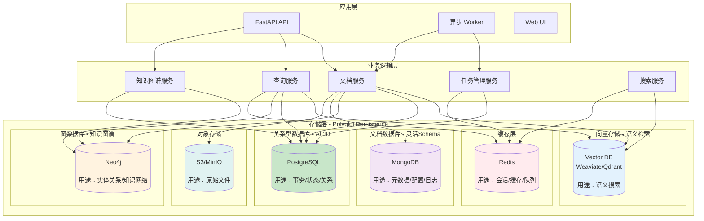
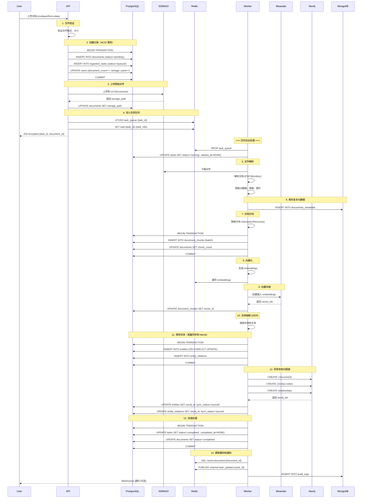
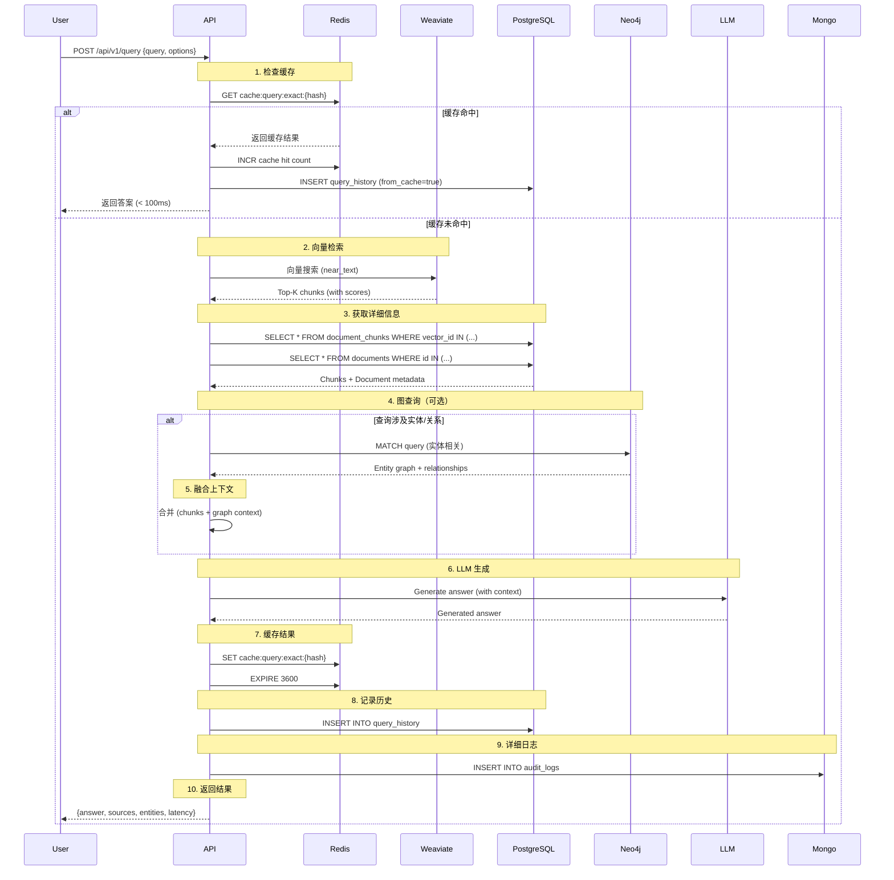

# Polyglot Persistence 多存储架构设计

## 📋 目录

- [概述](#概述)
- [架构总览](#架构总览)
- [存储策略详解](#存储策略详解)
  - [PostgreSQL - 关系型数据库](#1-postgresql---关系型数据库)
  - [Neo4j - 知识图谱数据库](#2-neo4j---知识图谱数据库)
  - [Weaviate/Qdrant - 向量数据库](#3-weaviateqdrant---向量数据库)
  - [MongoDB - 文档数据库](#4-mongodb---文档数据库)
  - [Redis - 缓存和队列](#5-redis---缓存和队列)
  - [S3/MinIO - 对象存储](#6-s3minio---对象存储)
- [数据流设计](#数据流设计)
- [数据一致性策略](#数据一致性策略)
- [关键设计决策](#关键设计决策)
- [实施路线图](#实施路线图)

---

## 概述

Knowledge Platform 采用 **Polyglot Persistence（多语言持久化）** 架构，根据数据特性选择最适合的存储方案。这种架构能够：

- ✅ **解决知识孤岛问题** - 通过知识图谱连接分散的知识
- ✅ **保证数据一致性** - ACID 事务保证关键业务数据
- ✅ **提升检索性能** - 专用向量数据库实现高效语义搜索
- ✅ **灵活扩展** - 不同存储独立扩展
- ✅ **优化成本** - 根据访问模式选择合适的存储

### 设计原则

1. **Right Tool for Right Job** - 为不同类型的数据选择最佳存储
2. **数据一致性优先** - 关键业务数据使用 ACID 保证
3. **最终一致性** - 非关键数据可接受异步同步
4. **单一数据源** - 每类数据有明确的主存储
5. **可观测性** - 所有存储操作可追踪

---

## 架构总览

### 多存储架构图



### 存储选型对比

| 存储系统 | 用途 | 数据特性 | 一致性 | 查询能力 | 扩展性 |
|---------|------|---------|--------|---------|--------|
| **PostgreSQL** | 核心业务数据 | 结构化 | ACID | SQL / JOIN | 垂直 |
| **Neo4j** | 知识图谱 | 图结构 | ACID | Cypher / 图查询 | 水平 |
| **Weaviate** | 向量搜索 | 高维向量 | 最终一致 | ANN / 语义 | 水平 |
| **MongoDB** | 元数据 | 半结构化 | 最终一致 | NoSQL | 水平 |
| **Redis** | 缓存/队列 | KV | 最终一致 | KV / PubSub | 水平 |
| **S3** | 文件存储 | Blob | 最终一致 | Object | 水平 |

---

## 存储策略详解

## 1. PostgreSQL - 关系型数据库

### 用途

- ✅ 核心业务数据（文档、用户、集合）
- ✅ 状态管理（任务状态、文档状态）
- ✅ 事务操作（需要 ACID 保证）
- ✅ 复杂查询和聚合
- ✅ 审计和历史记录

### Schema 设计

#### 文档管理表

```sql
-- ==================== 文档主表 ====================
CREATE TABLE documents (
    id UUID PRIMARY KEY DEFAULT gen_random_uuid(),
    
    -- 基本信息
    filename VARCHAR(500) NOT NULL,
    file_type VARCHAR(50) NOT NULL,
    file_size BIGINT NOT NULL,
    file_hash VARCHAR(64) UNIQUE NOT NULL,  -- SHA-256，用于去重
    
    -- 存储位置
    storage_path TEXT NOT NULL,  -- S3/MinIO 路径
    
    -- 元数据
    title TEXT,
    author TEXT,
    language VARCHAR(10),
    created_date TIMESTAMP,
    
    -- 状态管理 (ACID 保证) ⭐
    status VARCHAR(50) NOT NULL DEFAULT 'pending',  
    -- pending, processing, completed, failed, deleted
    
    -- 统计信息
    char_count INTEGER,
    word_count INTEGER,
    page_count INTEGER,
    chunk_count INTEGER DEFAULT 0,
    
    -- 分类和标签
    category VARCHAR(100),
    collection_id UUID REFERENCES collections(id),
    
    -- 审计字段
    created_at TIMESTAMP NOT NULL DEFAULT NOW(),
    updated_at TIMESTAMP NOT NULL DEFAULT NOW(),
    created_by UUID REFERENCES users(id),
    deleted_at TIMESTAMP,  -- 软删除
    
    CONSTRAINT documents_status_check 
        CHECK (status IN ('pending', 'processing', 'completed', 'failed', 'deleted'))
);

-- 索引优化
CREATE INDEX idx_documents_status ON documents(status) WHERE deleted_at IS NULL;
CREATE INDEX idx_documents_collection ON documents(collection_id);
CREATE INDEX idx_documents_created_at ON documents(created_at DESC);
CREATE INDEX idx_documents_file_hash ON documents(file_hash);
CREATE INDEX idx_documents_full_text ON documents USING GIN(to_tsvector('english', title));

-- ==================== 文档块表 ====================
CREATE TABLE document_chunks (
    id UUID PRIMARY KEY DEFAULT gen_random_uuid(),
    document_id UUID NOT NULL REFERENCES documents(id) ON DELETE CASCADE,
    
    -- 块信息
    chunk_index INTEGER NOT NULL,
    content TEXT NOT NULL,
    content_hash VARCHAR(64) NOT NULL,  -- 内容哈希
    
    -- 向量信息（与向量数据库关联）
    vector_id UUID,  -- 向量数据库中的ID
    embedding_model VARCHAR(100),
    
    -- 位置信息
    start_char INTEGER,
    end_char INTEGER,
    page_number INTEGER,
    
    -- 上下文增强
    preceding_context TEXT,
    following_context TEXT,
    section_title TEXT,
    
    -- 灵活元数据 (JSONB)
    metadata JSONB DEFAULT '{}',
    
    created_at TIMESTAMP NOT NULL DEFAULT NOW(),
    
    CONSTRAINT chunks_unique_position UNIQUE (document_id, chunk_index)
);

CREATE INDEX idx_chunks_document ON document_chunks(document_id);
CREATE INDEX idx_chunks_vector ON document_chunks(vector_id);
CREATE INDEX idx_chunks_metadata ON document_chunks USING GIN (metadata);
CREATE INDEX idx_chunks_content_full_text ON document_chunks USING GIN(to_tsvector('english', content));

-- ==================== 集合/分类表 ====================
CREATE TABLE collections (
    id UUID PRIMARY KEY DEFAULT gen_random_uuid(),
    name VARCHAR(200) NOT NULL UNIQUE,
    description TEXT,
    
    -- 配置
    chunk_strategy VARCHAR(50) DEFAULT 'recursive',
    chunk_size INTEGER DEFAULT 1000,
    chunk_overlap INTEGER DEFAULT 200,
    embedding_model VARCHAR(100),
    
    -- 统计
    document_count INTEGER DEFAULT 0,
    total_chunks INTEGER DEFAULT 0,
    
    created_at TIMESTAMP NOT NULL DEFAULT NOW(),
    updated_at TIMESTAMP NOT NULL DEFAULT NOW(),
    created_by UUID REFERENCES users(id)
);

-- ==================== 用户表 ====================
CREATE TABLE users (
    id UUID PRIMARY KEY DEFAULT gen_random_uuid(),
    username VARCHAR(100) UNIQUE NOT NULL,
    email VARCHAR(255) UNIQUE NOT NULL,
    password_hash VARCHAR(255) NOT NULL,
    
    -- 权限和配额
    role VARCHAR(50) DEFAULT 'user',  -- admin, user, guest
    quota_documents INTEGER DEFAULT 1000,
    quota_storage_mb INTEGER DEFAULT 10240,  -- 10GB
    
    -- 统计
    document_count INTEGER DEFAULT 0,
    storage_used_mb INTEGER DEFAULT 0,
    
    -- 状态
    is_active BOOLEAN DEFAULT TRUE,
    email_verified BOOLEAN DEFAULT FALSE,
    
    created_at TIMESTAMP NOT NULL DEFAULT NOW(),
    last_login_at TIMESTAMP
);

CREATE INDEX idx_users_email ON users(email);
CREATE INDEX idx_users_username ON users(username);
```

#### 任务管理表（关键 ACID）

```sql
-- ==================== 入库任务表 ====================
CREATE TABLE ingestion_tasks (
    id UUID PRIMARY KEY DEFAULT gen_random_uuid(),
    document_id UUID REFERENCES documents(id) ON DELETE CASCADE,
    user_id UUID REFERENCES users(id),
    
    -- 状态管理 (需要 ACID) ⭐⭐⭐
    status VARCHAR(50) NOT NULL DEFAULT 'queued',
    -- queued, running, completed, failed, cancelled
    
    -- 进度追踪
    progress FLOAT DEFAULT 0.0 CHECK (progress >= 0 AND progress <= 1),
    current_step VARCHAR(100),
    total_steps INTEGER DEFAULT 7,  -- load, parse, chunk, embed, persist, kg, complete
    
    -- 时间追踪
    queued_at TIMESTAMP NOT NULL DEFAULT NOW(),
    started_at TIMESTAMP,
    completed_at TIMESTAMP,
    
    -- 错误处理
    error_message TEXT,
    error_stack_trace TEXT,
    retry_count INTEGER DEFAULT 0,
    max_retries INTEGER DEFAULT 3,
    
    -- 结果统计
    chunks_created INTEGER DEFAULT 0,
    vectors_created INTEGER DEFAULT 0,
    entities_extracted INTEGER DEFAULT 0,
    relations_created INTEGER DEFAULT 0,
    
    -- 资源使用
    tokens_used INTEGER DEFAULT 0,
    processing_time_ms INTEGER,
    
    CONSTRAINT tasks_status_check 
        CHECK (status IN ('queued', 'running', 'completed', 'failed', 'cancelled'))
);

CREATE INDEX idx_tasks_status ON ingestion_tasks(status) WHERE status IN ('queued', 'running');
CREATE INDEX idx_tasks_document ON ingestion_tasks(document_id);
CREATE INDEX idx_tasks_user ON ingestion_tasks(user_id);
CREATE INDEX idx_tasks_queued_at ON ingestion_tasks(queued_at) WHERE status = 'queued';

-- ==================== 查询历史表 ====================
CREATE TABLE query_history (
    id UUID PRIMARY KEY DEFAULT gen_random_uuid(),
    user_id UUID REFERENCES users(id),
    session_id UUID,
    
    -- 查询信息
    query TEXT NOT NULL,
    query_type VARCHAR(50),  -- qa, search, chat, graph
    
    -- 检索结果
    retrieved_chunks INTEGER,
    reranked_chunks INTEGER,
    top_score FLOAT,
    
    -- 性能指标
    retrieval_latency_ms INTEGER,
    reranking_latency_ms INTEGER,
    generation_latency_ms INTEGER,
    graph_query_latency_ms INTEGER,
    total_latency_ms INTEGER,
    
    -- 使用统计
    tokens_used INTEGER,
    cost_usd NUMERIC(10, 6),
    
    -- 质量评估
    user_feedback INTEGER CHECK (user_feedback BETWEEN 1 AND 5),
    feedback_comment TEXT,
    
    created_at TIMESTAMP NOT NULL DEFAULT NOW()
);

CREATE INDEX idx_query_history_user ON query_history(user_id);
CREATE INDEX idx_query_history_session ON query_history(session_id);
CREATE INDEX idx_query_history_created ON query_history(created_at DESC);
CREATE INDEX idx_query_history_query_full_text ON query_history USING GIN(to_tsvector('english', query));
```

#### 实体表（与 Neo4j 同步）

```sql
-- ==================== 实体表 ====================
CREATE TABLE entities (
    id UUID PRIMARY KEY DEFAULT gen_random_uuid(),
    name VARCHAR(500) NOT NULL,
    type VARCHAR(100) NOT NULL,  -- PERSON, ORG, LOCATION, CONCEPT, etc.
    
    -- 与 Neo4j 同步
    neo4j_id BIGINT UNIQUE,  -- Neo4j 内部ID
    sync_status VARCHAR(50) DEFAULT 'pending',  -- pending, synced, failed
    last_synced_at TIMESTAMP,
    
    -- 属性
    description TEXT,
    aliases TEXT[],  -- 别名数组
    
    -- 统计
    mention_count INTEGER DEFAULT 0,
    document_count INTEGER DEFAULT 0,
    
    created_at TIMESTAMP NOT NULL DEFAULT NOW(),
    updated_at TIMESTAMP NOT NULL DEFAULT NOW(),
    
    CONSTRAINT entities_name_type_unique UNIQUE (name, type)
);

CREATE INDEX idx_entities_type ON entities(type);
CREATE INDEX idx_entities_name ON entities USING GIN (to_tsvector('english', name));
CREATE INDEX idx_entities_neo4j ON entities(neo4j_id) WHERE neo4j_id IS NOT NULL;

-- ==================== 实体关系表 ====================
CREATE TABLE entity_relations (
    id UUID PRIMARY KEY DEFAULT gen_random_uuid(),
    source_entity_id UUID NOT NULL REFERENCES entities(id) ON DELETE CASCADE,
    target_entity_id UUID NOT NULL REFERENCES entities(id) ON DELETE CASCADE,
    relation_type VARCHAR(100) NOT NULL,
    
    -- 与 Neo4j 同步
    neo4j_id BIGINT UNIQUE,
    sync_status VARCHAR(50) DEFAULT 'pending',
    
    -- 权重和置信度
    weight FLOAT DEFAULT 1.0,
    confidence FLOAT DEFAULT 1.0,
    
    -- 来源追踪
    source_document_id UUID REFERENCES documents(id),
    extraction_method VARCHAR(50),  -- rule_based, llm, manual
    
    created_at TIMESTAMP NOT NULL DEFAULT NOW(),
    
    CONSTRAINT relations_unique 
        UNIQUE (source_entity_id, target_entity_id, relation_type)
);

CREATE INDEX idx_relations_source ON entity_relations(source_entity_id);
CREATE INDEX idx_relations_target ON entity_relations(target_entity_id);
CREATE INDEX idx_relations_type ON entity_relations(relation_type);
CREATE INDEX idx_relations_document ON entity_relations(source_document_id);
```

### 关键事务示例

```sql
-- 文档入库事务（保证一致性）
BEGIN;

-- 1. 创建文档记录
INSERT INTO documents (filename, file_type, file_hash, storage_path, status)
VALUES ('paper.pdf', 'pdf', 'hash123', 's3://...', 'pending')
RETURNING id INTO doc_id;

-- 2. 创建入库任务
INSERT INTO ingestion_tasks (document_id, user_id, status)
VALUES (doc_id, user_id, 'queued');

-- 3. 更新用户统计
UPDATE users 
SET document_count = document_count + 1,
    storage_used_mb = storage_used_mb + file_size_mb
WHERE id = user_id;

COMMIT;
-- 如果任何步骤失败，自动回滚，保证数据一致性
```

---

## 2. Neo4j - 知识图谱数据库

### 用途

- ✅ 实体关系建模
- ✅ 知识网络构建
- ✅ 图查询和推理
- ✅ 解决知识孤岛问题 ⭐
- ✅ 知识发现和可视化

### 为什么需要知识图谱？

**问题**：传统 RAG 的知识孤岛现象

```
文档 A: "GPT-4 是由 OpenAI 开发的..."
文档 B: "Sam Altman 是 OpenAI 的 CEO..."
文档 C: "Transformer 架构被用于 GPT 系列..."

问题："Sam Altman 与 GPT-4 有什么关系？"
传统 RAG：可能找不到直接联系 ❌
知识图谱：通过关系链推理 ✅
  Sam Altman -> [CEO_OF] -> OpenAI -> [DEVELOPED] -> GPT-4
```

### Neo4j Schema 设计

#### 节点类型

```cypher
// ==================== 约束定义 ====================

// 文档节点
CREATE CONSTRAINT document_id IF NOT EXISTS
FOR (d:Document) REQUIRE d.id IS UNIQUE;

CREATE CONSTRAINT document_title IF NOT EXISTS
FOR (d:Document) REQUIRE d.title IS NOT NULL;

// 实体节点
CREATE CONSTRAINT entity_id IF NOT EXISTS
FOR (e:Entity) REQUIRE e.id IS UNIQUE;

CREATE CONSTRAINT entity_name_type IF NOT EXISTS
FOR (e:Entity) REQUIRE (e.name, e.type) IS UNIQUE;

// 概念节点
CREATE CONSTRAINT concept_id IF NOT EXISTS
FOR (c:Concept) REQUIRE c.id IS UNIQUE;

// 索引
CREATE INDEX entity_name IF NOT EXISTS
FOR (e:Entity) ON (e.name);

CREATE INDEX concept_category IF NOT EXISTS
FOR (c:Concept) ON (c.category);

CREATE INDEX document_created IF NOT EXISTS
FOR (d:Document) ON (d.created_at);
```

#### 节点模型

```cypher
// ==================== 文档节点 ====================
CREATE (d:Document {
    id: "uuid",
    title: "Attention Is All You Need",
    document_type: "academic_paper",
    author: "Vaswani et al.",
    year: 2017,
    citation_count: 50000,
    created_at: datetime(),
    
    // 与 PostgreSQL 关联
    postgres_id: "uuid"
})

// ==================== 实体节点 ====================

// 人物实体
CREATE (p:Entity:Person {
    id: "uuid",
    name: "Andrew Ng",
    type: "PERSON",
    description: "AI researcher and entrepreneur",
    aliases: ["吴恩达", "Andrew Y. Ng"],
    mention_count: 50,
    h_index: 100,  // 学术影响力
    
    // 与 PostgreSQL 关联
    postgres_id: "uuid"
})

// 组织实体
CREATE (o:Entity:Organization {
    id: "uuid",
    name: "OpenAI",
    type: "ORGANIZATION",
    founded: date("2015-12-11"),
    location: "San Francisco, CA",
    industry: "AI Research",
    
    postgres_id: "uuid"
})

// 地点实体
CREATE (l:Entity:Location {
    id: "uuid",
    name: "Stanford University",
    type: "LOCATION",
    country: "USA",
    coordinates: point({latitude: 37.4275, longitude: -122.1697})
})

// ==================== 概念节点 ====================
CREATE (c:Concept {
    id: "uuid",
    name: "Retrieval Augmented Generation",
    aliases: ["RAG", "检索增强生成"],
    category: "AI_TECHNIQUE",
    definition: "A technique that combines retrieval and generation...",
    
    // 统计
    related_papers: 500,
    first_appeared: date("2020-05-01"),
    popularity_score: 0.95,
    
    postgres_id: "uuid"
})

// 技术概念
CREATE (t:Concept:Technology {
    id: "uuid",
    name: "Transformer",
    category: "NEURAL_ARCHITECTURE",
    maturity: "mature",
    use_cases: ["NLP", "Computer Vision", "Audio"]
})
```

#### 关系模型

```cypher
// ==================== 文档相关关系 ====================

// 文档提及实体
CREATE (d:Document)-[:MENTIONS {
    count: 5,
    salience: 0.8,  // 显著性 (0-1)
    chunks: ["chunk_id_1", "chunk_id_2"],
    first_mention_position: 0.2  // 首次提及位置 (0-1)
}]->(e:Entity)

// 文档引用
CREATE (d1:Document)-[:CITES {
    citation_context: "Building on the work of...",
    citation_count: 1,
    citation_type: "background"  // background, method, comparison
}]->(d2:Document)

// 文档相似
CREATE (d1:Document)-[:SIMILAR_TO {
    similarity_score: 0.92,
    similarity_method: "embedding"
}]->(d2:Document)

// 文档讨论概念
CREATE (d:Document)-[:DISCUSSES {
    importance: 0.9,
    section: "Introduction"
}]->(c:Concept)

// ==================== 实体关系 ====================

// 工作关系
CREATE (p:Person)-[:WORKS_AT {
    since: date("2020-01-01"),
    until: date("2023-12-31"),  // null 表示当前
    role: "CEO",
    is_current: true
}]->(o:Organization)

// 教育背景
CREATE (p:Person)-[:EDUCATED_AT {
    degree: "PhD",
    field: "Computer Science",
    start_year: 2010,
    end_year: 2015
}]->(o:Organization)

// 合作关系
CREATE (p1:Person)-[:COLLABORATED_WITH {
    project: "Transformer Paper",
    years: [2017, 2018],
    paper_count: 3
}]->(p2:Person)

// 作者关系
CREATE (p:Person)-[:AUTHORED {
    year: 2017,
    role: "first_author",  // first_author, corresponding_author, co_author
    citation_count: 50000
}]->(d:Document)

// 创立关系
CREATE (p:Person)-[:FOUNDED {
    date: date("2015-12-11"),
    role: "Co-founder"
}]->(o:Organization)

// 位置关系
CREATE (o:Organization)-[:LOCATED_IN]->(l:Location)

// ==================== 概念关系 ====================

// 层次关系
CREATE (c1:Concept)-[:IS_A]->(c2:Concept)
// Example: "RAG" IS_A "AI Technique"

// 相关概念
CREATE (c1:Concept)-[:RELATED_TO {
    similarity: 0.85,
    co_occurrence: 50,
    relation_type: "uses"  // uses, improves, replaces
}]->(c2:Concept)

// 概念演化
CREATE (c1:Concept)-[:EVOLVED_TO {
    year: 2023,
    improvement: "Added retrieval component"
}]->(c2:Concept)

// 概念定义
CREATE (c:Concept)-[:DEFINED_IN {
    page: 1,
    definition_quality: 0.95
}]->(d:Document)

// 依赖关系
CREATE (c1:Concept)-[:REQUIRES]->(c2:Concept)
// Example: "RAG" REQUIRES "Vector Database"

// 应用关系
CREATE (c:Concept)-[:APPLIED_IN {
    domain: "Question Answering",
    effectiveness: 0.9
}]->(d:Document)

// ==================== 实体-概念关系 ====================

// 专家关系
CREATE (p:Person)-[:EXPERT_IN {
    expertise_level: 0.95,
    paper_count: 20,
    citation_count: 10000
}]->(c:Concept)

// 组织研究
CREATE (o:Organization)-[:RESEARCHES {
    since: date("2020-01-01"),
    team_size: 50,
    funding_million_usd: 100
}]->(c:Concept)

// 发展关系
CREATE (o:Organization)-[:DEVELOPED {
    year: 2023,
    version: "1.0",
    open_source: true
}]->(c:Technology)
```

### 复杂图查询示例

```cypher
// ==================== 1. 找到某人的研究网络 ====================
// 查询：Andrew Ng 的研究领域和合作者
MATCH path = (p:Person {name: "Andrew Ng"})-[:EXPERT_IN|AUTHORED|COLLABORATED_WITH*1..3]-(n)
WHERE n:Concept OR n:Person OR n:Document
RETURN path
LIMIT 100;

// ==================== 2. 知识链推理 ====================
// 查询："Sam Altman 与 GPT-4 的关系"
MATCH path = shortestPath(
    (p:Person {name: "Sam Altman"})-[*]-(c:Concept {name: "GPT-4"})
)
RETURN path;

// 可能返回：
// Sam Altman -[CEO_OF]-> OpenAI -[DEVELOPED]-> GPT-4

// ==================== 3. 找到领域专家 ====================
// 查询：RAG 领域的 Top 专家
MATCH (p:Person)-[e:EXPERT_IN]->(c:Concept {name: "RAG"})
MATCH (p)-[:AUTHORED]->(d:Document)-[:DISCUSSES]->(c)
WITH p, e.expertise_level as expertise, count(d) as paper_count
ORDER BY expertise DESC, paper_count DESC
LIMIT 10
RETURN p.name, expertise, paper_count;

// ==================== 4. 概念演化路径 ====================
// 查询：从 RNN 到 Transformer 的技术演化
MATCH path = (c1:Concept {name: "RNN"})-[:EVOLVED_TO*]->(c2:Concept {name: "Transformer"})
RETURN path;

// ==================== 5. 引用网络分析 ====================
// 查询：某篇论文的影响力（被引用网络）
MATCH (d:Document {title: "Attention Is All You Need"})<-[:CITES*1..3]-(citing:Document)
WITH citing, length(path) as citation_distance
RETURN citing.title, citing.year, citation_distance
ORDER BY citation_distance, citing.citation_count DESC;

// ==================== 6. 知识发现 - 潜在合作者 ====================
// 查询：与 Andrew Ng 研究领域重叠但未合作的研究者
MATCH (p1:Person {name: "Andrew Ng"})-[:EXPERT_IN]->(c:Concept)<-[:EXPERT_IN]-(p2:Person)
WHERE NOT (p1)-[:COLLABORATED_WITH]-(p2)
WITH p2, count(DISTINCT c) as common_interests
WHERE common_interests >= 3
RETURN p2.name, common_interests
ORDER BY common_interests DESC
LIMIT 10;

// ==================== 7. 文档推荐 ====================
// 查询：基于用户阅读历史推荐相关文档
MATCH (u:User)-[:READ]->(d1:Document)-[:MENTIONS]->(e:Entity)<-[:MENTIONS]-(d2:Document)
WHERE NOT (u)-[:READ]->(d2)
WITH d2, count(DISTINCT e) as共同实体
ORDER BY 共同实体 DESC
LIMIT 10
RETURN d2.title, 共同实体;

// ==================== 8. 社区发现 ====================
// 查询：发现研究社区
CALL gds.louvain.stream({
    nodeProjection: 'Person',
    relationshipProjection: {
        COLLABORATED_WITH: {
            type: 'COLLABORATED_WITH',
            orientation: 'UNDIRECTED'
        }
    }
})
YIELD nodeId, communityId
WITH gds.util.asNode(nodeId) AS person, communityId
RETURN communityId, collect(person.name) as community_members
ORDER BY size(community_members) DESC;

// ==================== 9. PageRank - 找重要节点 ====================
// 查询：最有影响力的概念
CALL gds.pageRank.stream({
    nodeProjection: 'Concept',
    relationshipProjection: {
        RELATED_TO: {
            type: 'RELATED_TO',
            orientation: 'NATURAL'
        }
    }
})
YIELD nodeId, score
RETURN gds.util.asNode(nodeId).name AS concept, score
ORDER BY score DESC
LIMIT 10;

// ==================== 10. 时间序列分析 ====================
// 查询：某个概念的研究趋势
MATCH (d:Document)-[:DISCUSSES]->(c:Concept {name: "RAG"})
WITH d.year as year, count(d) as paper_count
ORDER BY year
RETURN year, paper_count;
```

---

## 3. Weaviate/Qdrant - 向量数据库

### 用途

- ✅ 语义搜索
- ✅ 向量相似度检索
- ✅ 高维向量存储
- ✅ ANN (近似最近邻) 查询

### Weaviate Schema 定义

```python
{
    "class": "DocumentChunk",
    "description": "文档块向量存储",
    "vectorizer": "none",  # 使用自定义 embeddings
    "vectorIndexType": "hnsw",  # HNSW 算法
    "vectorIndexConfig": {
        "ef": 100,  # 搜索时的候选数量
        "efConstruction": 128,  # 构建索引时的候选数量
        "maxConnections": 64  # 每个节点的最大连接数
    },
    "properties": [
        {
            "name": "chunk_id",
            "dataType": ["uuid"],
            "description": "PostgreSQL 中的 chunk ID",
            "indexInverted": True
        },
        {
            "name": "document_id",
            "dataType": ["uuid"],
            "indexInverted": True
        },
        {
            "name": "content",
            "dataType": ["text"],
            "description": "文档块内容"
        },
        {
            "name": "chunk_index",
            "dataType": ["int"]
        },
        # 位置信息
        {
            "name": "section_title",
            "dataType": ["string"]
        },
        {
            "name": "page_number",
            "dataType": ["int"]
        },
        # 元数据（用于过滤）
        {
            "name": "document_title",
            "dataType": ["string"]
        },
        {
            "name": "author",
            "dataType": ["string"]
        },
        {
            "name": "document_type",
            "dataType": ["string"]
        },
        {
            "name": "language",
            "dataType": ["string"]
        },
        {
            "name": "created_at",
            "dataType": ["date"]
        },
        # 实体信息（与图数据库关联）
        {
            "name": "mentioned_entities",
            "dataType": ["string[]"],
            "description": "文档块中提及的实体"
        },
        {
            "name": "related_concepts",
            "dataType": ["string[]"],
            "description": "相关概念"
        },
        # 质量指标
        {
            "name": "quality_score",
            "dataType": ["number"],
            "description": "内容质量评分"
        }
    ]
}
```

### 查询示例

```python
# 基础语义搜索
client.query.get(
    "DocumentChunk",
    ["content", "document_title", "chunk_index"]
).with_near_text({
    "concepts": ["What is RAG?"],
    "certainty": 0.7  # 相似度阈值
}).with_limit(5).do()

# 带过滤的语义搜索
client.query.get(
    "DocumentChunk",
    ["content", "document_title", "mentioned_entities"]
).with_near_text({
    "concepts": ["machine learning"],
}).with_where({
    "path": ["document_type"],
    "operator": "Equal",
    "valueString": "academic_paper"
}).with_where({
    "path": ["created_at"],
    "operator": "GreaterThan",
    "valueDate": "2023-01-01T00:00:00Z"
}).with_limit(10).do()

# 混合搜索（语义 + 关键词）
client.query.get(
    "DocumentChunk",
    ["content", "document_title"]
).with_hybrid(
    query="retrieval augmented generation",
    alpha=0.75  # 0=纯BM25, 1=纯向量, 0.75=混合
).with_limit(10).do()
```

---

## 4. MongoDB - 文档数据库

### 用途

- ✅ 灵活的元数据存储
- ✅ 复杂嵌套数据结构
- ✅ 配置管理
- ✅ 日志和审计
- ✅ 快速迭代（Schema-less）

### Collection 设计

```javascript
// ==================== documents_metadata 集合 ====================
{
    "_id": ObjectId("..."),
    "document_id": "uuid",  // 与 PostgreSQL 关联
    
    // 提取的复杂元数据
    "extracted_metadata": {
        // 表格
        "tables": [
            {
                "page": 5,
                "caption": "Performance Comparison",
                "rows": 10,
                "columns": 5,
                "data": [[...]]  // 完整表格数据
            }
        ],
        
        // 图片
        "images": [
            {
                "page": 3,
                "caption": "Architecture Diagram",
                "s3_url": "s3://...",
                "width": 800,
                "height": 600,
                "alt_text": "..."
            }
        ],
        
        // 引用文献
        "references": [
            {
                "title": "Attention Is All You Need",
                "authors": ["Vaswani, A.", "..."],
                "year": 2017,
                "venue": "NeurIPS",
                "doi": "10.48550/arXiv.1706.03762"
            }
        ],
        
        // 关键发现
        "key_findings": [
            "RAG improves factual accuracy by 25%",
            "Retrieval reduces hallucination rate"
        ],
        
        // 方法论
        "methodology": {
            "type": "experimental",
            "dataset": "Natural Questions",
            "baseline": "GPT-3",
            "metrics": ["Accuracy", "F1", "BLEU"]
        },
        
        // 代码片段
        "code_snippets": [
            {
                "language": "python",
                "description": "...",
                "code": "def retrieve(...)..."
            }
        ]
    },
    
    // 自定义字段（用户可以添加任意字段）
    "custom_fields": {
        "project": "AI Research",
        "priority": "high",
        "tags": ["ml", "nlp", "rag"],
        "internal_id": "PROJ-123",
        "status": "reviewed",
        "notes": "Important paper for our work"
    },
    
    // 处理历史
    "processing_history": [
        {
            "timestamp": ISODate("2024-01-01T10:00:00Z"),
            "action": "uploaded",
            "user_id": "uuid",
            "ip_address": "192.168.1.1"
        },
        {
            "timestamp": ISODate("2024-01-01T10:05:00Z"),
            "action": "indexed",
            "chunks_created": 50,
            "duration_ms": 5000
        },
        {
            "timestamp": ISODate("2024-01-01T10:10:00Z"),
            "action": "entities_extracted",
            "entities_count": 20
        }
    ],
    
    // 版本控制
    "versions": [
        {
            "version": 1,
            "timestamp": ISODate("2024-01-01T10:00:00Z"),
            "file_hash": "abc123...",
            "changes": "Initial upload"
        },
        {
            "version": 2,
            "timestamp": ISODate("2024-01-15T14:00:00Z"),
            "file_hash": "def456...",
            "changes": "Updated with corrections"
        }
    ],
    
    // 质量评估
    "quality_assessment": {
        "readability_score": 0.85,
        "information_density": 0.75,
        "citation_quality": 0.90,
        "completeness": 0.95
    },
    
    "created_at": ISODate("2024-01-01T10:00:00Z"),
    "updated_at": ISODate("2024-01-15T14:00:00Z")
}

// ==================== system_config 集合 ====================
{
    "_id": ObjectId("..."),
    "config_key": "embedding_model",
    "config_value": {
        "provider": "openai",
        "model": "text-embedding-3-small",
        "dimension": 1536,
        "max_tokens": 8191,
        "cost_per_1k_tokens": 0.00002
    },
    "environment": "production",  // production, staging, development
    "version": 2,
    "updated_by": "admin",
    "updated_at": ISODate("2024-01-01T00:00:00Z"),
    "change_notes": "Upgraded to new embedding model"
}

// ==================== audit_logs 集合 ====================
{
    "_id": ObjectId("..."),
    "timestamp": ISODate("2024-01-01T12:00:00Z"),
    "log_type": "query",  // query, upload, delete, update
    "user_id": "uuid",
    "session_id": "uuid",
    
    "action": "search",
    "resource": "document:uuid",
    
    "details": {
        "query": "What is RAG?",
        "query_type": "qa",
        "result_count": 5,
        "top_score": 0.92,
        "latency_ms": 234,
        "tokens_used": 1500,
        "cost_usd": 0.003
    },
    
    "metadata": {
        "ip_address": "192.168.1.1",
        "user_agent": "Mozilla/5.0...",
        "location": "US-CA",
        "device": "desktop"
    },
    
    "result": "success"  // success, error, partial
}

// ==================== feature_flags 集合 ====================
{
    "_id": ObjectId("..."),
    "feature_name": "semantic_cache",
    "enabled": true,
    "rollout_percentage": 100,  // 0-100
    "allowed_users": ["uuid1", "uuid2"],  // 白名单
    "config": {
        "similarity_threshold": 0.95,
        "ttl_seconds": 3600
    },
    "created_at": ISODate("..."),
    "updated_at": ISODate("...")
}
```

### 索引优化

```javascript
// 文档元数据索引
db.documents_metadata.createIndex(
    { "document_id": 1 },
    { unique: true }
);

db.documents_metadata.createIndex(
    { "custom_fields.tags": 1 }
);

db.documents_metadata.createIndex(
    { "created_at": -1 }
);

// 全文搜索索引
db.documents_metadata.createIndex(
    {
        "extracted_metadata.key_findings": "text",
        "custom_fields.notes": "text"
    }
);

// 审计日志索引
db.audit_logs.createIndex(
    { "timestamp": -1 }
);

db.audit_logs.createIndex(
    { "user_id": 1, "timestamp": -1 }
);

// TTL 索引（自动删除旧日志）
db.audit_logs.createIndex(
    { "timestamp": 1 },
    { expireAfterSeconds: 7776000 }  // 90 天
);
```

---

## 5. Redis - 缓存和队列

### 用途

- ✅ 高性能缓存
- ✅ 会话管理
- ✅ 任务队列
- ✅ 限流
- ✅ 实时统计

### 数据结构设计

```python
# ==================== 1. 会话管理 ====================
"session:{session_id}" -> Hash
{
    "user_id": "uuid",
    "created_at": "timestamp",
    "last_activity": "timestamp",
    "conversation_history": "json_array",  # 对话历史
    "context": "json"  # 上下文信息
}
TTL: 3600  # 1 hour

# ==================== 2. 查询结果缓存 ====================
"cache:query:exact:{query_hash}" -> String (JSON)
{
    "query": "original query",
    "results": [...],
    "answer": "...",
    "sources": [...],
    "cached_at": "timestamp",
    "hit_count": 5
}
TTL: 3600  # 1 hour

# ==================== 3. 语义缓存 ====================
"cache:query:semantic:{query_embedding_hash}" -> String (JSON)
{
    "query": "original query",
    "query_embedding": [0.1, 0.2, ...],
    "results": [...],
    "similarity_threshold": 0.95
}
TTL: 3600

# ==================== 4. Embedding 缓存 ====================
"cache:embedding:{content_hash}" -> String (JSON)
{
    "content": "text...",
    "embedding": [0.1, 0.2, ...],
    "model": "text-embedding-3-small",
    "dimension": 1536,
    "cached_at": "timestamp"
}
TTL: 86400  # 24 hours

# ==================== 5. 任务队列 (Celery/RQ) ====================
# Celery 使用 Redis 作为消息代理
"celery:task:{task_id}" -> Hash
"celery:queue:default" -> List  # 默认队列
"celery:queue:high_priority" -> List  # 高优先级队列
"celery:queue:low_priority" -> List  # 低优先级队列

# 任务结果缓存
"celery:result:{task_id}" -> String (JSON)
TTL: 86400

# ==================== 6. 限流 ====================
# 用户查询限流
"rate_limit:user:{user_id}:queries:minute" -> String (counter)
TTL: 60  # 1 minute

"rate_limit:user:{user_id}:queries:hour" -> String (counter)
TTL: 3600  # 1 hour

"rate_limit:user:{user_id}:queries:day" -> String (counter)
TTL: 86400  # 1 day

# IP 限流
"rate_limit:ip:{ip_address}:requests:minute" -> String (counter)
TTL: 60

# ==================== 7. 实时统计 ====================
# 在线用户
"stats:users:online" -> Set (user_ids)

# 每日查询计数
"stats:queries:count:{date}" -> String (counter)

# 每小时查询计数
"stats:queries:count:{date}:{hour}" -> String (counter)

# 热门查询
"stats:queries:popular:{date}" -> Sorted Set
# Score: 查询次数, Member: 查询内容

# 系统性能指标
"stats:metrics:latency:{date}:{hour}" -> List (latency values)
"stats:metrics:success_rate:{date}" -> String (counter)

# ==================== 8. 分布式锁 ====================
# 文档处理锁（防止重复处理）
"lock:document:{document_id}" -> String (lock_id)
TTL: 30  # 30 seconds

# 任务执行锁
"lock:task:{task_id}" -> String (lock_id)
TTL: 300  # 5 minutes

# ==================== 9. 实时通知 ====================
# Pub/Sub 频道
"channel:task_updates:{user_id}"  # 用户任务更新
"channel:system_events"  # 系统事件

# 消息队列
"queue:notifications:{user_id}" -> List
{
    "type": "task_completed",
    "task_id": "uuid",
    "message": "Document processing completed",
    "timestamp": "..."
}

# ==================== 10. 临时数据 ====================
# 文件上传临时 token
"upload_token:{token}" -> Hash
{
    "user_id": "uuid",
    "filename": "paper.pdf",
    "created_at": "timestamp"
}
TTL: 300  # 5 minutes

# 验证码
"verification_code:{email}" -> String
TTL: 600  # 10 minutes
```

### 使用示例

```python
# 查询缓存
def get_cached_query_result(query: str) -> Optional[dict]:
    query_hash = hashlib.md5(query.encode()).hexdigest()
    key = f"cache:query:exact:{query_hash}"
    
    cached = redis.get(key)
    if cached:
        result = json.loads(cached)
        # 增加命中次数
        result["hit_count"] = result.get("hit_count", 0) + 1
        redis.set(key, json.dumps(result), ex=3600)
        return result
    return None

# 限流检查
def check_rate_limit(user_id: str, limit: int = 10, window: int = 60) -> bool:
    key = f"rate_limit:user:{user_id}:queries:minute"
    current = redis.incr(key)
    
    if current == 1:
        redis.expire(key, window)
    
    return current <= limit

# 分布式锁
from redis.lock import Lock

def process_document_with_lock(document_id: str):
    lock_key = f"lock:document:{document_id}"
    lock = Lock(redis, lock_key, timeout=30)
    
    if lock.acquire(blocking=False):
        try:
            # 处理文档
            process_document(document_id)
        finally:
            lock.release()
    else:
        raise Exception("Document is being processed")
```

---

## 6. S3/MinIO - 对象存储

### 用途

- ✅ 原始文件存储
- ✅ 备份和归档
- ✅ 大文件存储
- ✅ CDN 分发

### 存储结构

```
s3://knowledge-platform/
├── documents/                      # 原始文档
│   └── {user_id}/
│       └── {year}/
│           └── {month}/
│               ├── {document_id}.pdf
│               ├── {document_id}.docx
│               └── {document_id}.txt
│
├── images/                         # 提取的图片
│   └── {document_id}/
│       ├── page_001_img_001.png
│       └── page_003_img_001.jpg
│
├── embeddings/                     # 向量备份
│   └── {collection}/
│       └── {date}/
│           ├── embeddings.pkl
│           ├── metadata.json
│           └── index.faiss
│
├── exports/                        # 用户导出
│   └── {user_id}/
│       └── {export_id}.zip
│
├── backups/                        # 数据库备份
│   └── {date}/
│       ├── postgres_dump.sql
│       ├── neo4j_dump.graph
│       └── mongodb_dump.tar.gz
│
└── temp/                          # 临时文件
    └── {session_id}/
        └── upload_*.tmp

# TTL: temp/ 目录下的文件 24 小时后自动删除
```

### 使用示例

```python
import boto3
from pathlib import Path

s3_client = boto3.client('s3')

# 上传文档
def upload_document(file_path: Path, user_id: str, document_id: str) -> str:
    """上传文档到 S3"""
    year = datetime.now().year
    month = datetime.now().month
    
    s3_key = f"documents/{user_id}/{year}/{month:02d}/{document_id}{file_path.suffix}"
    
    s3_client.upload_file(
        str(file_path),
        "knowledge-platform",
        s3_key,
        ExtraArgs={
            'ContentType': get_content_type(file_path.suffix),
            'Metadata': {
                'user_id': user_id,
                'document_id': document_id,
                'upload_time': datetime.now().isoformat()
            }
        }
    )
    
    return f"s3://knowledge-platform/{s3_key}"

# 生成预签名 URL（临时访问）
def generate_presigned_url(s3_key: str, expiration: int = 3600) -> str:
    """生成临时访问 URL"""
    url = s3_client.generate_presigned_url(
        'get_object',
        Params={'Bucket': 'knowledge-platform', 'Key': s3_key},
        ExpiresIn=expiration
    )
    return url
```

---

## 数据流设计

### 文档入库流程（跨多个存储）



### 查询流程（多存储协同）



---

## 数据一致性策略

### 1. 强一致性（ACID）- PostgreSQL

**适用场景**：
- 文档状态变更
- 任务状态管理
- 用户配额扣减
- 财务交易

**实现**：
```sql
BEGIN;
  -- 多个操作
  UPDATE documents SET status = 'completed' WHERE id = ?;
  UPDATE ingestion_tasks SET status = 'completed' WHERE document_id = ?;
  UPDATE users SET document_count = document_count + 1 WHERE id = ?;
COMMIT;
-- 要么全部成功，要么全部回滚
```

### 2. 最终一致性 - 跨存储同步

**策略**：
- **主存储**: PostgreSQL（权威数据源）
- **从存储**: Neo4j, Weaviate（异步同步）
- **同步延迟**: < 5 秒

**实现**：
```python
# 方案 1: 事件驱动（推荐）
@dataclass
class EntityCreatedEvent:
    entity_id: str
    name: str
    type: str
    timestamp: datetime

async def handle_entity_created(event: EntityCreatedEvent):
    # 1. PostgreSQL 已保存（事务完成）
    
    # 2. 异步同步到 Neo4j
    try:
        neo4j_id = await neo4j_service.create_entity(event)
        
        # 3. 更新同步状态
        await pg_service.update_entity_sync_status(
            entity_id=event.entity_id,
            neo4j_id=neo4j_id,
            status="synced"
        )
    except Exception as e:
        # 标记失败，后续重试
        await pg_service.update_entity_sync_status(
            entity_id=event.entity_id,
            status="failed",
            error=str(e)
        )
        # 加入重试队列
        await retry_queue.enqueue(event)

# 方案 2: CDC (Change Data Capture)
# 使用 Debezium 监听 PostgreSQL 变更，自动同步
```

### 3. 同步检查和修复

```python
async def verify_data_consistency():
    """定期检查数据一致性"""
    
    # 检查 PostgreSQL <-> Neo4j
    pg_entities = await pg.query("SELECT id FROM entities WHERE sync_status = 'synced'")
    neo4j_entities = await neo4j.query("MATCH (e:Entity) RETURN e.postgres_id")
    
    missing_in_neo4j = set(pg_entities) - set(neo4j_entities)
    if missing_in_neo4j:
        logger.warning(f"Found {len(missing_in_neo4j)} entities missing in Neo4j")
        # 触发重新同步
        await resync_entities(missing_in_neo4j)
    
    # 检查 PostgreSQL <-> Weaviate
    pg_chunks = await pg.query("SELECT vector_id FROM document_chunks WHERE vector_id IS NOT NULL")
    weaviate_chunks = await weaviate.get_all_ids()
    
    missing_in_weaviate = set(pg_chunks) - set(weaviate_chunks)
    if missing_in_weaviate:
        await resync_vectors(missing_in_weaviate)
```

### 4. 冲突解决策略

**规则**：
1. **PostgreSQL 优先** - 作为 Single Source of Truth
2. **时间戳比较** - 使用 `updated_at` 判断最新版本
3. **版本号** - 使用乐观锁（version 字段）

```python
async def resolve_conflict(postgres_entity, neo4j_entity):
    """解决冲突"""
    if postgres_entity.updated_at > neo4j_entity.updated_at:
        # PostgreSQL 更新，同步到 Neo4j
        await neo4j.update_entity(postgres_entity)
    else:
        # Neo4j 更新（不应该发生，记录告警）
        logger.error("Neo4j data is newer than PostgreSQL!")
        # 可以选择回滚 Neo4j 或手动解决
```

---

## 关键设计决策

### 为什么需要 PostgreSQL？

| 需求 | PostgreSQL 解决方案 |
|------|-------------------|
| **ACID 事务** | 保证文档状态、任务状态的一致性 |
| **复杂查询** | JOIN、聚合、窗口函数 |
| **外键约束** | 保证数据完整性 |
| **成熟生态** | 丰富的工具、监控、备份方案 |
| **可靠性** | 久经考验，生产级稳定性 |

### 为什么需要 Neo4j？

| 需求 | Neo4j 解决方案 |
|------|---------------|
| **关系建模** | 自然表达实体之间的关系 |
| **知识推理** | 通过关系链进行推理 |
| **图查询** | 最短路径、社区发现、PageRank |
| **知识发现** | 发现隐藏的关系和模式 |
| **解决知识孤岛** | 连接分散的知识点 ⭐ |
| **可视化** | 直观展示知识网络 |

**实际例子**：
```
问题："Sam Altman 与 GPT-4 有什么关系？"

传统 RAG：
- 检索到文档 A: "GPT-4 by OpenAI"
- 检索到文档 B: "Sam Altman CEO"
- 无法建立联系 ❌

知识图谱：
- Sam Altman -[CEO_OF]-> OpenAI -[DEVELOPED]-> GPT-4
- 推理出："Sam Altman 是 OpenAI CEO，OpenAI 开发了 GPT-4" ✅
```

### 为什么需要 MongoDB？

| 需求 | MongoDB 解决方案 |
|------|-----------------|
| **灵活 Schema** | 元数据结构可以随时变化 |
| **嵌套文档** | 自然存储复杂数据（表格、图片） |
| **快速迭代** | 字段变更不需要迁移 |
| **高写入** | 适合日志和审计 |

### 为什么需要 Redis？

| 需求 | Redis 解决方案 |
|------|---------------|
| **毫秒级响应** | 高性能缓存 |
| **会话管理** | 分布式 session |
| **任务队列** | Celery/RQ 后端 |
| **限流** | 速率控制 |
| **实时统计** | 高并发计数器 |

### 存储选型决策树

```
数据特征分析
├─ 需要 ACID？
│  └─ Yes → PostgreSQL
├─ 是图结构？
│  └─ Yes → Neo4j
├─ 高维向量？
│  └─ Yes → Weaviate/Qdrant
├─ 灵活 Schema？
│  └─ Yes → MongoDB
├─ 需要高性能缓存？
│  └─ Yes → Redis
└─ 大文件存储？
   └─ Yes → S3/MinIO
```

---

## 实施路线图

### Phase 1: 基础存储（Week 1-2）

**目标**: 搭建核心存储基础设施

```
□ 设计 PostgreSQL schema
  - 文档表
  - 任务表
  - 用户表
  
□ 编写数据库迁移脚本
  - 使用 Alembic 管理迁移
  - 初始化数据
  
□ 实现基础 CRUD
  - 文档服务
  - 用户服务
  
□ 集成 S3/MinIO
  - 文件上传
  - 预签名 URL
  
□ 集成 Redis
  - 缓存配置
  - 会话管理
  
□ 单元测试
```

### Phase 2: 向量存储（Week 3）

**目标**: 实现语义检索

```
□ 选择向量数据库
  - 评估 Weaviate vs Qdrant
  - 部署向量数据库
  
□ 定义 Schema
  - DocumentChunk class
  - 索引配置
  
□ 实现向量服务
  - 插入接口
  - 查询接口
  - 批量操作
  
□ PostgreSQL <-> Vector 同步
  - 保存 vector_id
  - 数据一致性检查
  
□ 性能测试
  - 检索延迟
  - 准确率评估
```

### Phase 3: 知识图谱（Week 4-5）

**目标**: 构建知识网络

```
□ 部署 Neo4j
  - 集群配置
  - 备份策略
  
□ 设计图模型
  - 节点类型
  - 关系类型
  - 约束和索引
  
□ 实现实体抽取
  - NER 模型选型
  - 关系抽取
  
□ 实现图服务
  - 创建节点/关系
  - 图查询接口
  - 图可视化 API
  
□ PostgreSQL <-> Neo4j 同步
  - CDC 或事件驱动
  - 双写策略
  - 一致性检查
  
□ 图查询优化
```

### Phase 4: 元数据存储（Week 6）

**目标**: 灵活的元数据管理

```
□ 部署 MongoDB
  - 副本集配置
  - 备份策略
  
□ 定义 Collection
  - documents_metadata
  - audit_logs
  - system_config
  
□ 实现元数据服务
  - 复杂元数据提取
  - 自定义字段支持
  
□ 集成到入库流程
  
□ 日志和审计
```

### Phase 5: 数据一致性（Week 7）

**目标**: 确保跨存储一致性

```
□ 实现事件系统
  - 事件定义
  - 事件发布/订阅
  
□ 实现同步机制
  - 异步同步
  - 重试逻辑
  - 错误处理
  
□ 一致性检查工具
  - 定期校验
  - 自动修复
  
□ 监控和告警
  - 同步延迟监控
  - 数据差异告警
```

### Phase 6: 统一查询接口（Week 8）

**目标**: 提供统一的查询体验

```
□ 设计查询接口
  - 向量搜索
  - 图查询
  - 混合查询
  
□ 实现查询编排
  - 多存储协调
  - 结果合并
  
□ 缓存策略
  - 查询结果缓存
  - 语义缓存
  
□ 性能优化
  - 并行查询
  - 智能路由
  
□ API 文档和示例
```

### Phase 7: 生产就绪（Week 9-10）

**目标**: 生产环境准备

```
□ 备份和恢复
  - 自动备份
  - 恢复测试
  
□ 监控和告警
  - Prometheus + Grafana
  - 告警规则
  
□ 性能调优
  - 索引优化
  - 查询优化
  
□ 文档完善
  - 运维手册
  - API 文档
  
□ 灾难恢复计划
```

---

## 最佳实践

### 1. 数据建模

- ✅ **单一数据源**: 每类数据有明确的主存储
- ✅ **最小冗余**: 只在必要时冗余数据
- ✅ **规范化**: 避免数据重复
- ✅ **适度反规范化**: 性能优化时可以接受

### 2. 性能优化

- ✅ **索引策略**: 覆盖常见查询
- ✅ **缓存优先**: 热数据放 Redis
- ✅ **批量操作**: 减少网络往返
- ✅ **连接池**: 复用数据库连接

### 3. 安全性

- ✅ **最小权限**: 每个服务只有必要的权限
- ✅ **加密传输**: TLS/SSL
- ✅ **敏感数据加密**: 密码、Token 等
- ✅ **审计日志**: 记录所有敏感操作

### 4. 可维护性

- ✅ **迁移管理**: 使用 Alembic 等工具
- ✅ **版本控制**: Schema 版本化
- ✅ **文档同步**: 代码和文档保持一致
- ✅ **监控完善**: 可观测性

---

## 附录

### A. 依赖项

```toml
# PostgreSQL
psycopg2-binary = "^2.9.9"
asyncpg = "^0.29.0"
alembic = "^1.13.1"

# Neo4j
neo4j = "^5.15.0"

# Weaviate
weaviate-client = "^4.4.0"

# MongoDB
pymongo = "^4.6.1"
motor = "^3.3.2"  # 异步驱动

# Redis
redis = "^5.0.1"
hiredis = "^2.3.2"  # C 扩展，性能提升

# S3
boto3 = "^1.34.14"
```

### B. 监控指标

| 存储 | 关键指标 |
|------|---------|
| **PostgreSQL** | 连接数、慢查询、事务/秒、表大小 |
| **Neo4j** | 节点数、关系数、查询延迟、缓存命中率 |
| **Weaviate** | 向量数、查询 QPS、召回率、P95 延迟 |
| **MongoDB** | 文档数、写入 QPS、读取延迟 |
| **Redis** | 内存使用、命中率、QPS、慢查询 |
| **S3** | 存储大小、GET/PUT 请求数、带宽 |

### C. 备份策略

| 存储 | 备份频率 | 保留策略 |
|------|---------|---------|
| **PostgreSQL** | 每 6 小时 | 7 天增量 + 4 周完整 |
| **Neo4j** | 每天 | 30 天 |
| **Weaviate** | 每天 | 7 天 |
| **MongoDB** | 每 12 小时 | 30 天 |
| **Redis** | 每小时 RDB | 24 小时 |
| **S3** | 自动版本控制 | 永久 |

---

**文档版本**: 1.0  
**最后更新**: 2025-10-22  
**维护者**: Research Agent Team

