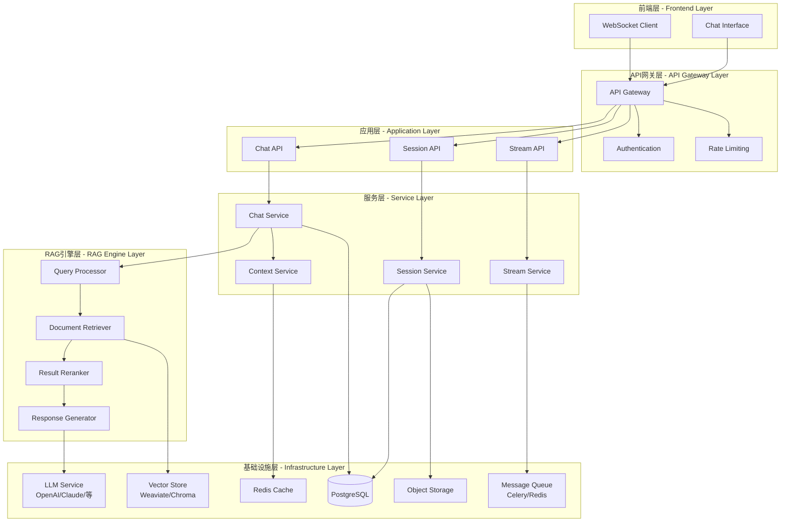
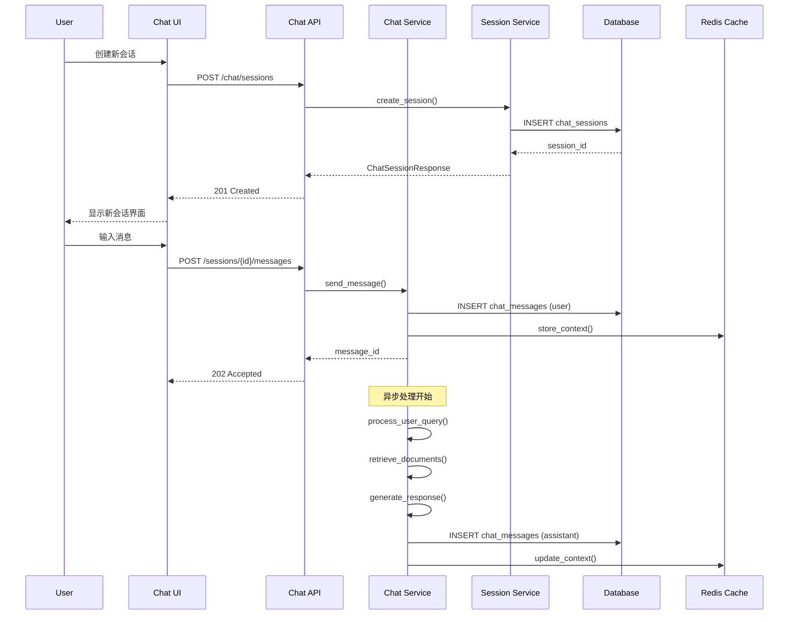
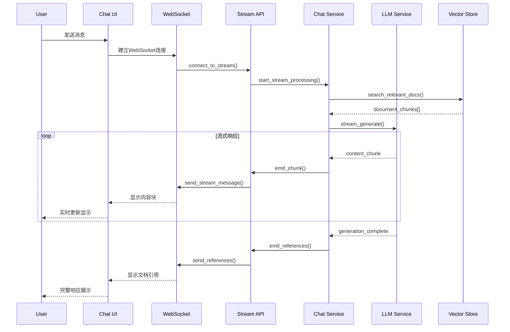
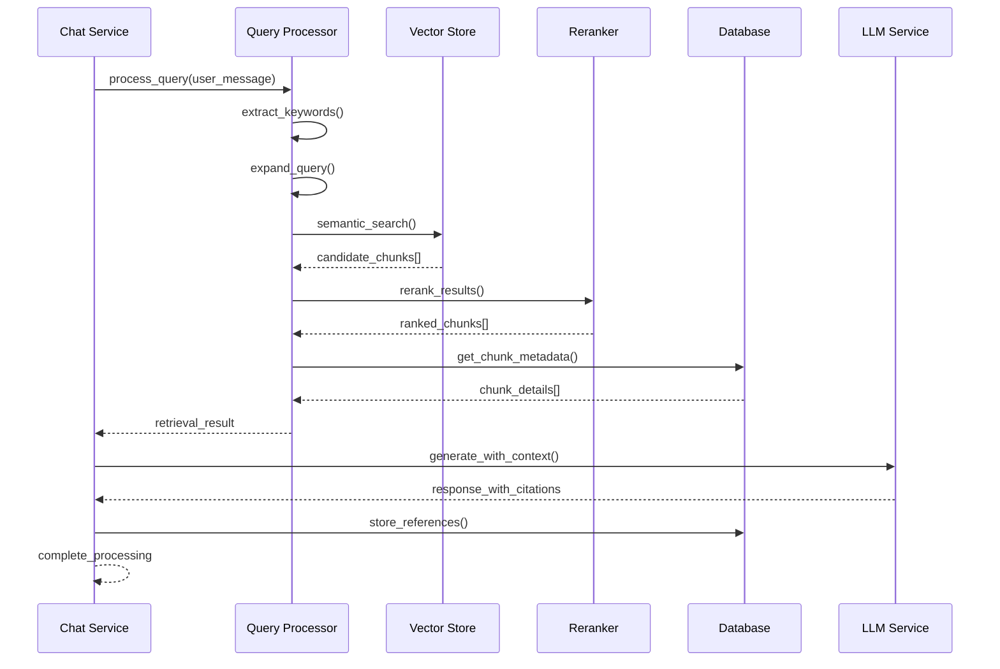

# 文档Chat系统技术设计方案

## 📋 目录

1. [项目概述](#项目概述)
2. [整体架构设计](#整体架构设计)
3. [数据模型设计](#数据模型设计)
4. [API接口设计](#api接口设计)
5. [时序图和交互流程](#时序图和交互流程)
6. [模块设计](#模块设计)
7. [技术选型](#技术选型)
8. [实现计划](#实现计划)
9. [性能考虑](#性能考虑)
10. [安全考虑](#安全考虑)

---

## 🎯 项目概述

### 功能目标

基于现有RAG系统，设计并实现一个智能文档Chat功能，让用户能够：

- **智能对话**：与文档内容进行自然语言对话
- **上下文理解**：维持对话上下文，支持多轮对话
- **文档引用**：准确引用相关文档片段
- **实时交互**：支持流式响应和实时对话
- **多模态支持**：支持文本、图片等多种输入方式
- **会话管理**：支持会话保存、历史查看、分享等功能

### 核心特性

1. **基于RAG的智能问答**：结合向量检索和大语言模型
2. **流式响应**：WebSocket实时流式返回答案
3. **上下文记忆**：智能管理对话历史和上下文
4. **多文档整合**：跨多个文档进行信息整合
5. **引用溯源**：提供准确的文档来源引用
6. **个性化体验**：根据用户偏好调整对话风格

---

## 🏗️ 整体架构设计

### 系统架构图



### 架构分层说明

#### 1. 前端层 (Frontend Layer)
- **Chat Interface**: React/Vue.js构建的聊天界面
- **WebSocket Client**: 实时双向通信客户端

#### 2. API网关层 (API Gateway Layer)
- **API Gateway**: 统一入口，路由分发
- **Authentication**: 用户认证和授权
- **Rate Limiting**: 访问频率限制

#### 3. 应用层 (Application Layer)
- **Chat API**: RESTful聊天接口
- **Session API**: 会话管理接口
- **Stream API**: WebSocket流式接口

#### 4. 服务层 (Service Layer)
- **Chat Service**: 核心聊天业务逻辑
- **Session Service**: 会话生命周期管理
- **Context Service**: 对话上下文管理
- **Stream Service**: 流式响应处理

#### 5. RAG引擎层 (RAG Engine Layer)
- **Query Processor**: 查询预处理和优化
- **Document Retriever**: 文档检索器
- **Result Reranker**: 结果重排序
- **Response Generator**: 响应生成器

#### 6. 基础设施层 (Infrastructure Layer)
- **LLM Service**: 大语言模型服务
- **Vector Store**: 向量数据库
- **Cache**: Redis缓存
- **Database**: PostgreSQL关系数据库
- **Storage**: MinIO对象存储
- **Message Queue**: 异步任务队列

---

## 💾 数据模型设计

### 核心数据模型

#### 1. 会话模型 (ChatSession)

```sql
CREATE TABLE chat_sessions (
    id BIGSERIAL PRIMARY KEY,
    session_id VARCHAR(255) UNIQUE NOT NULL,
    
    -- 关联信息
    user_id BIGINT,
    topic_id BIGINT REFERENCES topics(id),
    
    -- 会话信息
    title VARCHAR(500),
    description TEXT,
    status VARCHAR(50) DEFAULT 'active',
    
    -- 配置信息
    model_config JSONB DEFAULT '{}',
    context_settings JSONB DEFAULT '{}',
    
    -- 统计信息
    message_count INTEGER DEFAULT 0,
    total_tokens INTEGER DEFAULT 0,
    last_activity_at TIMESTAMP WITH TIME ZONE,
    
    -- 时间戳
    created_at TIMESTAMP WITH TIME ZONE DEFAULT NOW(),
    updated_at TIMESTAMP WITH TIME ZONE DEFAULT NOW()
);

CREATE INDEX idx_chat_sessions_user_id ON chat_sessions(user_id);
CREATE INDEX idx_chat_sessions_topic_id ON chat_sessions(topic_id);
CREATE INDEX idx_chat_sessions_status ON chat_sessions(status);
```

#### 2. 消息模型 (ChatMessage)

```sql
CREATE TABLE chat_messages (
    id BIGSERIAL PRIMARY KEY,
    message_id VARCHAR(255) UNIQUE NOT NULL,
    
    -- 关联信息
    session_id VARCHAR(255) REFERENCES chat_sessions(session_id),
    parent_message_id VARCHAR(255),
    
    -- 消息内容
    role VARCHAR(20) NOT NULL, -- 'user', 'assistant', 'system'
    content TEXT NOT NULL,
    content_type VARCHAR(50) DEFAULT 'text',
    
    -- 元数据
    metadata JSONB DEFAULT '{}',
    tokens INTEGER DEFAULT 0,
    
    -- 状态信息
    status VARCHAR(50) DEFAULT 'completed',
    error_message TEXT,
    
    -- 时间戳
    created_at TIMESTAMP WITH TIME ZONE DEFAULT NOW(),
    updated_at TIMESTAMP WITH TIME ZONE DEFAULT NOW()
);

CREATE INDEX idx_chat_messages_session_id ON chat_messages(session_id);
CREATE INDEX idx_chat_messages_parent_id ON chat_messages(parent_message_id);
CREATE INDEX idx_chat_messages_role ON chat_messages(role);
```

#### 3. 上下文模型 (ChatContext)

```sql
CREATE TABLE chat_contexts (
    id BIGSERIAL PRIMARY KEY,
    context_id VARCHAR(255) UNIQUE NOT NULL,
    
    -- 关联信息
    session_id VARCHAR(255) REFERENCES chat_sessions(session_id),
    message_id VARCHAR(255) REFERENCES chat_messages(message_id),
    
    -- 上下文信息
    context_type VARCHAR(50) NOT NULL, -- 'retrieval', 'conversation', 'system'
    context_data JSONB NOT NULL,
    relevance_score DECIMAL(5,4),
    
    -- 时间戳
    created_at TIMESTAMP WITH TIME ZONE DEFAULT NOW()
);

CREATE INDEX idx_chat_contexts_session_id ON chat_contexts(session_id);
CREATE INDEX idx_chat_contexts_message_id ON chat_contexts(message_id);
CREATE INDEX idx_chat_contexts_type ON chat_contexts(context_type);
```

#### 4. 文档引用模型 (ChatReference)

```sql
CREATE TABLE chat_references (
    id BIGSERIAL PRIMARY KEY,
    reference_id VARCHAR(255) UNIQUE NOT NULL,
    
    -- 关联信息
    message_id VARCHAR(255) REFERENCES chat_messages(message_id),
    document_id VARCHAR(255) REFERENCES documents(id),
    chunk_id VARCHAR(255) REFERENCES document_chunks(id),
    
    -- 引用信息
    reference_type VARCHAR(50) NOT NULL, -- 'direct', 'context', 'related'
    relevance_score DECIMAL(5,4),
    excerpt TEXT,
    
    -- 位置信息
    start_char INTEGER,
    end_char INTEGER,
    page_number INTEGER,
    
    -- 时间戳
    created_at TIMESTAMP WITH TIME ZONE DEFAULT NOW()
);

CREATE INDEX idx_chat_references_message_id ON chat_references(message_id);
CREATE INDEX idx_chat_references_document_id ON chat_references(document_id);
CREATE INDEX idx_chat_references_chunk_id ON chat_references(chunk_id);
```

#### 5. 流式响应模型 (ChatStream)

```sql
CREATE TABLE chat_streams (
    id BIGSERIAL PRIMARY KEY,
    stream_id VARCHAR(255) UNIQUE NOT NULL,
    
    -- 关联信息
    session_id VARCHAR(255) REFERENCES chat_sessions(session_id),
    message_id VARCHAR(255) REFERENCES chat_messages(message_id),
    
    -- 流式信息
    chunk_index INTEGER NOT NULL,
    chunk_content TEXT,
    chunk_type VARCHAR(50) DEFAULT 'text',
    
    -- 状态信息
    is_final BOOLEAN DEFAULT FALSE,
    error_message TEXT,
    
    -- 时间戳
    created_at TIMESTAMP WITH TIME ZONE DEFAULT NOW()
);

CREATE INDEX idx_chat_streams_stream_id ON chat_streams(stream_id);
CREATE INDEX idx_chat_streams_message_id ON chat_streams(message_id);
```

### Schema定义 (Pydantic Models)

#### 会话相关Schema

```python
# modules/schemas/chat.py

from typing import Optional, List, Dict, Any
from datetime import datetime
from enum import Enum
from pydantic import BaseModel, Field

class ChatSessionStatus(str, Enum):
    ACTIVE = "active"
    ARCHIVED = "archived"
    DELETED = "deleted"

class MessageRole(str, Enum):
    USER = "user"
    ASSISTANT = "assistant"
    SYSTEM = "system"

class MessageStatus(str, Enum):
    PENDING = "pending"
    STREAMING = "streaming"
    COMPLETED = "completed"
    FAILED = "failed"

class ChatSessionCreate(BaseModel):
    title: Optional[str] = None
    description: Optional[str] = None
    topic_id: Optional[int] = None
    model_config: Dict[str, Any] = Field(default_factory=dict)
    context_settings: Dict[str, Any] = Field(default_factory=dict)

class ChatSessionUpdate(BaseModel):
    title: Optional[str] = None
    description: Optional[str] = None
    status: Optional[ChatSessionStatus] = None
    model_config: Optional[Dict[str, Any]] = None
    context_settings: Optional[Dict[str, Any]] = None

class ChatSessionResponse(BaseModel):
    id: int
    session_id: str
    user_id: Optional[int]
    topic_id: Optional[int]
    title: Optional[str]
    description: Optional[str]
    status: ChatSessionStatus
    model_config: Dict[str, Any]
    context_settings: Dict[str, Any]
    message_count: int
    total_tokens: int
    last_activity_at: Optional[datetime]
    created_at: datetime
    updated_at: datetime

class ChatMessageCreate(BaseModel):
    content: str
    content_type: str = "text"
    metadata: Dict[str, Any] = Field(default_factory=dict)

class ChatMessageResponse(BaseModel):
    id: int
    message_id: str
    session_id: str
    parent_message_id: Optional[str]
    role: MessageRole
    content: str
    content_type: str
    metadata: Dict[str, Any]
    tokens: int
    status: MessageStatus
    error_message: Optional[str]
    created_at: datetime
    updated_at: datetime

class ChatReferenceResponse(BaseModel):
    id: int
    reference_id: str
    message_id: str
    document_id: str
    chunk_id: str
    reference_type: str
    relevance_score: float
    excerpt: str
    start_char: Optional[int]
    end_char: Optional[int]
    page_number: Optional[int]
    created_at: datetime
```

---

## 🔌 API接口设计

### 1. 会话管理API

#### 创建会话
```http
POST /api/v1/chat/sessions
Content-Type: application/json

{
    "title": "关于AI技术的讨论",
    "description": "探讨机器学习相关问题",
    "topic_id": 123,
    "model_config": {
        "model": "gpt-4",
        "temperature": 0.7,
        "max_tokens": 2000
    },
    "context_settings": {
        "max_context_length": 8000,
        "include_document_metadata": true
    }
}
```

#### 获取会话列表
```http
GET /api/v1/chat/sessions?page=1&page_size=20&topic_id=123&status=active
```

#### 获取会话详情
```http
GET /api/v1/chat/sessions/{session_id}
```

#### 更新会话
```http
PUT /api/v1/chat/sessions/{session_id}
Content-Type: application/json

{
    "title": "更新后的标题",
    "status": "archived"
}
```

#### 删除会话
```http
DELETE /api/v1/chat/sessions/{session_id}
```

### 2. 消息管理API

#### 发送消息
```http
POST /api/v1/chat/sessions/{session_id}/messages
Content-Type: application/json

{
    "content": "请解释一下机器学习的基本概念",
    "content_type": "text",
    "metadata": {
        "user_context": "初学者",
        "preferred_language": "zh-CN"
    }
}
```

#### 获取消息历史
```http
GET /api/v1/chat/sessions/{session_id}/messages?page=1&page_size=50&before_message_id=msg_123
```

#### 获取消息详情
```http
GET /api/v1/chat/messages/{message_id}
```

#### 重新生成回复
```http
POST /api/v1/chat/messages/{message_id}/regenerate
```

### 3. 流式对话API (WebSocket)

#### 连接WebSocket
```javascript
const ws = new WebSocket('ws://localhost:8000/api/v1/chat/sessions/{session_id}/stream');

ws.onopen = function() {
    console.log('Connected to chat stream');
};

ws.onmessage = function(event) {
    const data = JSON.parse(event.data);
    handleStreamMessage(data);
};
```

#### 流式消息格式
```json
{
    "type": "stream_start",
    "session_id": "session_123",
    "message_id": "msg_456",
    "timestamp": "2024-01-15T10:30:00Z"
}

{
    "type": "content_chunk",
    "session_id": "session_123",
    "message_id": "msg_456",
    "chunk_index": 1,
    "content": "机器学习是一种",
    "is_final": false,
    "timestamp": "2024-01-15T10:30:01Z"
}

{
    "type": "reference_chunk",
    "session_id": "session_123",
    "message_id": "msg_456",
    "reference": {
        "document_id": "doc_789",
        "chunk_id": "chunk_101",
        "excerpt": "机器学习的定义...",
        "relevance_score": 0.95
    },
    "timestamp": "2024-01-15T10:30:02Z"
}

{
    "type": "stream_end",
    "session_id": "session_123",
    "message_id": "msg_456",
    "total_tokens": 150,
    "total_chunks": 25,
    "timestamp": "2024-01-15T10:30:15Z"
}
```

### 4. 上下文管理API

#### 获取会话上下文
```http
GET /api/v1/chat/sessions/{session_id}/context
```

#### 更新上下文设置
```http
PUT /api/v1/chat/sessions/{session_id}/context
Content-Type: application/json

{
    "max_context_length": 10000,
    "include_document_metadata": true,
    "context_window_strategy": "sliding",
    "relevance_threshold": 0.7
}
```

### 5. 搜索和引用API

#### 文档搜索
```http
POST /api/v1/chat/search
Content-Type: application/json

{
    "query": "机器学习算法",
    "topic_id": 123,
    "search_type": "hybrid",
    "max_results": 10,
    "relevance_threshold": 0.6
}
```

#### 获取消息引用
```http
GET /api/v1/chat/messages/{message_id}/references
```

---

## ⏰ 时序图和交互流程

### 1. 创建会话并发送消息流程



### 2. 流式对话交互流程



### 3. 文档检索和引用流程



---

## 🧩 模块设计

### 1. Chat Service模块

```python
# modules/services/chat_service.py

class ChatService(BaseService):
    """聊天服务核心业务逻辑"""
    
    def __init__(self, 
                 session: AsyncSession,
                 llm_service: ILLMService,
                 retrieval_service: IRetrievalService,
                 context_service: IContextService):
        super().__init__(session)
        self.llm_service = llm_service
        self.retrieval_service = retrieval_service
        self.context_service = context_service
    
    async def send_message(self, 
                          session_id: str,
                          message: ChatMessageCreate) -> ChatMessageResponse:
        """发送消息并生成回复"""
        
    async def process_stream_message(self,
                                   session_id: str,
                                   message: ChatMessageCreate) -> AsyncIterator[StreamChunk]:
        """流式处理消息"""
        
    async def regenerate_response(self,
                                message_id: str,
                                config: Optional[Dict] = None) -> ChatMessageResponse:
        """重新生成回复"""
```

### 2. Session Service模块

```python
# modules/services/session_service.py

class SessionService(BaseService):
    """会话管理服务"""
    
    async def create_session(self, 
                           user_id: Optional[int],
                           session_data: ChatSessionCreate) -> ChatSessionResponse:
        """创建新会话"""
        
    async def get_session(self, session_id: str) -> Optional[ChatSessionResponse]:
        """获取会话详情"""
        
    async def update_session(self,
                           session_id: str,
                           updates: ChatSessionUpdate) -> ChatSessionResponse:
        """更新会话"""
        
    async def list_sessions(self,
                          user_id: Optional[int] = None,
                          topic_id: Optional[int] = None,
                          status: Optional[str] = None,
                          page: int = 1,
                          page_size: int = 20) -> ChatSessionList:
        """获取会话列表"""
```

### 3. Context Service模块

```python
# modules/services/context_service.py

class ContextService(BaseService):
    """上下文管理服务"""
    
    async def build_context(self,
                          session_id: str,
                          current_message: str,
                          max_length: int = 8000) -> ChatContext:
        """构建对话上下文"""
        
    async def update_context(self,
                           session_id: str,
                           message_id: str,
                           context_data: Dict[str, Any]) -> None:
        """更新上下文信息"""
        
    async def get_relevant_history(self,
                                 session_id: str,
                                 query: str,
                                 limit: int = 10) -> List[ChatMessageResponse]:
        """获取相关历史消息"""
```

### 4. Stream Service模块

```python
# modules/services/stream_service.py

class StreamService:
    """流式响应服务"""
    
    def __init__(self, redis_client: Redis):
        self.redis = redis_client
        self.active_streams: Dict[str, WebSocket] = {}
    
    async def start_stream(self,
                         session_id: str,
                         websocket: WebSocket) -> None:
        """开始流式响应"""
        
    async def emit_chunk(self,
                       session_id: str,
                       chunk: StreamChunk) -> None:
        """发送流式数据块"""
        
    async def end_stream(self,
                       session_id: str,
                       final_data: Dict[str, Any]) -> None:
        """结束流式响应"""
```

### 5. Retrieval Service模块

```python
# modules/services/retrieval_service.py

class RetrievalService:
    """文档检索服务"""
    
    def __init__(self,
                 vector_store: IVectorStore,
                 reranker: IReranker,
                 embedding_service: IEmbeddingService):
        self.vector_store = vector_store
        self.reranker = reranker
        self.embedding_service = embedding_service
    
    async def search_documents(self,
                             query: str,
                             topic_id: Optional[int] = None,
                             max_results: int = 10,
                             relevance_threshold: float = 0.7) -> List[RetrievalResult]:
        """搜索相关文档"""
        
    async def hybrid_search(self,
                          query: str,
                          filters: Optional[Dict] = None) -> List[RetrievalResult]:
        """混合搜索（语义+关键词）"""
```

### 6. Chat API模块

```python
# modules/api/chat_api.py

router = APIRouter(prefix="/chat", tags=["chat"])

@router.post("/sessions", response_model=APIResponse[ChatSessionResponse])
async def create_session(
    session_data: ChatSessionCreate,
    current_user: User = Depends(get_current_user),
    service: SessionService = Depends(get_session_service)
):
    """创建聊天会话"""

@router.post("/sessions/{session_id}/messages", response_model=APIResponse[ChatMessageResponse])
async def send_message(
    session_id: str,
    message: ChatMessageCreate,
    service: ChatService = Depends(get_chat_service)
):
    """发送消息"""

@router.websocket("/sessions/{session_id}/stream")
async def chat_stream(
    websocket: WebSocket,
    session_id: str,
    service: StreamService = Depends(get_stream_service)
):
    """WebSocket流式聊天"""
```

---

## 🛠️ 技术选型

### 1. 后端技术栈

| 组件 | 技术选型 | 版本 | 说明 |
|------|----------|------|------|
| **Web框架** | FastAPI | 0.104+ | 高性能异步框架，原生支持WebSocket |
| **数据库** | PostgreSQL | 15+ | 关系数据库，支持JSONB和向量扩展 |
| **向量数据库** | Weaviate | 1.21+ | 支持混合搜索和多模态 |
| **缓存** | Redis | 7.0+ | 内存缓存和消息队列 |
| **异步任务** | Celery | 5.3+ | 分布式任务队列 |
| **LLM接口** | OpenAI API | GPT-4 | 大语言模型服务 |
| **Embedding** | OpenAI API | text-embedding-3-large | 向量嵌入服务 |
| **WebSocket** | FastAPI WebSocket | - | 原生WebSocket支持 |

### 2. 前端技术栈

| 组件 | 技术选型 | 版本 | 说明 |
|------|----------|------|------|
| **框架** | React | 18+ | 现代前端框架 |
| **状态管理** | Zustand | 4.4+ | 轻量级状态管理 |
| **UI组件** | Ant Design | 5.0+ | 企业级UI组件库 |
| **WebSocket** | Socket.IO Client | 4.7+ | 实时通信客户端 |
| **Markdown** | React Markdown | 8.0+ | Markdown渲染 |
| **代码高亮** | Prism.js | 1.29+ | 代码语法高亮 |

### 3. DevOps技术栈

| 组件 | 技术选型 | 版本 | 说明 |
|------|----------|------|------|
| **容器化** | Docker | 24+ | 应用容器化 |
| **编排** | Docker Compose | 2.21+ | 本地开发环境 |
| **负载均衡** | Nginx | 1.25+ | 反向代理和负载均衡 |
| **监控** | Prometheus | 2.45+ | 指标监控 |
| **日志** | Grafana | 10.0+ | 日志分析和可视化 |
| **存储** | MinIO | 2023+ | 对象存储服务 |

### 4. LLM服务选型

#### 主要选项对比

| 服务商 | 模型 | 优势 | 劣势 | 适用场景 |
|--------|------|------|------|----------|
| **OpenAI** | GPT-4 Turbo | 最强理解能力 | 成本较高 | 复杂推理 |
| **OpenAI** | GPT-3.5 Turbo | 性价比高 | 能力略弱 | 一般对话 |
| **Anthropic** | Claude-3 | 更安全可控 | API限制 | 敏感内容 |
| **本地部署** | Llama2/ChatGLM | 数据安全 | 资源要求高 | 私有部署 |

#### 推荐配置

```python
# config/llm.py

LLM_CONFIGS = {
    "production": {
        "primary": {
            "provider": "openai",
            "model": "gpt-4-1106-preview",
            "max_tokens": 4000,
            "temperature": 0.7
        },
        "fallback": {
            "provider": "openai", 
            "model": "gpt-3.5-turbo-1106",
            "max_tokens": 3000,
            "temperature": 0.7
        }
    },
    "development": {
        "primary": {
            "provider": "openai",
            "model": "gpt-3.5-turbo-1106",
            "max_tokens": 2000,
            "temperature": 0.5
        }
    }
}
```

### 5. 向量数据库选型

#### 对比分析

| 数据库 | 性能 | 扩展性 | 易用性 | 功能丰富度 | 推荐指数 |
|--------|------|--------|--------|------------|----------|
| **Weaviate** | ⭐⭐⭐⭐⭐ | ⭐⭐⭐⭐⭐ | ⭐⭐⭐⭐ | ⭐⭐⭐⭐⭐ | ⭐⭐⭐⭐⭐ |
| **Qdrant** | ⭐⭐⭐⭐⭐ | ⭐⭐⭐⭐ | ⭐⭐⭐⭐ | ⭐⭐⭐⭐ | ⭐⭐⭐⭐ |
| **Chroma** | ⭐⭐⭐ | ⭐⭐⭐ | ⭐⭐⭐⭐⭐ | ⭐⭐⭐ | ⭐⭐⭐ |
| **Pinecone** | ⭐⭐⭐⭐⭐ | ⭐⭐⭐⭐⭐ | ⭐⭐⭐⭐⭐ | ⭐⭐⭐⭐ | ⭐⭐⭐⭐ |

**选择理由**：
- **Weaviate**: 支持混合搜索、多模态、GraphQL API
- **备选方案**: Qdrant（高性能）或Pinecone（托管服务）

---

## 📈 实现计划

### Phase 1: 基础架构 (2周)

#### Week 1: 数据模型和基础服务
- [ ] 创建Chat相关数据表
- [ ] 实现基础Schema定义
- [ ] 开发SessionService和基础Repository
- [ ] 配置数据库迁移脚本

#### Week 2: 核心服务开发
- [ ] 实现ChatService核心逻辑
- [ ] 开发ContextService上下文管理
- [ ] 集成现有RAG组件
- [ ] 编写单元测试

### Phase 2: API开发 (2周)

#### Week 3: RESTful API
- [ ] 开发会话管理API
- [ ] 实现消息发送API
- [ ] 添加搜索和引用API
- [ ] API文档和测试

#### Week 4: WebSocket实现
- [ ] 开发StreamService
- [ ] 实现WebSocket连接管理
- [ ] 流式响应机制
- [ ] 错误处理和重连

### Phase 3: 高级功能 (3周)

#### Week 5-6: 智能检索
- [ ] 优化文档检索算法
- [ ] 实现结果重排序
- [ ] 多模态搜索支持
- [ ] 缓存和性能优化

#### Week 7: 用户体验
- [ ] 上下文智能管理
- [ ] 对话历史压缩
- [ ] 个性化配置
- [ ] 实时协作功能

### Phase 4: 前端集成 (2周)

#### Week 8: 前端开发
- [ ] React聊天界面开发
- [ ] WebSocket客户端集成
- [ ] 流式渲染实现
- [ ] 响应式设计

#### Week 9: 测试和优化
- [ ] 端到端测试
- [ ] 性能压力测试
- [ ] 用户体验优化
- [ ] 部署和监控

---

## ⚡ 性能考虑

### 1. 响应时间优化

#### 目标指标
- **首次响应**: < 500ms
- **流式首包**: < 200ms  
- **平均响应**: < 2s
- **并发支持**: 1000+ WebSocket连接

#### 优化策略

##### 缓存策略
```python
# 多层缓存设计
class CacheStrategy:
    # L1: 内存缓存 (最近对话)
    memory_cache = TTLCache(maxsize=1000, ttl=300)
    
    # L2: Redis缓存 (会话上下文)
    redis_cache = Redis(db=1)
    
    # L3: 数据库 (持久化存储)
    database = PostgreSQL()
    
    async def get_context(self, session_id: str):
        # 1. 先查内存
        if context := self.memory_cache.get(session_id):
            return context
            
        # 2. 再查Redis
        if context := await self.redis_cache.get(f"context:{session_id}"):
            self.memory_cache[session_id] = context
            return context
            
        # 3. 最后查数据库
        context = await self.database.get_context(session_id)
        await self.redis_cache.setex(f"context:{session_id}", 300, context)
        self.memory_cache[session_id] = context
        return context
```

##### 异步处理
```python
# 异步任务处理
class AsyncProcessing:
    async def process_message(self, message: str) -> str:
        # 1. 立即返回确认
        response_id = await self.create_response_placeholder()
        
        # 2. 异步处理
        asyncio.create_task(self._async_process(message, response_id))
        
        return response_id
    
    async def _async_process(self, message: str, response_id: str):
        # 检索文档
        docs = await self.retrieve_documents(message)
        
        # 生成回复 (流式)
        async for chunk in self.llm.stream_generate(message, docs):
            await self.stream_service.emit_chunk(response_id, chunk)
```

### 2. 并发处理

#### 连接池配置
```python
# 数据库连接池
DATABASE_CONFIG = {
    "pool_size": 20,
    "max_overflow": 30,
    "pool_timeout": 30,
    "pool_recycle": 3600
}

# Redis连接池
REDIS_CONFIG = {
    "max_connections": 50,
    "retry_on_timeout": True,
    "socket_timeout": 5
}
```

#### WebSocket管理
```python
class WebSocketManager:
    def __init__(self):
        self.active_connections: Dict[str, WebSocket] = {}
        self.connection_pool = asyncio.Semaphore(1000)  # 最大连接数
    
    async def connect(self, session_id: str, websocket: WebSocket):
        async with self.connection_pool:
            await websocket.accept()
            self.active_connections[session_id] = websocket
    
    async def broadcast_to_session(self, session_id: str, message: dict):
        if websocket := self.active_connections.get(session_id):
            try:
                await websocket.send_json(message)
            except ConnectionClosedOK:
                del self.active_connections[session_id]
```

### 3. 数据库优化

#### 索引策略
```sql
-- 会话查询优化
CREATE INDEX CONCURRENTLY idx_chat_sessions_user_activity 
ON chat_sessions(user_id, last_activity_at DESC);

-- 消息查询优化
CREATE INDEX CONCURRENTLY idx_chat_messages_session_created 
ON chat_messages(session_id, created_at DESC);

-- 上下文查询优化
CREATE INDEX CONCURRENTLY idx_chat_contexts_session_relevance 
ON chat_contexts(session_id, relevance_score DESC);
```

#### 分区策略
```sql
-- 按时间分区消息表
CREATE TABLE chat_messages_2024_01 PARTITION OF chat_messages
FOR VALUES FROM ('2024-01-01') TO ('2024-02-01');

CREATE TABLE chat_messages_2024_02 PARTITION OF chat_messages  
FOR VALUES FROM ('2024-02-01') TO ('2024-03-01');
```

---

## 🔒 安全考虑

### 1. 认证和授权

#### JWT Token设计
```python
class ChatAuthService:
    async def generate_chat_token(self, user_id: int, session_id: str) -> str:
        payload = {
            "user_id": user_id,
            "session_id": session_id,
            "permissions": ["chat.read", "chat.write"],
            "exp": datetime.utcnow() + timedelta(hours=24)
        }
        return jwt.encode(payload, SECRET_KEY, algorithm="HS256")
    
    async def validate_session_access(self, user_id: int, session_id: str) -> bool:
        session = await self.session_repo.get_by_id(session_id)
        return session and session.user_id == user_id
```

#### 权限控制
```python
class ChatPermissionChecker:
    async def check_session_permission(self, user_id: int, session_id: str, action: str):
        # 检查会话所有权
        if not await self.auth_service.validate_session_access(user_id, session_id):
            raise PermissionDenied("无权访问此会话")
        
        # 检查操作权限
        if action == "delete" and not await self.check_admin_permission(user_id):
            raise PermissionDenied("无权删除会话")
```

### 2. 数据安全

#### 敏感信息过滤
```python
class ContentFilter:
    SENSITIVE_PATTERNS = [
        r'\b\d{15,19}\b',  # 信用卡号
        r'\b\d{3}-\d{2}-\d{4}\b',  # SSN
        r'\b[A-Za-z0-9._%+-]+@[A-Za-z0-9.-]+\.[A-Z|a-z]{2,}\b'  # 邮箱
    ]
    
    async def filter_content(self, content: str) -> str:
        for pattern in self.SENSITIVE_PATTERNS:
            content = re.sub(pattern, "[REDACTED]", content)
        return content
```

#### 数据加密
```python
class DataEncryption:
    def __init__(self, encryption_key: bytes):
        self.fernet = Fernet(encryption_key)
    
    async def encrypt_message(self, content: str) -> str:
        encrypted = self.fernet.encrypt(content.encode())
        return base64.b64encode(encrypted).decode()
    
    async def decrypt_message(self, encrypted_content: str) -> str:
        encrypted = base64.b64decode(encrypted_content.encode())
        decrypted = self.fernet.decrypt(encrypted)
        return decrypted.decode()
```

### 3. 访问控制

#### 频率限制
```python
class RateLimiter:
    def __init__(self, redis_client: Redis):
        self.redis = redis_client
    
    async def check_rate_limit(self, user_id: int, action: str) -> bool:
        key = f"rate_limit:{user_id}:{action}"
        current = await self.redis.get(key)
        
        limits = {
            "send_message": (60, 60),  # 60条/分钟
            "create_session": (10, 3600),  # 10个/小时
        }
        
        max_requests, window = limits.get(action, (100, 3600))
        
        if current and int(current) >= max_requests:
            return False
        
        await self.redis.incr(key)
        await self.redis.expire(key, window)
        return True
```

#### IP白名单
```python
class IPWhitelist:
    ALLOWED_IPS = {
        "admin": ["192.168.1.0/24"],
        "api": ["10.0.0.0/8"],
    }
    
    def check_ip_permission(self, ip: str, permission_type: str) -> bool:
        allowed_networks = self.ALLOWED_IPS.get(permission_type, [])
        ip_addr = ipaddress.ip_address(ip)
        
        for network in allowed_networks:
            if ip_addr in ipaddress.ip_network(network):
                return True
        return False
```

---

## 📝 总结

### 核心特点

1. **完整的架构设计**: 从数据模型到API接口的全栈设计
2. **高性能实现**: 流式响应、缓存优化、异步处理
3. **智能检索**: 基于RAG的文档检索和上下文管理
4. **安全可靠**: 完善的认证授权和数据保护机制
5. **扩展性强**: 模块化设计，便于功能扩展

### 技术亮点

- **流式响应**: WebSocket实时流式对话体验
- **智能上下文**: 动态上下文管理和历史记忆
- **混合检索**: 语义搜索+关键词搜索的混合检索
- **多模态支持**: 支持文本、图片等多种输入方式
- **高并发**: 支持1000+并发WebSocket连接

### 实施价值

1. **用户体验**: 提供类ChatGPT的流畅对话体验
2. **知识整合**: 将文档知识有机整合到对话中
3. **效率提升**: 大幅提升文档查询和理解效率
4. **技术先进**: 采用最新的RAG和LLM技术

该设计方案为文档Chat功能提供了完整的技术实现路径，确保功能的先进性、稳定性和可扩展性。


