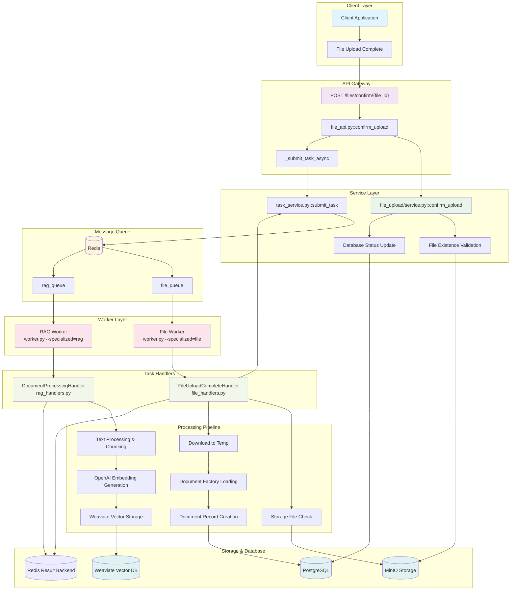
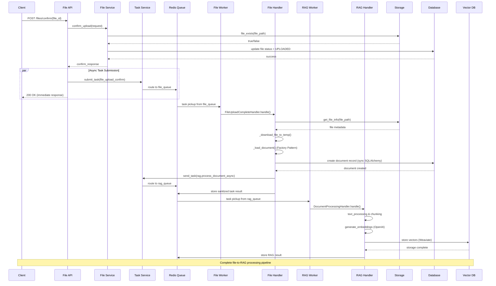
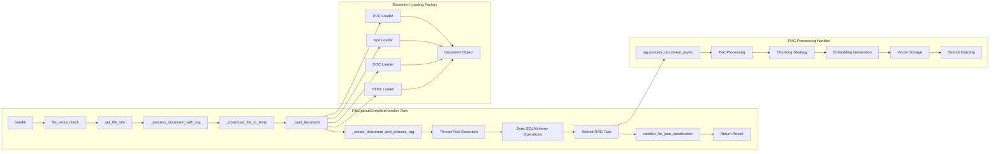
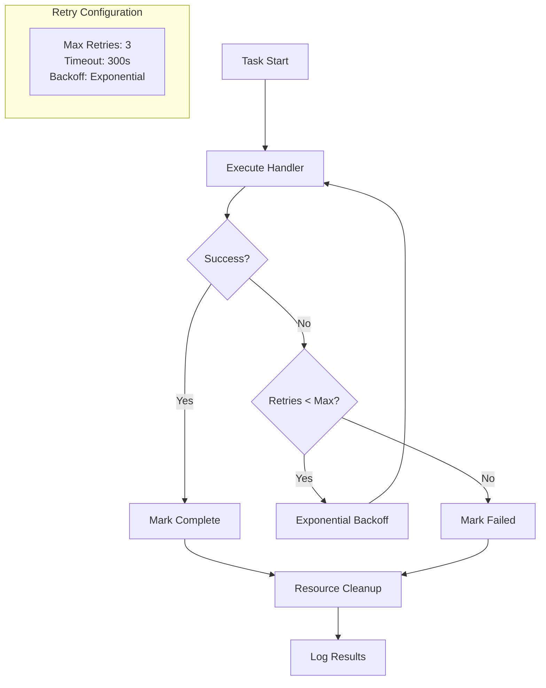
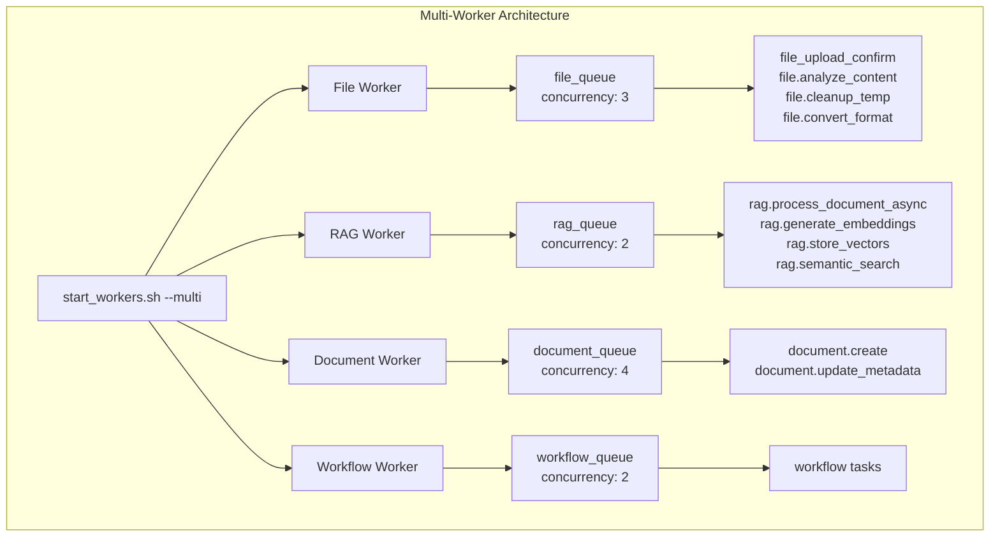

# File Upload Processing Flow Diagram

## High-Level Architecture Flow

```mermaid
graph TB
    subgraph "Client Layer"
        Client["Client Application"]
        Upload["File Upload Complete"]
    end
    
    subgraph "API Gateway"
        API["POST /files/confirm/{file_id}"]
        FileAPI["file_api.py::confirm_upload"]
        AsyncTask["_submit_task_async"]
    end
    
    subgraph "Service Layer"
        FileService["file_upload/service.py::confirm_upload"]
        Validation["File Existence Validation"]
        DBUpdate["Database Status Update"]
        TaskService["task_service.py::submit_task"]
    end
    
    subgraph "Message Queue"
        Redis[("Redis")]
        FileQueue["file_queue"]
        RAGQueue["rag_queue"]
    end
    
    subgraph "Worker Layer"
        FileWorker["File Worker<br>worker.py --specialized=file"]
        RAGWorker["RAG Worker<br>worker.py --specialized=rag"]
    end
    
    subgraph "Task Handlers"
        FileHandler["FileUploadCompleteHandler<br>file_handlers.py"]
        RAGHandler["DocumentProcessingHandler<br>rag_handlers.py"]
    end
    
    subgraph "Processing Pipeline"
        StorageCheck["Storage File Check"]
        Download["Download to Temp"]
        DocLoad["Document Factory Loading"]
        DBCreate["Document Record Creation"]
        TextProcess["Text Processing & Chunking"]
        Embedding["OpenAI Embedding Generation"]
        VectorStore["Weaviate Vector Storage"]
    end
    
    subgraph "Storage & Database"
        MinIO[("MinIO Storage")]
        PostgreSQL[("PostgreSQL")]
        Weaviate[("Weaviate Vector DB")]
        ResultBackend[("Redis Result Backend")]
    end
    
    Client --> Upload
    Upload --> API
    API --> FileAPI
    FileAPI --> FileService
    FileAPI --> AsyncTask
    
    FileService --> Validation
    FileService --> DBUpdate
    Validation --> MinIO
    DBUpdate --> PostgreSQL
    
    AsyncTask --> TaskService
    TaskService --> Redis
    Redis --> FileQueue
    Redis --> RAGQueue
    
    FileQueue --> FileWorker
    RAGQueue --> RAGWorker
    
    FileWorker --> FileHandler
    RAGWorker --> RAGHandler
    
    FileHandler --> StorageCheck
    StorageCheck --> MinIO
    FileHandler --> Download
    Download --> DocLoad
    DocLoad --> DBCreate
    DBCreate --> PostgreSQL
    FileHandler --> TaskService
    
    RAGHandler --> TextProcess
    TextProcess --> Embedding
    Embedding --> VectorStore
    VectorStore --> Weaviate
    
    FileHandler --> ResultBackend
    RAGHandler --> ResultBackend
    
    style Client fill:#e1f5fe
    style API fill:#f3e5f5
    style FileService fill:#e8f5e8
    style Redis fill:#fff3e0
    style FileWorker fill:#fce4ec
    style RAGWorker fill:#fce4ec
    style FileHandler fill:#f1f8e9
    style RAGHandler fill:#f1f8e9
    style MinIO fill:#e0f2f1
    style PostgreSQL fill:#e0f2f1
    style Weaviate fill:#e0f2f1
```

## Detailed Processing Sequence

```mermaid
sequenceDiagram
    participant C as Client
    participant API as File API
    participant FS as File Service
    participant TS as Task Service
    participant R as Redis Queue
    participant FW as File Worker
    participant FH as File Handler
    participant RW as RAG Worker
    participant RH as RAG Handler
    participant S as Storage
    participant DB as Database
    participant V as Vector DB

    C->>API: POST /files/confirm/{file_id}
    API->>FS: confirm_upload(request)
    FS->>S: file_exists(file_path)
    S-->>FS: true/false
    FS->>DB: update file status = UPLOADED
    DB-->>FS: success
    FS-->>API: confirm_response
    
    par Async Task Submission
        API->>TS: submit_task(file_upload_confirm)
        TS->>R: route to file_queue
        API-->>C: 200 OK (immediate response)
    end
    
    R->>FW: task pickup from file_queue
    FW->>FH: FileUploadCompleteHandler.handle()
    
    FH->>S: get_file_info(file_path)
    S-->>FH: file metadata
    FH->>FH: _download_file_to_temp()
    FH->>FH: _load_document() (Factory Pattern)
    FH->>DB: create document record (sync SQLAlchemy)
    DB-->>FH: document created
    
    FH->>TS: send_task(rag.process_document_async)
    TS->>R: route to rag_queue
    FH->>R: store sanitized task result
    
    R->>RW: task pickup from rag_queue
    RW->>RH: DocumentProcessingHandler.handle()
    
    RH->>RH: text_processing & chunking
    RH->>RH: generate_embeddings (OpenAI)
    RH->>V: store vectors (Weaviate)
    V-->>RH: storage complete
    RH->>R: store RAG result
    
    Note over C,V: Complete file-to-RAG processing pipeline
```

## Task Handler Details

```mermaid
graph LR
    subgraph "FileUploadCompleteHandler Flow"
        A[handle] --> B[file_exists check]
        B --> C[get_file_info]
        C --> D[_process_document_with_rag]
        D --> E[_download_file_to_temp]
        E --> F[_load_document]
        F --> G[_create_document_and_process_rag]
        G --> H[Thread Pool Execution]
        H --> I[Sync SQLAlchemy Operations]
        I --> J[Submit RAG Task]
        J --> K[sanitize_for_json_serialization]
        K --> L[Return Result]
    end
    
    subgraph "Document Loading Factory"
        F --> PDF[PDF Loader]
        F --> TXT[Text Loader] 
        F --> DOC[DOC Loader]
        F --> HTML[HTML Loader]
        PDF --> LoadResult[Document Object]
        TXT --> LoadResult
        DOC --> LoadResult
        HTML --> LoadResult
    end
    
    subgraph "RAG Processing Handler"
        RAGStart[rag.process_document_async] --> TextProc[Text Processing]
        TextProc --> Chunk[Chunking Strategy]
        Chunk --> Embed[Embedding Generation]
        Embed --> VecStore[Vector Storage]
        VecStore --> Index[Search Indexing]
    end
    
    J --> RAGStart
```

## Error Handling & Recovery

```mermaid
graph TD
    TaskStart[Task Start] --> Execute[Execute Handler]
    Execute --> Success{Success?}
    Success -->|Yes| Complete[Mark Complete]
    Success -->|No| Retry{Retries < Max?}
    Retry -->|Yes| Delay[Exponential Backoff]
    Delay --> Execute
    Retry -->|No| Failed[Mark Failed]
    
    Complete --> Cleanup[Resource Cleanup]
    Failed --> Cleanup
    Cleanup --> Log[Log Results]
    
    subgraph "Retry Configuration"
        RetryConfig["Max Retries: 3<br>Timeout: 300s<br>Backoff: Exponential"]
    end
```

## Worker Specialization

```mermaid
graph TB
    subgraph "Multi-Worker Architecture"
        Master[start_workers.sh --multi]
        
        Master --> FW[File Worker]
        Master --> RW[RAG Worker] 
        Master --> DW[Document Worker]
        Master --> WW[Workflow Worker]
        
        FW --> FQ["file_queue<br>concurrency: 3"]
        RW --> RQ["rag_queue<br>concurrency: 2"]
        DW --> DQ["document_queue<br>concurrency: 4"]
        WW --> WQ["workflow_queue<br>concurrency: 2"]
        
        FQ --> FTasks["file_upload_confirm<br>file.analyze_content<br>file.cleanup_temp<br>file.convert_format"]
        RQ --> RTasks["rag.process_document_async<br>rag.generate_embeddings<br>rag.store_vectors<br>rag.semantic_search"]
        DQ --> DTasks["document.create<br>document.update_metadata"]
        WQ --> WTasks["workflow tasks"]
    end
```