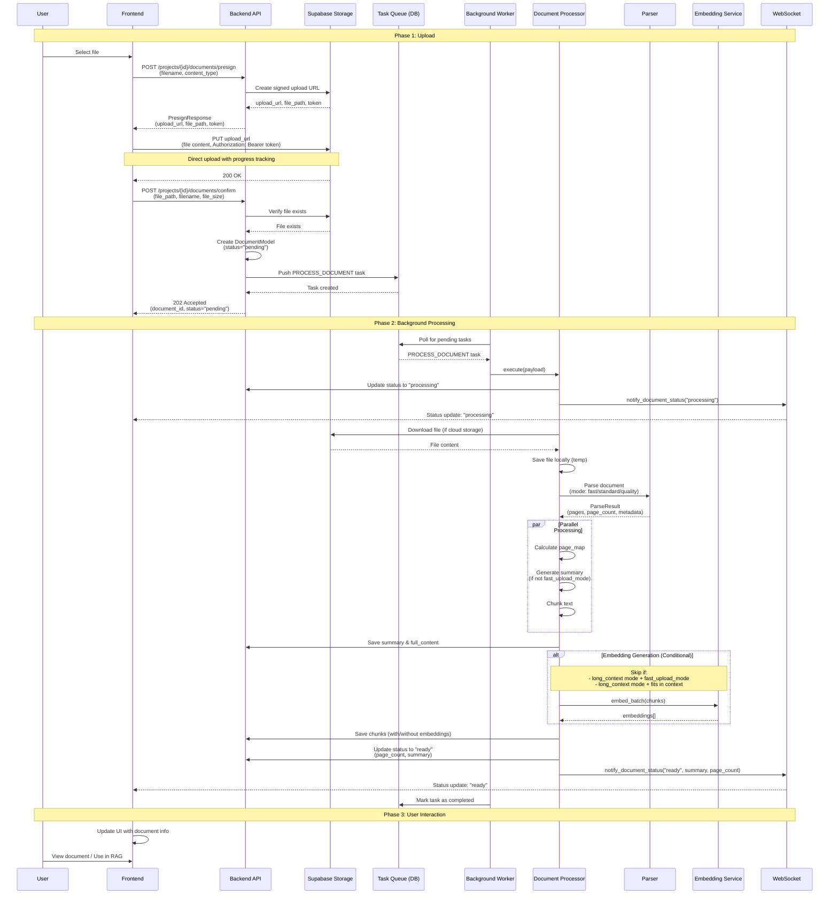

# File Upload Processing Flow

## Overview

This document describes the technical design and sequence flow for file upload and processing in the system.

## Architecture

The system uses a **presigned URL upload pattern** with **asynchronous background processing**:

1. **Upload Phase**: Client uploads directly to Supabase Storage using presigned URLs
2. **Confirmation Phase**: Backend confirms upload and schedules processing task
3. **Processing Phase**: Background worker processes the document asynchronously
4. **Notification Phase**: Real-time status updates via WebSocket

## Technology Stack

- **Storage**: Supabase Storage (cloud) or Local Storage (fallback)
- **Task Queue**: Database-backed task queue (PostgreSQL)
- **Background Worker**: ARQ-based worker with async task processing
- **Real-time Updates**: WebSocket notifications
- **Document Parsing**: ParserFactory with multiple parser support (PyMuPDF, Docling, etc.)

## Sequence Diagram



## Processing Pipeline Details

### Step 1: File Acquisition
- **Input**: `file_path` (Supabase Storage path or local path)
- **Action**: Download from Supabase Storage if needed, save locally for processing
- **Output**: Local file path

### Step 2: Document Parsing
- **Parser Selection**: Based on `document_processing_mode` setting (fast/standard/quality)
- **Supported Formats**: PDF, DOCX, PPTX, etc.
- **Output**: 
  - `pages`: List of page objects with content
  - `page_count`: Total number of pages
  - `metadata`: Parser-specific metadata (OCR info, layout type, etc.)

### Step 2.5 & 3: Parallel Processing
Three operations run in parallel:
1. **Page Map Calculation**: Maps character positions to page numbers for citation
2. **Summary Generation**: LLM-generated summary (skipped in fast_upload_mode + long_context)
3. **Chunking**: Text segmentation into chunks for retrieval

### Step 3b: Full Content Storage
- Combines all pages into `full_content`
- Estimates token count
- Saves parsing metadata

### Step 4: Embedding Generation (Conditional)
**Skip conditions**:
- `rag_mode == "long_context"` AND `fast_upload_mode == true`
- `rag_mode == "long_context"` AND document fits in LLM context window

**Generate when**:
- `rag_mode == "traditional"` (always needs embeddings)
- `rag_mode == "hybrid"` (needs embeddings for retrieval)
- Document selection feature requires embeddings

### Step 5: Status Update
- Update document status to `READY`
- Save `page_count` and `summary`
- Send WebSocket notification

## Key Design Decisions

### 1. Presigned URL Upload
**Why**: 
- Reduces backend load (files don't pass through API server)
- Better upload progress tracking
- Supports large files without timeout issues

**Fallback**: Direct upload to backend (deprecated endpoint)

### 2. Asynchronous Processing
**Why**:
- Long-running operations (OCR, embedding generation) can take minutes
- Prevents API timeouts
- Better user experience (non-blocking)

**Implementation**: Database-backed task queue with ARQ worker

### 3. Fresh Database Sessions
**Why**: 
- Long operations (OCR, embedding) can cause connection timeouts
- Each major step uses a fresh session to avoid stale connections

**Pattern**: `async with get_async_session() as fresh_session:`

### 4. Conditional Embedding Generation
**Why**:
- Long context mode doesn't need embeddings (uses full content directly)
- Fast upload mode prioritizes speed over retrieval capability
- Reduces API costs and processing time

### 5. WebSocket Notifications
**Why**:
- Real-time status updates without polling
- Better UX for long-running operations

**Implementation**: In-memory connection registry (can be upgraded to Redis Pub/Sub for horizontal scaling)

## Error Handling

1. **Upload Errors**: Frontend handles and shows error message
2. **Processing Errors**: Document status set to `ERROR`, error message saved
3. **Timeout Handling**: ARQ worker handles timeouts, updates document status
4. **Retry Logic**: Task queue supports retry with `max_attempts`

## Status Flow

```
pending → processing → ready
   ↓           ↓
   └───────────┴──→ error
```

## Configuration Options

### User/Project Settings
- `document_processing_mode`: "fast" | "standard" | "quality"
- `rag_mode`: "traditional" | "long_context" | "hybrid"
- `fast_upload_mode`: boolean (skip embeddings in long_context mode)
- `long_context_safety_ratio`: float (token safety margin)

### Environment Settings
- `SUPABASE_URL`: Supabase project URL
- `SUPABASE_SERVICE_ROLE_KEY`: Service role key for storage access
- `STORAGE_BUCKET`: Bucket name for documents
- `UPLOAD_DIR`: Local storage directory (fallback)

## Performance Considerations

1. **Parallel Processing**: Page map, summary, and chunking run in parallel
2. **Batch Operations**: Chunks saved in batches (50 per batch)
3. **Connection Management**: Fresh sessions prevent timeout issues
4. **Conditional Processing**: Skip unnecessary steps based on RAG mode

## Future Improvements

1. **Horizontal Scaling**: Redis Pub/Sub for WebSocket notifications
2. **Progressive Processing**: Stream chunks as they're generated
3. **Resumable Uploads**: Support for large file uploads with resume capability
4. **Processing Priority**: Priority queue for urgent documents
5. **Distributed Processing**: Multiple workers with task distribution


