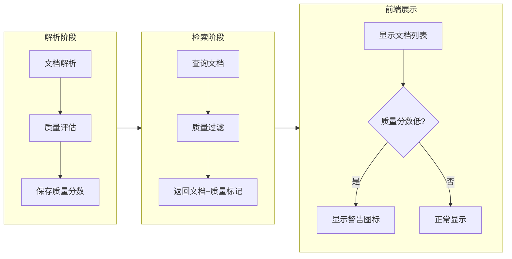

# PRD: 文档内容质量评估系统

## 概述

### 背景

当 RAG 策略设置为 `long_context` 模式时，系统直接使用文档的完整内容进行问答。然而，存在以下问题：

1. **空内容未过滤**：`full_content` 为空字符串时仍被选中参与检索
2. **低质量内容无检测**：即使有内容，若大量换行符、乱码、无效字符，检索效果也很差
3. **用户无感知**：前端无法告知用户文档解析质量问题

### 目标

建立文档内容质量评估机制，在解析阶段记录质量分数，在检索阶段过滤低质量文档，并在前端展示质量警告。

---

## 系统架构



---

## 详细设计

### 1. 内容质量评估服务

**文件位置**: `app/backend/src/research_agent/domain/services/content_quality_service.py`

```python
@dataclass
class ContentQualityResult:
    score: float           # 0.0 - 1.0, 越高越好
    is_valid: bool         # 是否达到最低质量标准
    issues: List[str]      # 检测到的问题列表
    metrics: Dict[str, Any]  # 详细指标

class ContentQualityService:
    MIN_QUALITY_SCORE = 0.3  # 低于此分数标记警告
    
    def evaluate(self, content: str) -> ContentQualityResult:
        """评估内容质量"""
        # 检查项：
        # 1. 有效字符比例 (字母+数字+中文 vs 总字符)
        # 2. 换行符密度 (换行符数 / 总字符数)
        # 3. 连续空白比例
        # 4. 乱码/控制字符比例
        # 5. 平均词长 (过短可能是乱码)
```

#### 质量评估指标

| 指标 | 权重 | 说明 |
|-----|-----|-----|
| 有效字符比例 | 0.4 | 字母/数字/中文占比 |
| 换行密度 | 0.2 | 换行符过多表示解析问题 |
| 连续空白 | 0.2 | 连续空格/换行过多 |
| 乱码比例 | 0.2 | 控制字符/替换字符占比 |

**质量分数计算**: `score = Σ(指标得分 × 权重)`

---

### 2. 数据库模型更新

**文件位置**: `app/backend/src/research_agent/infrastructure/database/models.py`

在 `DocumentModel` 中添加以下字段：

```python
# Content quality fields
content_quality_score: Mapped[Optional[float]] = mapped_column(
    Float, nullable=True, comment="Content quality score (0.0-1.0)"
)
content_quality_issues: Mapped[Optional[dict]] = mapped_column(
    JSONB, nullable=True, comment="List of quality issues detected"
)
```

需要创建数据库迁移脚本：`alembic/versions/YYYYMMDD_add_content_quality_fields.py`

---

### 3. 文档处理流程集成

**文件位置**: `app/backend/src/research_agent/worker/tasks/document_processor.py`

修改 Step 3b 部分，在保存 `full_content` 时同时评估质量：

```python
# Step 3b: Prepare full content and evaluate quality
full_content = "\n\n".join([page.content for page in pages])

# 新增：评估内容质量
from research_agent.domain.services.content_quality_service import ContentQualityService
quality_service = ContentQualityService()
quality_result = quality_service.evaluate(full_content)

logger.info(
    f"📊 Content quality: score={quality_result.score:.2f}, "
    f"valid={quality_result.is_valid}, issues={quality_result.issues}"
)

# 保存到数据库（包含质量信息）
stmt = update(DocumentModel).where(DocumentModel.id == document_id).values(
    full_content=full_content,
    content_token_count=token_count,
    content_quality_score=quality_result.score,
    content_quality_issues=quality_result.issues,
    parsing_metadata=parsing_metadata,
)
```

---

### 4. 检索阶段质量过滤

**文件位置**: `app/backend/src/research_agent/domain/services/document_selector.py`

修改文档选择查询条件：

```python
from sqlalchemy import and_, or_

MIN_QUALITY_SCORE = 0.3

stmt = select(DocumentModel).where(
    DocumentModel.project_id == project_id,
    DocumentModel.status == DocumentStatus.READY.value,
    DocumentModel.full_content.isnot(None),
    DocumentModel.full_content != "",  # 过滤空字符串
    # 质量分数过滤：分数>=阈值 或 分数为NULL（旧数据兼容）
    or_(
        DocumentModel.content_quality_score >= MIN_QUALITY_SCORE,
        DocumentModel.content_quality_score.is_(None),
    ),
)
```

---

### 5. API 响应更新

**文件位置**: `app/backend/src/research_agent/application/dto/document.py`

更新文档响应 DTO：

```python
class DocumentResponse(BaseModel):
    id: UUID
    filename: str
    status: str
    # ... 现有字段
    
    # 新增质量信息
    content_quality_score: Optional[float] = None
    content_quality_issues: Optional[List[str]] = None
    has_quality_warning: bool = False  # 便于前端判断
```

---

### 6. 前端质量警告展示

**文件位置**: `app/frontend/src/components/` (相关文档列表组件)

对低质量文档显示警告图标和提示：

```tsx
import { AlertTriangle } from 'lucide-react';
import { Tooltip } from '@/components/ui/tooltip';

// 在文档列表项中
{doc.has_quality_warning && (
  <Tooltip content="文档解析质量较低，问答结果可能不准确">
    <AlertTriangle className="text-yellow-500" size={16} />
  </Tooltip>
)}
```

---

## 实现任务清单

| # | 任务 | 优先级 | 说明 |
|---|------|--------|-----|
| 1 | 创建 ContentQualityService | P0 | 内容质量评估核心逻辑 |
| 2 | 数据库迁移 | P0 | 添加质量分数字段 |
| 3 | 集成到文档处理流程 | P0 | 解析完成后自动评估质量 |
| 4 | 修改检索过滤条件 | P0 | 过滤空内容和低质量文档 |
| 5 | 更新 API 响应 | P1 | 返回质量信息给前端 |
| 6 | 前端警告展示 | P1 | 低质量文档显示警告 |

---

## 质量阈值配置

建议在 `config.py` 中添加可配置的质量阈值：

```python
# Content Quality Configuration
content_quality_min_score: float = 0.3  # 最低质量分数
content_quality_warning_threshold: float = 0.5  # 警告阈值
```

---

## 兼容性考虑

1. **旧数据兼容**：`content_quality_score` 为 NULL 的文档（迁移前处理的）不会被过滤
2. **渐进式更新**：可以通过后台任务对现有文档重新评估质量分数
3. **降级处理**：质量评估失败时，记录警告日志但不阻断文档处理流程

---

## 监控与日志

在文档处理日志中增加质量评估信息：

```
📊 Content quality: score=0.85, valid=True, issues=[]
📊 Content quality: score=0.25, valid=False, issues=["high_newline_density", "low_valid_char_ratio"]
```

可通过 Grafana 监控低质量文档比例，及时发现解析器问题。


