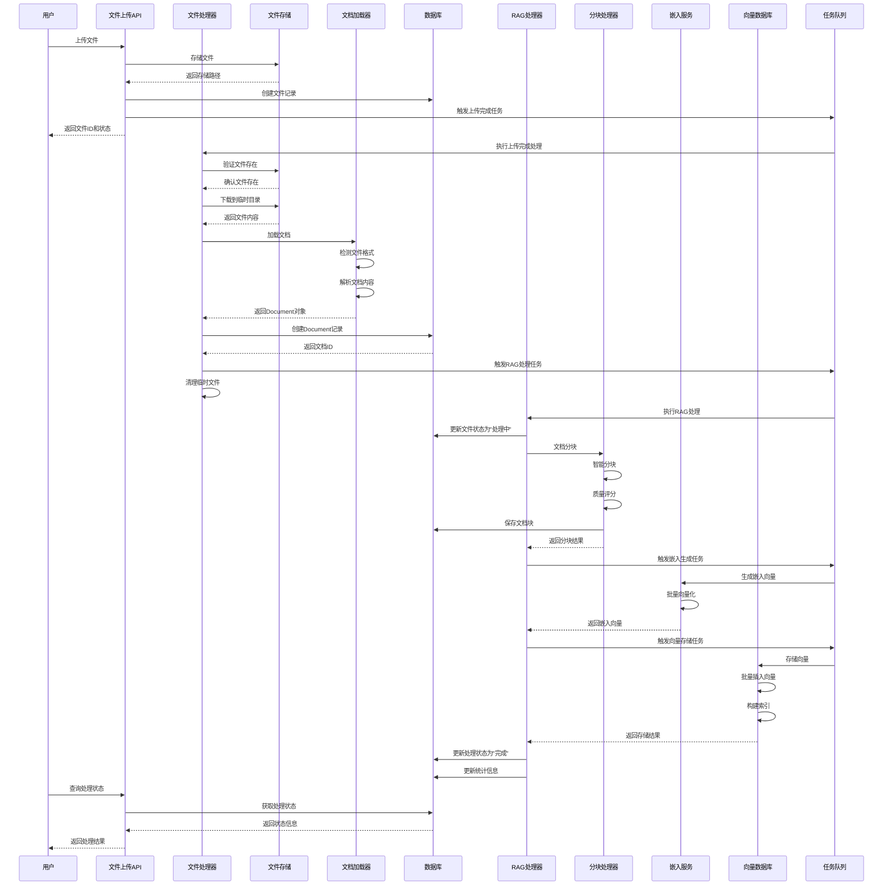
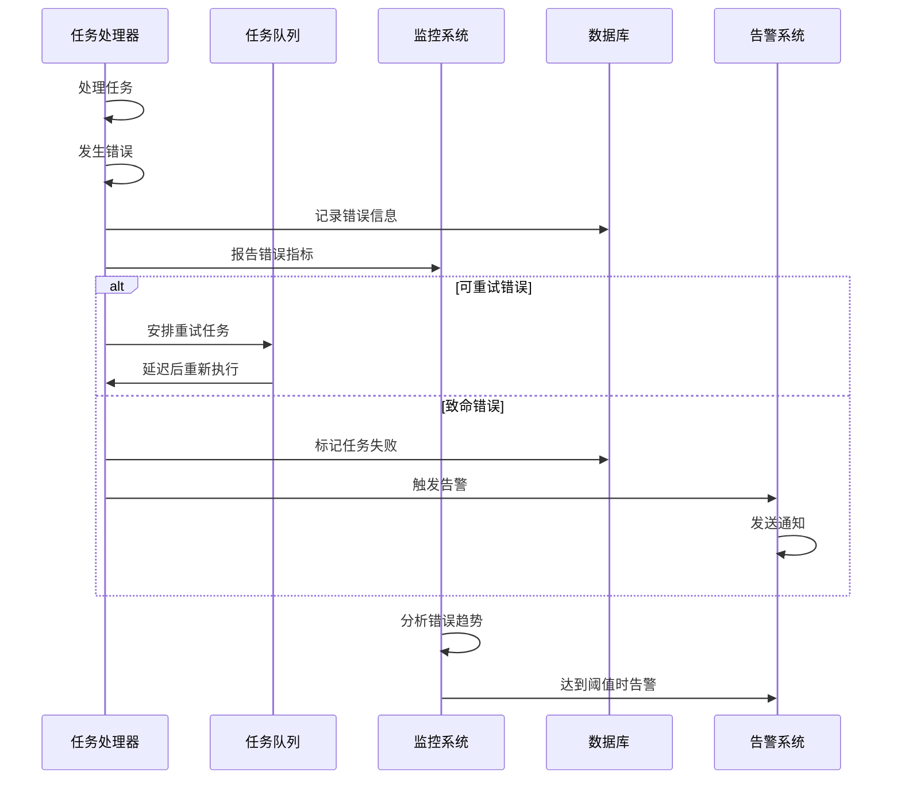
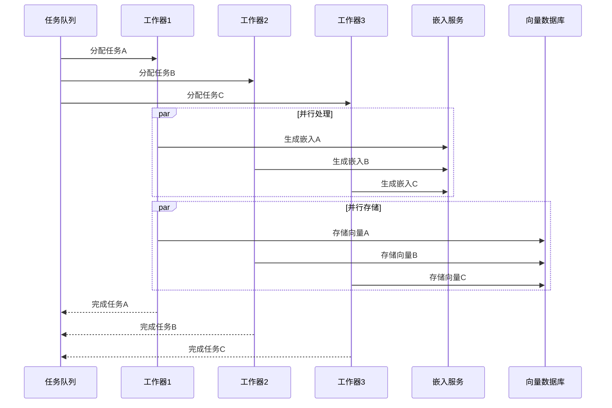
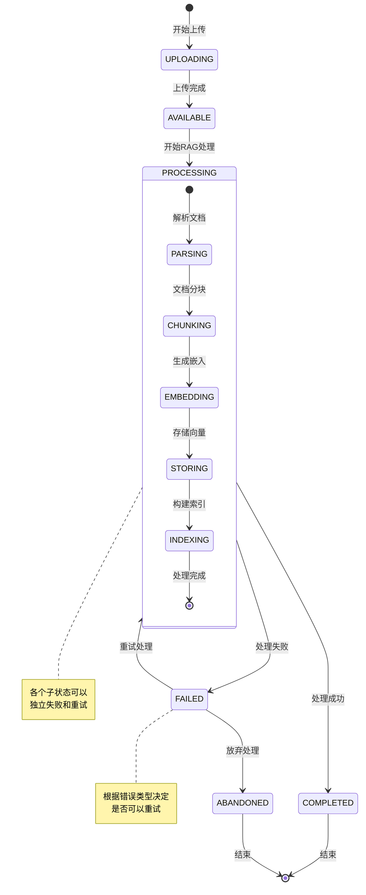
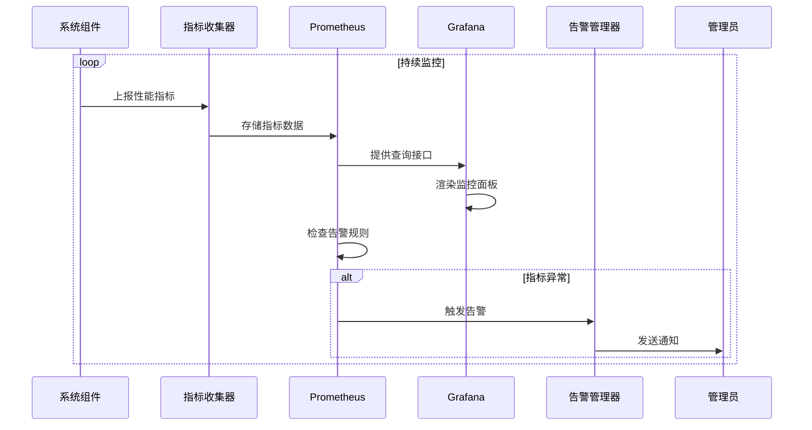

# RAG处理流程时序图

## 完整的文件上传后RAG处理时序图

以下是详细的时序图，展示了从文件上传到RAG处理完成的完整流程：

## 错误处理流程

## 并发处理流程

## 状态流转图

## 性能监控流程

这些图表展示了RAG处理系统的完整工作流程，包括正常处理流程、错误处理、并发处理、状态管理和监控等各个方面。通过这些可视化图表，可以更好地理解系统的设计和运行机制。

