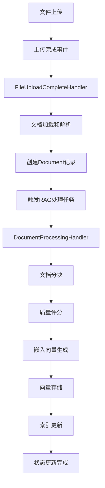
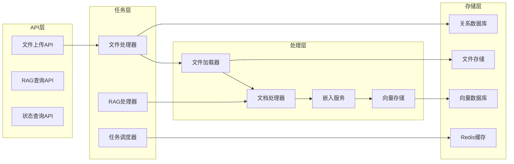
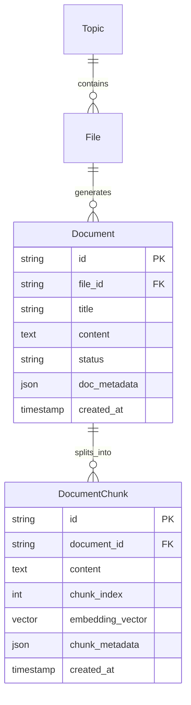
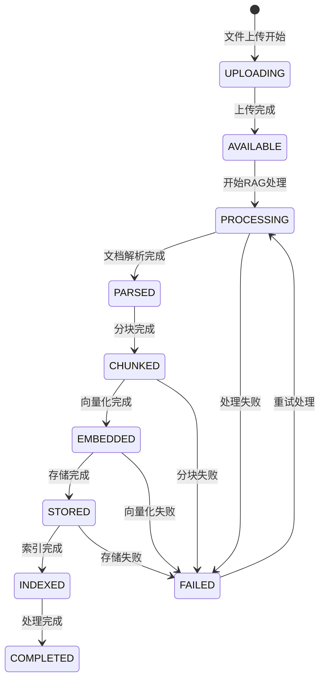

# 文件上传后RAG处理技术方案设计

## 1. 方案概述

本文档描述了基于当前系统架构的文件上传后RAG（Retrieval-Augmented Generation）处理的完整技术方案。该方案设计了一个异步、可扩展、高可靠的文档处理流水线，支持多种文件格式的智能解析、语义分块、向量化和存储。

### 1.1 设计目标

- **异步处理**: 文件上传后立即返回，后台异步进行RAG处理
- **高可靠性**: 支持任务重试、状态跟踪和错误恢复
- **可扩展性**: 支持多种文件格式、嵌入模型和向量存储
- **性能优化**: 批量处理、并发控制和资源管理
- **监控可观测**: 完整的日志、指标和进度追踪

### 1.2 核心组件

- **任务编排系统**: 基于Redis的异步任务队列
- **文件加载器**: 多格式文件解析（PDF、Word、Text等）
- **文档处理器**: 智能分块和质量评分
- **嵌入服务**: 向量化服务（OpenAI、HuggingFace等）
- **向量存储**: 向量数据库存储（Weaviate、pgvector等）
- **状态管理**: 实时状态跟踪和进度报告

## 2. 系统架构

### 2.1 整体流程图



### 2.2 组件架构图



## 3. 详细技术设计

### 3.1 文件上传完成处理

#### 3.1.1 触发机制
- **事件源**: 文件上传API完成后触发
- **任务类型**: `FILE_UPLOAD_CONFIRM`
- **处理器**: `FileUploadCompleteHandler`
- **优先级**: 高
- **队列**: `file_queue`

#### 3.1.2 处理流程
```python
async def handle_file_upload_complete(file_id: str, file_path: str, **metadata):
    # 1. 验证文件存在性
    if not await storage.file_exists(file_path):
        raise FileNotFoundError()
    
    # 2. 获取文件信息
    file_info = await storage.get_file_info(file_path)
    
    # 3. 下载到临时目录
    temp_path = await download_to_temp(file_path)
    
    # 4. 文档加载和解析
    document = await load_document(temp_path)
    
    # 5. 创建Document记录
    document_record = await create_document_record(document, file_id)
    
    # 6. 触发RAG处理
    await trigger_rag_processing(document_record.id)
    
    # 7. 清理临时文件
    cleanup_temp_file(temp_path)
```

### 3.2 文档加载和解析

#### 3.2.1 多格式支持
- **文本文件**: `.txt`, `.md`, `.csv`, `.log`
- **文档文件**: `.pdf`, `.docx`, `.rtf`（扩展支持）
- **代码文件**: `.py`, `.js`, `.java`（扩展支持）

#### 3.2.2 加载器架构
```python
class MultiFormatFileLoader:
    def __init__(self):
        self._loaders = {
            ContentType.TXT: TextFileLoader(),
            ContentType.PDF: PDFFileLoader(),  # 待实现
            ContentType.DOCX: DocxFileLoader()  # 待实现
        }
    
    async def load_document(self, request: FileLoadRequest) -> Document:
        content_type = detect_content_type(request.file_path)
        loader = self._loaders.get(content_type)
        return await loader.load_document(request)
```

#### 3.2.3 内容提取策略
- **编码检测**: 自动检测文件编码（UTF-8、GBK等）
- **元数据提取**: 文件大小、创建时间、修改时间
- **内容清理**: 去除不必要的格式字符
- **质量检查**: 内容完整性和可读性验证

### 3.3 RAG处理管道

#### 3.3.1 管道配置
```python
class PipelineConfig:
    chunk_size: int = 1000           # 分块大小
    chunk_overlap: int = 200         # 重叠大小
    enable_embeddings: bool = True   # 启用嵌入
    enable_vector_storage: bool = True # 启用向量存储
    batch_size: int = 50            # 批处理大小
    max_concurrent_chunks: int = 5   # 最大并发数
    retry_attempts: int = 3          # 重试次数
    timeout_seconds: int = 300       # 超时时间
```

#### 3.3.2 处理阶段
1. **文档解析** (`DOCUMENT_PARSING`)
   - 文本提取和清理
   - 结构化信息识别
   - 元数据收集

2. **文本分块** (`TEXT_CHUNKING`)
   - 智能分块算法
   - 内容完整性保持
   - 质量评分

3. **嵌入生成** (`EMBEDDING_GENERATION`)
   - 批量向量化
   - 多模型支持
   - 错误处理和重试

4. **向量存储** (`VECTOR_STORAGE`)
   - 批量插入优化
   - 索引构建
   - 元数据关联

5. **索引更新** (`INDEXING`)
   - 搜索索引更新
   - 缓存刷新
   - 状态同步

### 3.4 文档分块策略

#### 3.4.1 分块算法
```python
class ChunkingProcessor:
    async def process_document(self, document: Document) -> List[DocumentChunk]:
        # 1. 基础分块
        chunks = await self._split_by_size(document.content)
        
        # 2. 语义优化
        chunks = await self._optimize_semantic_boundaries(chunks)
        
        # 3. 质量评分
        chunks = await self._score_chunks(chunks)
        
        # 4. 过滤低质量块
        chunks = await self._filter_low_quality(chunks)
        
        return chunks
```

#### 3.4.2 质量评分指标
- **长度分数**: 基于理想长度范围
- **完整性分数**: 句子和段落完整性
- **内容密度**: 信息密度评估
- **语义连贯性**: 上下文相关性

#### 3.4.3 分块元数据
```python
chunk_metadata = {
    "chunk_index": 0,
    "start_char": 0,
    "end_char": 1000,
    "quality_score": 0.85,
    "content_type": "paragraph",
    "language": "zh-CN",
    "token_count": 250
}
```

### 3.5 嵌入向量生成

#### 3.5.1 支持的提供商
- **OpenAI**: text-embedding-3-small/large
- **Azure OpenAI**: 企业级API
- **HuggingFace**: 开源模型
- **本地模型**: 自部署向量化服务

#### 3.5.2 嵌入服务架构
```python
class EmbeddingService:
    async def generate_embeddings(self, texts: List[str]) -> EmbeddingResult:
        # 1. 文本预处理
        preprocessed_texts = await self._preprocess_texts(texts)
        
        # 2. 批量处理
        batches = self._create_batches(preprocessed_texts)
        
        # 3. 并发生成
        results = await asyncio.gather(*[
            self._generate_batch(batch) for batch in batches
        ])
        
        # 4. 结果合并
        return self._merge_results(results)
```

#### 3.5.3 性能优化
- **批量处理**: 减少API调用次数
- **并发控制**: 避免超出API限制
- **缓存机制**: 相同文本的向量缓存
- **降级策略**: 多提供商备份

### 3.6 向量存储设计

#### 3.6.1 支持的向量数据库
- **Weaviate**: 企业级向量数据库
- **pgvector**: PostgreSQL扩展
- **ChromaDB**: 轻量级向量数据库
- **Pinecone**: 云端向量服务

#### 3.6.2 存储架构
```python
class VectorDocument:
    id: str                    # 唯一标识
    vector: List[float]        # 向量数据
    content: str              # 原始内容
    metadata: Dict[str, Any]  # 元数据
    document_id: str          # 关联文档ID
    chunk_index: int          # 块索引
```

#### 3.6.3 批量操作优化
```python
async def upsert_vectors(self, documents: List[VectorDocument]) -> BulkOperationResult:
    # 1. 数据验证
    validated_docs = await self._validate_documents(documents)
    
    # 2. 批量分组
    batches = self._create_batches(validated_docs, self.batch_size)
    
    # 3. 并发插入
    results = await asyncio.gather(*[
        self._upsert_batch(batch) for batch in batches
    ], return_exceptions=True)
    
    # 4. 结果汇总
    return self._aggregate_results(results)
```

### 3.7 状态管理和监控

#### 3.7.1 处理状态
```python
class ProcessingStatus:
    PENDING = "pending"       # 等待处理
    RUNNING = "running"       # 处理中
    COMPLETED = "completed"   # 处理完成
    FAILED = "failed"         # 处理失败
    CANCELLED = "cancelled"   # 已取消
```

#### 3.7.2 进度跟踪
```python
class ProcessingProgress:
    request_id: str           # 请求ID
    current_stage: ProcessingStage  # 当前阶段
    progress_percentage: float      # 进度百分比
    estimated_remaining_ms: float   # 预计剩余时间
    message: str             # 状态消息
```

#### 3.7.3 指标收集
- **处理时间**: 各阶段耗时统计
- **成功率**: 处理成功率监控
- **错误分析**: 错误类型和频率
- **资源使用**: CPU、内存使用情况

## 4. 数据流设计

### 4.1 数据模型关系



### 4.2 状态流转



## 5. 性能优化策略

### 5.1 并发控制
- **文件级并发**: 多个文件同时处理
- **块级并发**: 单文件内分块并行处理
- **批处理优化**: 嵌入和存储批量操作
- **资源限制**: 防止系统过载

### 5.2 内存管理
- **流式处理**: 大文件分段处理
- **临时文件清理**: 及时释放存储空间
- **缓存策略**: LRU缓存热点数据
- **内存池**: 复用对象减少GC压力

### 5.3 网络优化
- **连接池**: 复用HTTP连接
- **压缩传输**: 减少数据传输量
- **超时控制**: 避免长时间阻塞
- **重试机制**: 智能退避重试

### 5.4 存储优化
- **分片存储**: 向量数据分片存储
- **索引优化**: 高效搜索索引
- **压缩算法**: 向量数据压缩
- **缓存预热**: 热点数据预加载

## 6. 错误处理和容错

### 6.1 错误分类
- **业务错误**: 文件格式不支持、内容为空等
- **系统错误**: 网络超时、服务不可用等
- **资源错误**: 内存不足、存储空间不足等

### 6.2 重试策略
```python
class RetryConfig:
    max_retries: int = 3
    initial_delay: float = 1.0
    max_delay: float = 60.0
    exponential_base: float = 2.0
    jitter: bool = True
```

### 6.3 降级策略
- **嵌入服务降级**: 多提供商备份
- **向量存储降级**: 备用存储后端
- **处理能力降级**: 减少并发数
- **功能降级**: 关闭非核心功能

### 6.4 恢复机制
- **断点续传**: 从失败点继续处理
- **状态恢复**: 系统重启后状态恢复
- **数据修复**: 损坏数据自动修复
- **一致性检查**: 定期数据一致性验证

## 7. 安全性设计

### 7.1 文件安全
- **格式验证**: 严格的文件格式检查
- **大小限制**: 防止过大文件攻击
- **内容扫描**: 恶意内容检测
- **隔离执行**: 沙箱环境处理

### 7.2 数据安全
- **敏感信息过滤**: 自动识别和脱敏
- **访问控制**: 基于角色的权限管理
- **数据加密**: 传输和存储加密
- **审计日志**: 完整的操作记录

### 7.3 API安全
- **认证授权**: JWT token验证
- **限流控制**: 防止API滥用
- **参数验证**: 严格的输入验证
- **HTTPS强制**: 加密传输通道

## 8. 监控和运维

### 8.1 指标监控
- **系统指标**: CPU、内存、磁盘、网络
- **业务指标**: 处理量、成功率、延迟
- **错误指标**: 错误率、错误分布
- **性能指标**: 响应时间、吞吐量

### 8.2 日志系统
- **结构化日志**: JSON格式日志
- **分级记录**: DEBUG、INFO、WARN、ERROR
- **上下文追踪**: 请求链路跟踪
- **集中收集**: ELK Stack日志分析

### 8.3 告警机制
- **阈值告警**: 指标超阈值告警
- **异常告警**: 系统异常实时告警
- **性能告警**: 性能下降告警
- **业务告警**: 业务异常告警

### 8.4 可观测性
```python
# 埋点示例
@log_execution_time(threshold_ms=1000)
@monitor_metrics("rag.process_document")
async def process_document(request: DocumentProcessingRequest):
    with task_context(task_id=request.file_id):
        # 处理逻辑
        pass
```

## 9. 扩展性设计

### 9.1 水平扩展
- **无状态设计**: 服务无状态，便于水平扩展
- **负载均衡**: 智能负载分发
- **分布式任务**: 跨机器任务分发
- **弹性伸缩**: 基于负载自动扩缩容

### 9.2 组件扩展
- **插件架构**: 支持第三方组件接入
- **接口标准化**: 统一的接口定义
- **配置驱动**: 通过配置切换实现
- **热插拔**: 运行时组件替换

### 9.3 存储扩展
- **分片策略**: 数据水平分片
- **读写分离**: 读写负载分离
- **多活部署**: 多地域部署
- **备份恢复**: 完善的备份机制

## 10. 部署方案

### 10.1 容器化部署
```yaml
# Docker Compose示例
version: '3.8'
services:
  rag-processor:
    image: rag-system:latest
    environment:
      - REDIS_URL=redis://redis:6379
      - DB_URL=postgresql://db:5432/rag
      - EMBEDDING_PROVIDER=openai
    depends_on:
      - redis
      - postgresql
      - weaviate
```

### 10.2 微服务架构
- **服务拆分**: 按功能拆分微服务
- **服务注册**: 服务自动发现
- **配置中心**: 集中配置管理
- **网关路由**: API网关统一入口

### 10.3 运维自动化
- **CI/CD流水线**: 自动化部署
- **健康检查**: 服务健康监测
- **自动重启**: 异常自动恢复
- **版本管理**: 灰度发布和回滚

## 11. 测试策略

### 11.1 单元测试
- **组件测试**: 各组件独立测试
- **接口测试**: API接口测试
- **边界测试**: 边界条件测试
- **异常测试**: 异常情况测试

### 11.2 集成测试
- **端到端测试**: 完整流程测试
- **性能测试**: 负载和压力测试
- **并发测试**: 并发场景测试
- **容错测试**: 故障注入测试

### 11.3 测试数据
```python
# 测试用例示例
test_cases = [
    {
        "name": "小文本文件处理",
        "file_type": "txt",
        "file_size": "1KB",
        "expected_chunks": 1
    },
    {
        "name": "大PDF文件处理", 
        "file_type": "pdf",
        "file_size": "10MB",
        "expected_chunks": 100
    }
]
```

## 12. 总结

本技术方案设计了一个完整的文件上传后RAG处理系统，具有以下特点：

### 12.1 技术优势
- **异步架构**: 高性能、高并发处理能力
- **模块化设计**: 组件解耦，易于维护和扩展
- **多模型支持**: 灵活的嵌入和存储方案
- **容错设计**: 完善的错误处理和恢复机制

### 12.2 业务价值
- **用户体验**: 快速响应，实时状态反馈
- **处理能力**: 支持大规模文件批量处理
- **智能化**: 自动文档理解和知识提取
- **可扩展**: 支持业务快速增长需求

### 12.3 实施建议
1. **分阶段实施**: 按优先级分步骤实现
2. **小步快跑**: 快速验证和迭代
3. **监控先行**: 完善监控后再上线
4. **文档完善**: 维护详细的技术文档

该方案提供了完整的技术路线图，可以根据实际需求和资源情况进行适当调整和优化。


