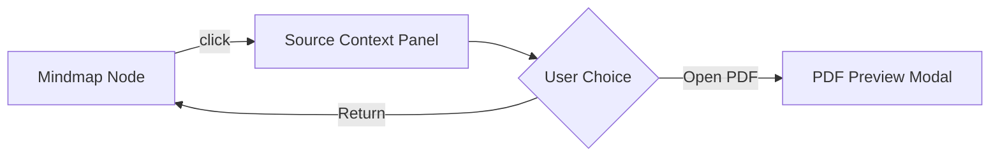

# Design: Mindmap Drilldown Architecture

## Overview

This design enables **macro-to-micro navigation** within mindmaps by linking each node to its source paragraphs in the original documents.



## Data Model Changes

### SourceRef Structure

```python
@dataclass
class SourceRef:
    source_id: str        # ID of the source entity (document_id, node_id, etc.)
    source_type: str      # 'document', 'node', 'selection', etc. (default: 'document')
    location: Optional[str] # Context-dependent:
                            # - PDF: Page number (e.g., "5")
                            # - Video/Audio: Timestamp in seconds (e.g., "120.5")
    quote: str            # Exact quoted text or transcript segment
```

### MindmapNode Extension

```python
@dataclass
class MindmapNode:
    id: str
    label: str
    content: str
    depth: int
    parent_id: Optional[str]
    x: float
    y: float
    width: float
    height: float
    color: str
    status: str
    source_refs: List[SourceRef] = field(default_factory=list)  # NEW
```

## LLM Prompt Strategy

The key challenge is getting reliable source references from the LLM. Two approaches:

### Option A: Inline Extraction (Recommended)

Modify the branch generation prompt to include source attribution:

```
Generate {max_branches} sub-topics for "{current_node_label}".
For each branch, include the EXACT quote from the source document that supports this sub-topic.

Response format:
{
  "branches": [
    {
      "label": "Branch label",
      "content": "Brief explanation",
      "source_quote": "The exact text from the document...",
      "source_location": "Section: X / Page: Y (if identifiable)"
    }
  ]
}
```

**Pros**: Single LLM call per expansion level
**Cons**: Quote accuracy depends on LLM context window

### Option B: Post-hoc Retrieval

After generating nodes, use vector search to find relevant chunks:

```python
for node in new_nodes:
    chunks = await vector_store.search(node.label + " " + node.content, top_k=2)
    node.source_refs = [SourceRef(c.doc_id, c.page, c.text) for c in chunks]
```

**Pros**: More accurate source matching using embeddings
**Cons**: Additional latency, requires vector store integration during generation

### Recommendation

Start with **Option A** (inline extraction) for MVP. The document content is already in the LLM context, so requesting quotes is a lightweight change. If accuracy is insufficient, we can layer Option B as a refinement step.

## Frontend Architecture

### Component Hierarchy

```
MindMapCanvasNode
└── MindMapViews
    └── MindMapEditor
        ├── RichMindMapNode (clickable)
        └── SourceContextPanel (slide-out)
```

### State Flow

```typescript
// In MindMapEditor
const [activeNodeId, setActiveNodeId] = useState<string | null>(null);
const [showSourcePanel, setShowSourcePanel] = useState(false);

const handleNodeClick = (nodeId: string) => {
  setActiveNodeId(nodeId);
  setShowSourcePanel(true);
};

const activeNode = nodes.find(n => n.id === activeNodeId);
const sourceRefs = activeNode?.sourceRefs ?? [];
```

### SourceContextPanel UX

- Appears as a **slide-in panel** from the right (similar to PDF tools panel)
- Width: 320px
- Shows:
  - Node label as header
  - List of source references as cards
  - Each card: document icon + name + page number + quoted text
  - "Open in PDF" button linking to existing PDF Preview Modal

## Performance Considerations

1. **Payload Size**: Each node gains ~500 bytes for source refs. For a 50-node mindmap, this adds ~25KB—acceptable.

2. **Lazy Loading**: For very long quotes, store only first 200 chars + full quote ID; fetch full text on panel open if needed.

3. **Caching**: Source refs don't change after generation; cache in component state to avoid re-renders.

## Edge Cases

| Case | Behavior |
|------|----------|
| Node without source refs | Show "This concept is synthesized from multiple sections" message |
| Source document deleted | Show document name but disable "Open PDF" action |

## Future Extensibility: Canvas Selection

To support future workflows where users generate mindmaps from selected canvas content (e.g., "box select 3 notes -> generate mindmap"), the `SourceRef` model is designed to be polymorphic.

### Scenario: Generation from Box Selection
1. User selects 3 nodes on canvas
2. Backend receives `source_nodes` list
3. Mindmap generated with `SourceRef`:
   - `source_id`: UUID of the original canvas node
   - `source_type`: "node"
   - `quote`: Text from that node

The Frontend `SourceContextPanel` will need to handle different `source_type`s:
- `document`: Show page preview (Current MVP)
- `node`: Pan canvas to show the original node (Future)
- `chat`: Scroll chat history to message (Future)

### Scenario: Video/Audio Drilldown
1. Source is a video file
2. `SourceRef` contains:
   - `source_type`: "document" (or specific "media")
   - `location`: "45" (Timestamp in seconds)
   - `quote`: Transcript segment
3. On click, the Preview Modal opens the video player and seeks to 00:45

