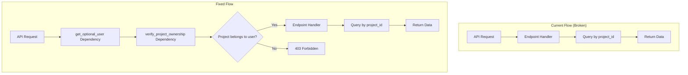

# Design: User Data Isolation Fix

## Architecture Overview



## Solution Components

### 1. New Dependency: `get_verified_project`

A FastAPI dependency that combines user authentication with project ownership verification:

```python
async def get_verified_project(
    project_id: UUID,
    session: AsyncSession = Depends(get_db),
    user: UserContext = Depends(get_optional_user),
) -> Project:
    """
    Verify project exists and belongs to the authenticated user.
    
    Raises:
        HTTPException 404: Project not found
        HTTPException 403: User not authorized to access project
    """
    project_repo = SQLAlchemyProjectRepository(session)
    project = await project_repo.find_by_id(project_id)
    
    if not project:
        raise HTTPException(status_code=404, detail="Project not found")
    
    if not settings.auth_bypass_enabled:
        user_id = user.user_id if user else None
        if project.user_id and project.user_id != user_id:
            raise HTTPException(status_code=403, detail="Not authorized")
    
    return project
```

### 2. Refactor Pattern

Each endpoint will be updated to include the dependency:

**Before:**
```python
@router.post("/projects/{project_id}/chat/stream")
async def stream_message(
    project_id: UUID,
    request: ChatMessageRequest,
    session: AsyncSession = Depends(get_db),
):
    # Directly uses project_id without verification
```

**After:**
```python
@router.post("/projects/{project_id}/chat/stream")
async def stream_message(
    project_id: UUID,
    request: ChatMessageRequest,
    session: AsyncSession = Depends(get_db),
    user: UserContext = Depends(get_optional_user),
    _: Project = Depends(get_verified_project),  # Verification happens here
):
    # project_id is now verified to belong to user
```

### 3. Auth Bypass Handling

For development mode (`AUTH_BYPASS_ENABLED=true`), verification is skipped to allow local testing without authentication.

## Files to Modify

### New Files
- `api/deps.py`: Add `get_verified_project` dependency

### Modified Files
| File | Changes |
|------|---------|
| `api/v1/chat.py` | Add `get_verified_project` to all endpoints |
| `api/v1/outputs.py` | Add `get_verified_project` to all endpoints |
| `api/v1/url.py` | Add `get_verified_project` to project-scoped endpoints |
| `api/v1/canvas.py` | Add `get_verified_project` to all endpoints |
| `api/v1/documents.py` | Add `get_verified_project` to `confirm_upload` |
| `api/v1/inbox.py` | Add user scoping to inbox queries |

## Trade-offs

### Pros
- Centralized, consistent verification logic
- Single point of change for future auth modifications
- Clear, explicit dependency injection pattern
- Works with existing auth bypass for development

### Cons
- Additional database query per request (project lookup)
- Slightly more verbose endpoint signatures

### Mitigation
- Project lookup is fast (indexed by UUID primary key)
- Could cache project ownership in session if performance becomes an issue

