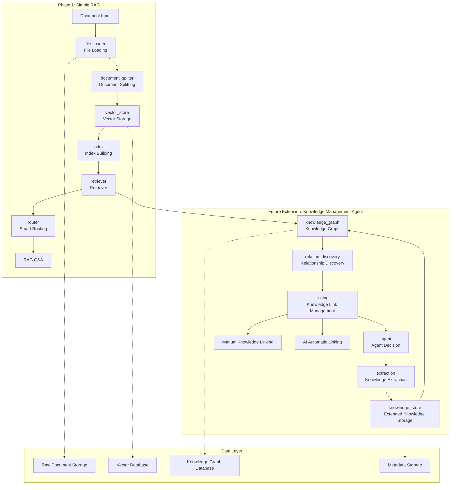

# Knowledge Management Agent System Architecture Design Roadmap

## 🎯 Project Vision

Based on the NotebookLM concept, build an intelligent knowledge management Agent system that solves the "island problem" between PDF documents and achieves knowledge interconnection. The system is not just a simple RAG, but one that can:

- **AI Knowledge Extraction**: Automatically extract structured knowledge from documents
- **Manual Link Building**: Support users to manually create knowledge associations
- **AI Automatic Linking**: Intelligently discover and establish knowledge relationships
- **Knowledge Interconnection**: Let scattered knowledge form organic knowledge networks

## 🏗️ System Architecture Design

### Core Architecture Layers

```
┌─────────────────────────────────────────────────────────────┐
│                    Interface Layer                         │
├─────────────────────────────────────────────────────────────┤
│                     Service Layer                          │
├─────────────────────────────────────────────────────────────┤
│                   Processing Layer                         │
├─────────────────────────────────────────────────────────────┤
│                      Data Layer                            │
└─────────────────────────────────────────────────────────────┘
```

### Module Architecture Diagram



## 📋 Module Detailed Design

### Phase 1: Simple RAG (Based on Existing Structure)

#### 1. `file_loader/` - File Loader
- **Function**: Support loading and parsing of multiple document formats
- **Supported Formats**: PDF, Word, Markdown, TXT, etc.
- **Features**: Metadata extraction, format detection, error handling
- **Interface**: Unified document object interface

#### 2. `document_spliter/` - 文档分割器
- **功能**：智能文档分块和预处理
- **策略**：语义分割、层次分割、重叠分块
- **特性**：保持语义完整性、支持自定义分割策略
- **输出**：结构化的文档块集合

#### 3. `vector_store/` - 向量存储
- **功能**：文档向量的存储和检索
- **支持数据库**：ChromaDB、Qdrant、Weaviate等
- **特性**：混合检索、相似度计算、批量操作
- **接口**：统一的向量操作接口

#### 4. `knowledge_store/` - 知识存储
- **功能**：文档元数据和知识信息管理
- **存储内容**：文档信息、处理状态、知识片段
- **特性**：版本控制、元数据索引、快速查询
- **扩展性**：为未来知识图谱预留接口

#### 5. `retriever/` - 检索器
- **功能**：多策略文档检索和重排序
- **检索策略**：语义检索、关键词检索、混合检索
- **特性**：结果重排序、相关性评分、过滤机制
- **接口**：统一的检索接口

#### 6. `router/` - 智能路由
- **功能**：查询分析和智能路由
- **路由策略**：基于查询类型的服务选择
- **特性**：负载均衡、服务发现、错误处理
- **扩展性**：为未来Agent决策预留扩展点

#### 7. `index/` - 索引构建
- **功能**：多种索引类型的构建和管理
- **索引类型**：向量索引、关键词索引、混合索引
- **特性**：增量更新、索引优化、性能监控
- **接口**：统一的索引管理接口

### 未来扩展：知识管理Agent

#### 8. `knowledge_graph/` - 知识图谱模块
- **功能**：实体和关系的图结构管理
- **图数据库**：Neo4j、ArangoDB等
- **特性**：图查询、路径分析、社区发现
- **接口**：图操作和查询接口

#### 9. `extraction/` - 知识提取模块
- **功能**：AI驱动的知识结构化提取
- **提取类型**：实体识别、关系抽取、概念分类
- **模型**：NER模型、关系抽取模型、分类模型
- **接口**：批量提取和实时提取接口

#### 10. `relation_discovery/` - 关系发现模块
- **功能**：跨文档关系挖掘和关联分析
- **发现策略**：语义相似性、共现分析、引用关系
- **特性**：自动关系发现、置信度评分、关系验证
- **接口**：关系查询和发现接口

#### 11. `linking/` - 知识链接管理
- **功能**：人工和AI混合的知识链接管理
- **链接类型**：概念链接、文档链接、知识链接
- **特性**：人工确认、AI建议、链接验证
- **接口**：链接创建、查询和管理接口

#### 12. `agent/` - Agent决策模块
- **功能**：智能任务规划和执行
- **决策能力**：任务分解、资源分配、结果评估
- **特性**：多步骤执行、错误恢复、学习优化
- **接口**：任务提交和状态查询接口

## 🚀 分阶段实施计划

### 第一阶段：RAG基础功能（1-2个月）
**目标**：建立基础的RAG系统，支持文档处理和问答功能

**主要任务**：
1. 完善现有模块的基础实现
2. 建立标准的数据流管道
3. 实现基本的RAG功能
4. 设计可扩展的接口

**交付物**：
- 可运行的RAG系统
- 基础的用户界面
- 文档处理管道
- 向量检索功能

**技术重点**：
- 文档加载和分割
- 向量化和存储
- 基础检索算法
- 简单的问答接口

### 第二阶段：知识提取和结构化（2-3个月）
**目标**：增强知识提取能力，建立知识图谱基础

**主要任务**：
1. 实现知识提取模块
2. 构建知识图谱存储
3. 开发关系发现算法
4. 建立知识链接基础

**交付物**：
- 知识提取服务
- 基础知识图谱
- 关系发现工具
- 知识链接界面

**技术重点**：
- AI模型集成
- 图数据库设计
- 关系抽取算法
- 知识表示学习

### 第三阶段：知识管理Agent（3-4个月）
**目标**：实现完整的知识管理Agent系统

**主要任务**：
1. 开发Agent决策模块
2. 完善知识链接管理
3. 实现智能知识发现
4. 优化用户体验

**交付物**：
- 完整的Agent系统
- 智能知识管理界面
- 知识演化追踪
- 个性化推荐

**技术重点**：
- Agent架构设计
- 多模态知识处理
- 智能推荐算法
- 系统性能优化

## 🛠️ 技术选型建议

### 数据存储技术
- **向量数据库**：
  - 开发环境：ChromaDB（轻量级、易部署）
  - 生产环境：Qdrant（高性能、可扩展）
  - 云服务：Pinecone、Weaviate

- **知识图谱数据库**：
  - 图数据库：Neo4j（成熟、生态丰富）
  - 多模型数据库：ArangoDB（灵活、性能好）
  - 云服务：Amazon Neptune、Azure Cosmos DB

- **缓存和元数据**：
  - 缓存：Redis（高性能、支持多种数据结构）
  - 元数据：PostgreSQL（关系型、支持JSON）

### AI服务集成
- **大语言模型**：
  - 商业API：OpenAI GPT-4、Anthropic Claude
  - 开源模型：Llama 2、Mistral、Qwen
  - 本地部署：支持Ollama、vLLM等

- **嵌入模型**：
  - 通用模型：OpenAI ada-002、BGE系列
  - 领域模型：根据具体应用场景选择
  - 多语言支持：考虑国际化需求

- **知识抽取模型**：
  - NER模型：BERT-CRF、BiLSTM-CRF
  - 关系抽取：BERT-based、T5-based
  - 文本分类：BERT、RoBERTa等

### 处理框架和工具
- **文档处理**：
  - 核心框架：LangChain、LlamaIndex
  - PDF处理：PyPDF2、pdfplumber、pymupdf
  - Office文档：python-docx、openpyxl

- **图处理**：
  - 图算法：NetworkX、igraph
  - 图神经网络：PyTorch Geometric、DGL
  - 可视化：Plotly、D3.js

- **数据处理**：
  - 数据框架：Pandas、Polars
  - 数值计算：NumPy、SciPy
  - 机器学习：Scikit-learn、XGBoost

## 🎨 核心特性设计

### 1. 解决知识孤岛问题
- **跨文档关联**：自动发现相关概念和关系
- **知识图谱**：构建统一的知识网络
- **语义理解**：基于内容的智能关联
- **引用追踪**：建立文档间的引用关系

### 2. 多模态知识处理
- **文本处理**：支持各种文本格式和语言
- **图表识别**：自动提取图表中的信息
- **公式处理**：数学公式的识别和渲染
- **多媒体支持**：图片、音频等非文本内容

### 3. 动态知识链接
- **实时发现**：持续发现新的知识关联
- **智能推荐**：基于用户行为的个性化推荐
- **关系验证**：自动验证和更新知识关系
- **演化追踪**：记录知识的变化和发展

### 4. 协作式知识管理
- **AI建议**：智能的知识链接建议
- **人工确认**：用户审核和确认AI建议
- **协作编辑**：多人协作的知识管理
- **版本控制**：知识内容的版本管理

## 📊 成功指标

### 技术指标
- **检索准确率**：Top-5准确率 > 85%
- **响应时间**：查询响应时间 < 2秒
- **系统可用性**：99.5%以上
- **扩展性**：支持百万级文档处理

### 用户体验指标
- **知识发现效率**：减少50%的知识查找时间
- **关联发现**：自动发现80%的相关知识
- **用户满意度**：用户满意度 > 4.5/5
- **活跃用户**：月活跃用户增长率 > 20%

### 业务价值指标
- **知识利用率**：提高知识复用率30%
- **决策支持**：改善决策质量25%
- **协作效率**：提升团队协作效率40%
- **创新支持**：加速新想法产生和验证

## 🔮 未来发展方向

### 短期目标（6个月内）
- 完成基础RAG系统
- 实现知识提取功能
- 建立基础知识图谱

### 中期目标（1年内）
- 完整的知识管理Agent
- 智能知识发现和推荐
- 多用户协作平台

### 长期目标（2年内）
- 企业级知识管理平台
- 跨组织知识共享
- AI驱动的知识创新

## 📝 总结

这个架构设计为知识管理Agent系统提供了一个清晰的发展路径：

1. **渐进式演进**：从简单RAG开始，逐步增强功能
2. **模块化设计**：每个模块都有明确的职责和接口
3. **技术灵活性**：支持多种技术栈的选择和替换
4. **用户中心**：始终以解决用户的知识管理痛点为目标

通过分阶段实施，我们可以在每个阶段都提供价值，同时为未来的高级功能奠定坚实的基础。这个系统将不仅仅是另一个RAG工具，而是一个真正能够解决知识孤岛问题、促进知识互联互通的智能平台。
